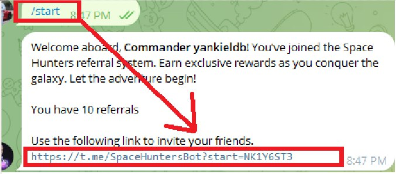
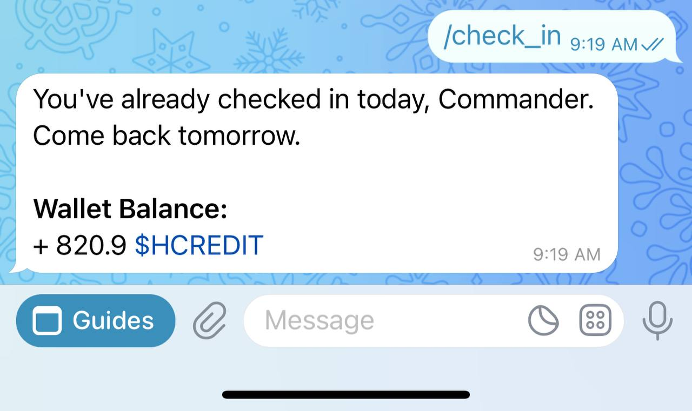

[User guides](../../../index.md)

****

# Getting started.
- [Getting started.](#getting-started)
  - [What is Space Hunters?](#what-is-space-hunters)
  - [What is the current status of the project?](#what-is-the-current-status-of-the-project)
  - [Is there currently anything I can participate in?](#is-there-currently-anything-i-can-participate-in)
  - [What is $HCREDIT and how can I get it?](#what-is-hcredit-and-how-can-i-get-it)
  - [Here an easy way to understand the purposes and uses for $HCREDIT in one of the Game Modes ( Free-To-Play )](#here-an-easy-way-to-understand-the-purposes-and-uses-for-hcredit-in-one-of-the-game-modes--free-to-play-)
  - [What advantages do I have by being part of this community?](#what-advantages-do-i-have-by-being-part-of-this-community)
  - [How can I start farming $HCREDIT?](#how-can-i-start-farming-hcredit)
  - [How can I get free NFTs?](#how-can-i-get-free-nfts)
    - [Wallets](#wallets)
  - [Our Whitepaper (Documentation)](#our-whitepaper-documentation)
  - [Social Networks](#social-networks)

****

This community focuses on presenting a game that offers entertainment, fun and a sustainable community-oriented economy, where players can enjoy a diversified experience and earn rewards without affecting the game economy. 

This is a free project that promotes active participation and long-term growth.

## What is Space Hunters?

**Space Hunters** is an imaginary strategy game for the gamer community, interested or not in the *cryptographic world*.

**SH** utilizes various economic styles and game modes, giving the user the ability to choose how to play and create their own strategies based on the wide variety of possibilities, such as: 
* Engaging people to play together by exploring, mining resources and important items required for crafting.
* Secret and limited-time missions.
* Daily in-game tasks.
* Quests to build and repair assets and structures.
> And many more ways to interact with the ecosystem we are building. Stay tuned!!

## What is the current status of the project?

**Space Hunters** is still in development but you can be part of our progress and acquire free NFTs and tokens for participating and being active.

## Is there currently anything I can participate in?

Our **Space Hunters** community can follow us on social media, interact with other members and share game links and updates on social media and Zealy. This way, they can earn and accumulate the free $HCREDIT token, which will give them future advantages.

## What is $HCREDIT and how can I get it?

$HCREDIT is an in-game social economy token for **Space Hunters** that players can earn by participating in project activities and with partners.

Currently you can get $HCREDIT in the following ways: 
* By doing daily Check-in in our [Telegram BOT](https://t.me/SpaceHuntersBot).
* Completing [Zealy](https://zealy.io/cw/spacehuntersthereborn/invite/UroI4c6fhtB3SX65siHBX) tasks.
* With our 2-tier referral system.

For referring you get 100 $HCREDIT, you receive 4 $HCREDIT if your friends Check-in daily and 1 $HCREDIT if your friends recommend other people who also Check-in.

<!-- TODO change this link when page is up -->
> Ambassador Program is another great way and 2 new more ways to earn [here](https://telegra.ph/Ambassador-Program-08-29)

## Here an easy way to understand the purposes and uses for $HCREDIT in one of the Game Modes ( Free-To-Play )

I will do something simple for you:

Imagine a land where you need workers, but this land can be only bought with $HCREDIT, and your worker can only participate boosting your land with $HCREDIT. Every hour we pay to land owners and workers the $HCASH token for their participation.

Now, this game mode is FREE TO PLAY, we provide to active players and supporters the $HCREDIT tokens just for being active and support the project in social task, check in etc. Mean more active you are more opportunities.

* The “Generator“ pack will be limited and expensive in $HCREDIT tokens and only available in that currency.
* Because is the game mode that focus on social support and engagement, but that is not all there is more coming, but talking about this, every hour you will receive 35% of your Generator tokens farmed, and 65% distributed among all the contributors which not own Generators but booster yours. 
* To avoid inflation and keep it working for longer the $HCREDIT economy is well planned and calculated. You can read how it works in the whitepaper but I will resume:

The contribution to the generators owners is called “Engineers contract“, expire after 24h to encourage the community daily participation, mean if you not stay active you will not earn $HCREDIT which mean no more $HCASH and less players = more to split.

* Same happen with the $HCREDIT more you have = more $HCASH.

You as an Generator owner can upgrade your generator capacity to increase the amount of Engineers (Slot capacity) cuz more engineer mean more powerful. And it is possible only with $HCREDIT.

In resume: $HCREDIT is the 50% of the deflationary system for $HCASH, and at the same time $HCASH has his own allocation and economy system that pay to players for play and being active. 

* Then the 3rd point is the game items:

90% are free and can be earned playing or bought with game tokens earned from FREE TO PLAY modes. And each assets has his own pools, probability and supply allocation/control .

There is many plans for both tokens, the only difference is one is in-game and the other one is the final objective: get paid an on-chain token $$$.

## What advantages do I have by being part of this community?

Being part of the **Space Hunters: The Reborn** community offers several advantages:
* **Free Game Access:** You can play at no initial cost, with free resources and assets to get you started.
* **Daily Rewards:** Earn $HCREDIT and other prizes by participating in daily activities, our social media channels and events.
* **Diversity of Game Modes:** Enjoy different game modes that adapt to your style and available time. At this stage of development we will only have a couple of options through our BOT, make the most of everything you can get before launch and you will start with an advantage over other players.
* **Sustainable Economy:** Benefit from an in-game economy designed to be fair and balanced, avoiding inflation and maximizing rewards.
* **Development Participation:** Contribute to the growth of the game and community through testing, feedback, and community activities.
* **Free Airdrops:** Get NFTs and other stuff for free, just follow our announcement channel to not miss out on opportunities.
* **Growth Opportunities:** Join an active and growing community, with plans for new game modes, expansions and future features.

## How can I start farming $HCREDIT?

1. To start, you need to have been referred by a friend.
> If you got here on your own, you can use our [referral link](https://t.me/SpaceHuntersBot?start=NK1Y6ST3), from which we will not obtain any benefits and it only exists to help you get started.
2. Then make sure you have clicked ''DONE'' and then you can start using the BOT commands.
3. Use the `/start` command to start the bot or to see your own referral link and invite other friends.

4. Use the `/username` command to register your username as you want to call yourself later in the game. Example: `/username YankielDBC`.
5. To start your daily check-in, use the `/check_in` command and you will be credited with the 20 $HCREDIT. 
6. If you want to see your balance, use the same command again.

## How can I get free NFTs?

To get the free NFTs, you must first have a crypto wallet.

> Make sure your wallet is compatible with the WAX Blockchain. There are several options, including WaxCloud Wallet, Anchor, and Wombat.

> If you are Latin American, or you encounter restrictions due to the region you are in, try Wombat.

### Wallets

* [Wax Cloud Wallet](https://www.mycloudwallet.com/)
* [Wombat](https://www.wombat.app/)

After you get an account from one of these wallets, you just have to wait for us to announce some activity where you can claim your free NFTs and you can use them to play **Space Hunters** after its release.

<!-- TODO add change url when page is up-->
## Our Whitepaper (Documentation)

For more detailed information about the entire project you can read our documentation: [LINK](https://spaceheroes.gitbook.io/space-hunters)

## Social Networks

Follow us in our social networks. 

****

[User guides](../../../index.md)