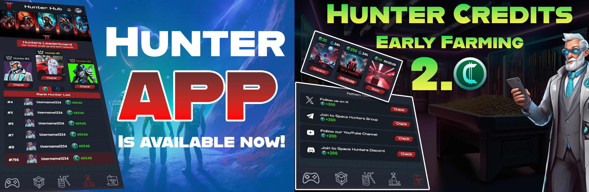
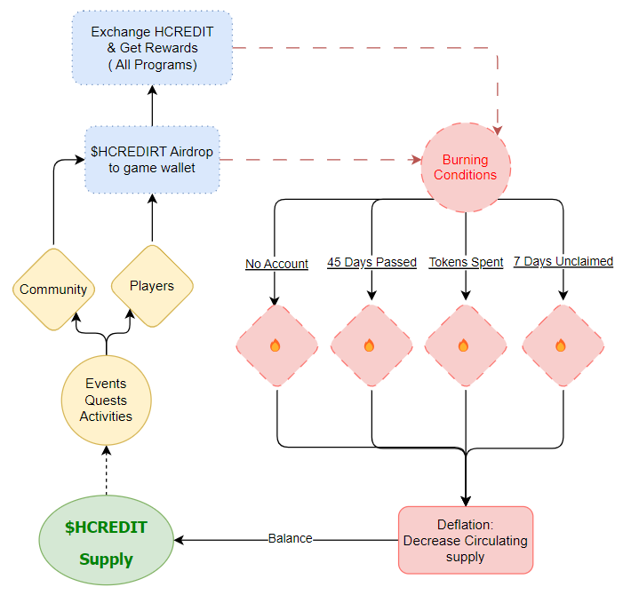

[Back to Index](../../../index.md)
> # Hunter Credits Full Guide

## About HCREDIT

**$HCREDIT** is an off-chain reward token based on the **mass adoption model**. It can only be obtained through **social events**, tasks, or **partnership activities**. Think of it as our **monetization model**, where players can monetize their social networks, gaming channels, content creation and more with no limitations or ridiculous requirements.  This token is not tradable on any exchange and can only be used within the Hunter ecosystem. 

This is an innovative reward system which convert your participation into a valuable tool to generate you revenues. We continue innovating and adding more use cases and ways to interact with the token and ecosystem, the following list are the current plans and the ones coming very soon:

- [Claim Process](#claim-process)
- [Wallet & Username](#wallet--username)
- [Utility](#utility)
- [Supply, distribution and burning](#supply-distribution-and-burning)
- [Reward distribution](#reward-distribution)
- [HCREDIT Flow](#hcredit-flow)
- [How to earn?](#how-to-earn?)
   - [Daily Check-in](#daily-check-in)
   - [Referring Friends](#referring-friends)
   - [On-Chain Transactions](#on-chain-transactions)
   - [Space Hunters in your Telegram Name](#space-hunters-in-your-telegram-name)
   - [Chat-to-Earn](#chat-to-earn)
   - [Buy HCREDIT with HCASH](#buying-hcredit-with-hcash)
- [Final step: Earn $HCASH  with $HCREDIT](#earning-hcash-with-my-hcredit-tokens)

## Claim Process

$HCREDIT is directly sent to the **game wallet**. If a user does **not provide a game wallet** or if the provided wallet address is **inaccurate**, the reward will **not be distributed** and will automatically be **burned**. There is always a **timeline** for this process, along with an **announcement** detailing the steps to follow.

## Wallet & Username
**UPDATE:** Your game username is your wallet address in our ecosystem for $HCASH and $HCREDIT tokens, you can add your username right now using the command /username like this : **/username yankieldbc**. After TGE this details will be updated if required for deposits from external wallets.

> You have 2 **free tries**, if you want to make another change you can do so after 24h but this option only available to [TechPass](/docs/eng/01-user-guides/generatorsenglish.md/#benefits-of-techpass) members.

## Utility

The main utility is monetize your social support, content creation and effort over many social networks. We have many plans for $HCREDIT & the current ones under development include:

- **Special Rewards**: Exclusive items for active players.
- **Unique Rewards**: Rare or limited-time items.
- **Limited Time Rewards**: Obtain items only during special events.
- **Discount Coupon**: Use $HCREDIT to get discounts on in-game items.
- **Airdrop Shares**: Receive additional tokens during airdrops.
- **Tech: Generators**: Buy Generators, contract Engineers,upgrade your technology and engineers ability.

*These are just  a few examples of the many uses we have planned for $HCREDIT. We will continue to innovate, do not limit  yourself to the current uses.*

## Supply, Distribution, and Burning
$HCREDIT is build  on the **mass adoption model** with a **perfect deflationary system**:

- **Total Supply**: Unlimited
- **Supply Allocation**: 100% Community Rewards
- **Burning Mechanism**: 
  - Each token spent is **burned**. 
  - **Unclaimed tokens** (after 15 days) are burned.
  - $HCREDIT is **not a holding token**; after a **45-day period**, all tokens are burned, resetting the $HCREDIT economy **every 45 days**.

When $HCREDIT is distributed via **airdrop or system activities**, and a member has **no game account** at the time of distribution, the tokens are **burned** and cannot be reclaimed or refunded. We always announce **timelines**, so it is the member's **responsibility** to stay informed or ask for help before the end date.

If $HCREDIT is earned through **normal player-system interaction**, it is automatically **credited**.

## **Reward Distribution:** 
Each event or activity will have a **max cap**, **reward pool**, or **reward per points**. The allocation for pools and max caps will be based on the **leaderboard** and distribution for social participation is based on Mass Adoption concept with no earning limits.

## $HCREDIT Flow
This is a simple design which explain in short the flow concept:

## How to Earn Daily $HCREDIT

$HCREDIT can be earned from the following ways:

- [TechPass](/docs/eng/01-user-guides/generatorsenglish.md/#benefits-of-techpass): Purchase the monthly pass to receive various rewards and benefits but also x2 HCREDIT earnings.
- **Holding $HCASH**: Say good bye to old Staking systems, we are going to launch an innovative Staking system with $HCASH tokens to earn more $HCREDIT.
- **Achievements**: Completing achievements can earn rewards, some of which include $HCREDIT. (Note: Not all achievements provide $HCREDIT.)
- **Interactions with the Project or Partners**: Participate in selected events and activities to gain rewards.

## **Daily Check-in** 
Earn **20 $HCREDIT** for daily check-ins and **3% compounded check-in rewards** over a 30-day cycle if you check in for 29 consecutive days. This means on day 1 you will earn 20 $HCREDIT, and starting from day 2, the compound effect will begin. If you miss a day, the cycle will reset.

## **Referring Friends**
 **300 $HCREDIT** for your friend and **100 $HCREDIT** for you. Additionally, you’ll earn **4 $HCREDIT** every day when your friends check-in, and **1 $HCREDIT**every day if your friends refer others who check-in.

## Tasks
- **Social Tasks**: Complete social tasks to earn $HCREDIT. The amount varies depending on the event.
-  **Limited Daily Tasks**: Complete limited tasks which reset daily to maximize your earnings.

## On-Chain Transactions
> Earn $HCREDIT by **cooling overheated engines**. You can choose from the following options:

- Every **45 minutes**: Earn **5 $HCREDIT** (On-Chain).
- Every **3 hours**: Earn **10 $HCREDIT** (On-Chain).

*On-chain gas may be covered by blockchain partners, additional rewards may be offered from partners and dual-farming may be available in some cases.*

## ''Space Hunters'' in your Telegram name
**This program is named:** *Name the Fav*, members who add "SpaceHunters," "Space Hunters," "Space Hunter," or "SpaceHunter" to their Telegram name will be rewarded daily, with increasing rewards over a 28-day cycle with a scaling payment from 20 $HCREDIT first day and 260 on the 28th day for a total of 2500 $HCREDITs paid. We plan to add some other features to this program in the future.

## Chat-to-Earn
**Farming While Chatting:** This concept evolved into a Chat Hashrate-Powered system which auto assign a power rate to your words determining how powerful they are and pay you based on the combination of the different linked ambassador chats and official groups. In short, earn extra tokens just by chatting. Do not try to defeat the system, it is designed to be fair and detect your exploit attempts, intentional abuse attempts may result you in a **permanent blacklist** for this program.

### Buying $HCREDIT with $HCASH

You can purchase $HCREDIT with $HCASH. The exchange rate is subject to **fluctuations** and is only focused on help you to get additional tokens to complete your needed balance for specific activities before the economy get reset.

## Earning $HCASH with my $HCREDIT tokens
Spend your $HCREDIT tokens playing in Tech: Generators game to earn $HCASH every hour, Read full guide [Generators Guide](/).

***
> This document will get updated while we progress on development, last update October 05/2024
***

## ✅ Social Media
Follow us on our social media

[Back to Index](../../../index.md)