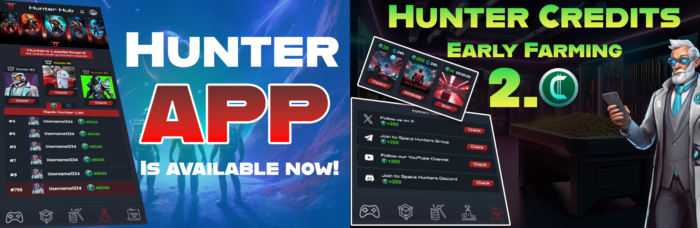

[Back to Index](../../../index.md)
# Hunter Credits ($HCREDIT)
## **Index**
- [About $HCREDIT](#about-hcredit)
- [Claim Process](#claim-process)
- [Wallet and Username](#wallet-and-username)
- [Utility](#utility)
- [Supply, Distribution, and Burn](#supply-distribution-and-burn)
- [How to Earn $HCREDIT Daily](#how-to-earn-hcredit-daily)
- [Daily Login](#daily-login)
- [Refer Friends](#refer-friends)
- [Tasks](#tasks)
- [Space Hunters in Your Telegram Name](#space-hunters-in-your-telegram-name)
- [Chat-to-Earn](#chat-to-earn)
- [Buy $HCREDIT with $HCASH](#buy-hcredit-with-hcash)
---
## **About $HCREDIT** 
$HCREDIT is an **off-chain** reward token based on the mass adoption model. It can only be obtained through social events, tasks in the **HUB App**, collaborative activities, and rarely in the game store for new users or in limited quantities. 
This token is not exchangeable on any exchange and can only be used within the **Hunter** ecosystem to mine the main token **$HCASH** through the various games in our ecosystem.
It is an innovative rewards system that turns your participation into a valuable tool for generating income. We continue to innovate and add more use cases and ways to interact with the token and the ecosystem.

[🔼 Back to Top](#index)

---
## **Claim Process** 
$HCREDIT is sent directly to your in-game account. If a user earns tokens in an event and is not part of the ecosystem at the time of token distribution, the reward will not be distributed and will be automatically burned. 
There is always a deadline for this process, along with an announcement detailing the steps to follow.

[🔼 Back to Top](#index)

---
## **Wallet and Username** 
Your **Telegram** username and your "Nick" in our **HUB App** serve as your wallet address in our ecosystem. Your **nick name** is set the first time you open the app.

[🔼 Back to Top](#index)

---
## **Utility** 
The main utility of $HCREDIT is to use it while playing and mining the primary token **$HCASH** consistently. It also allows you to monetize your social support, content creation, and effort across many social networks.
### **Future Plans and Current Uses**
- **Special Rewards**: Exclusive items for active players.
- **Unique Rewards**: Rare or time-limited items.
- **Time-Limited Rewards**: Obtain items only during special events.
- **Technology: Generators**: Buy generators, hire engineers, upgrade your technology, and improve engineer skills.
These are just a few examples of the many uses we have planned for $HCREDIT. We will continue to innovate, so don’t limit yourself to the current uses!

[🔼 Back to Top](#index)

---
## **Supply, Distribution, and Burn** 
$HCREDIT is based on the mass adoption model with a perfect deflationary system:
- **Total Supply**: Unlimited.
- **Supply Allocation**: 100% Rewards for the Community.
- **Burn Mechanism**:
  - Every token spent is burned.
  - $HCREDIT is not a retention token; after a 30-day period, all tokens are burned, resetting the $HCREDIT economy every 30 days.
When $HCREDIT is distributed via **airdrop** or system activities, and a member does not have a game account at the time of distribution, the tokens are burned and cannot be claimed or refunded. We always announce deadlines, so it is the member's responsibility to stay informed or seek help before the deadline.

[🔼 Back to Top](#index)

---
## **How to Earn $HCREDIT Daily** 
$HCREDIT can be earned in the following ways:
- **TechPass**: Purchase the monthly pass to receive various rewards and benefits, including doubling your $HCREDIT earnings.
- **Hold $HCASH**: We will soon launch an innovative **Staking** system with $HCASH tokens to earn more $HCREDIT and interest in $HCASH, making it a mixed-reward model.
- **Achievements**: Completing achievements may grant rewards, some of which include $HCREDIT. (Note: Not all achievements provide $HCREDIT).
- **Interactions with the Project or Partners**: Participate in selected events and activities to earn rewards.
- **Daily Tasks**: Complete tasks in the daily section, i.e., tasks you can complete every day to earn free tokens for playing.
- **Social Tasks**: Complete tasks in the social section. These are one-time tasks where supporting the project benefits everyone, and you also earn rewards for your support.
> **Note**: Currently, by being active with daily tasks, you can earn over **150,000 $HCREDIT** per month with **Tech Pass**.

[🔼 Back to Top](#index)

---
## **Daily Login** 
Earn $HCREDIT through daily logins and multiply your daily reward over a 28-day cycle. This means:
- **Day 1**: You will earn **100 $HCREDIT**.
- **Day 2 onwards**: The consistency effect begins, allowing you to generate over **4,000 $HCREDIT** in a month with just 1 click per day.
> **Important**: If you miss a day, the cycle resets.

[🔼 Back to Top](#index)

---
## **Refer Friends** 
- **1,000 $HCREDIT** for your friend and **500 $HCREDIT** for you.
- Additionally, you will earn **4 $HCREDIT** each day when your friends register, and **1 $HCREDIT** each day if your friends refer others who register.

[🔼 Back to Top](#index)

---
## **Tasks** 
- **Social Tasks**: Complete social tasks to earn $HCREDIT. The amount varies depending on the event.
- **Limited Daily Tasks**: Complete limited tasks that reset daily to maximize your earnings.

[🔼 Back to Top](#index)

---
## **Space Hunters in Your Telegram Name** 
This program is called **Name the Fav**. Members who add "SpaceHunters", "Space Hunters", "Space Hunter", or "SpaceHunter" to their Telegram name will be rewarded daily, with increasing rewards over a 28-day cycle:
- **Scaled Payout**:
  - Day 1: **20 $HCREDIT**.
  - Day 28: **260 $HCREDIT**.
  - **Total**: **2,500 $HCREDIT** paid.
> **Note**: If you have Tech Pass, you earn double.
We plan to add more features to this program in the future.

[🔼 Back to Top](#index)

---
## **Chat-to-Earn** 
**Farming While Chatting**: This concept has evolved into a system driven by **Chat Hashrate**, which automatically assigns a power rate to your words, determining how powerful they are, and pays you based on the combination of different linked ambassador chats and official groups.
In short, earn additional tokens just by chatting. Do not attempt to cheat the system; it is designed to be fair and detect exploitation attempts. Intentional abuse attempts may result in your permanent inclusion on a blacklist for this program.

[🔼 Back to Top](#index)

---
## **Buy $HCREDIT with $HCASH** 
You can buy $HCREDIT with $HCASH. The exchange rate is subject to fluctuations and is only focused on helping you obtain additional tokens to complete your balance for specific activities before the economy resets.
> **Note**: This functionality is not yet available.

[Back to Index](../../../index.md)

---
---

