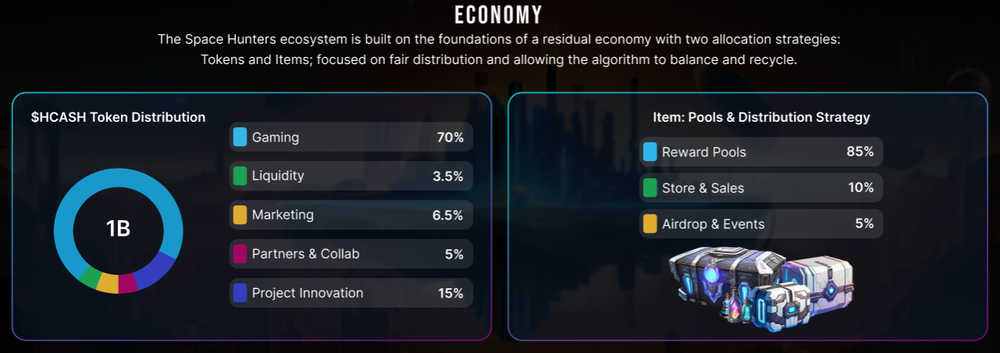
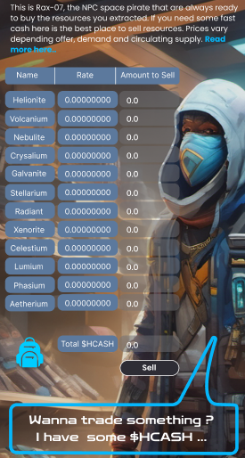
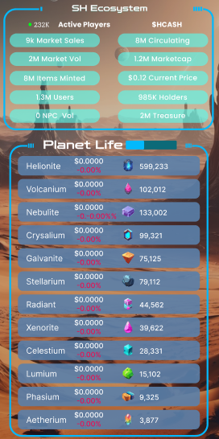

[Back to Index](../../../index.md)
# Space Hunters Whitepaper

> ### This Whitepaper is only for Space Hunters Game, other games have his own
- [🔘 Problems resolved by Space Hunters](#problems-resolved-by-space-hunters)
- [🔘 **Tokenomics**](#tokenomics)
  - [What is Hunter Cash ($HCASH)?](#what-is-hunter-cash-hcash)
  - [Total Supply & Scarcity](#total-supply--scarcity)
  - [Token Distribution](#token-distribution)
  - [Gaming Allocation Distribution](#how-is-the-gaming-allocation-distributed)
  - [$HCASH Launch Price](#what-is-the-hcash-launch-price)
  - [Economy Flow Graphic](#economy-flow-graphic)
  - [Where will $HCASH be released?](#where-will-hcash-be-minted)
- [🔘 **Space Hunters Ecosystem**](#ecosystem)
  - [Concept: Shared Experience](#shared-experience)
  - [HGE Flow ( Hunter Gaming Ecosystem)](#hge-flow)
  - [HGE Inflow Strategy](#hge-inflow-strategy)
  - [HGE Outflow Strategy](#hge-outflow-strategy)
  - [Withdrawal](#withdrawal)
- [🔘 **Marketplace & Fees**](#market-and-fees)
    - [Listings](#market-listing-fee)
    - [Sales](#market-sales-fee)
    - [Auctions](#auction-fees)
    - [NPC Market](#npc-market)
- [🔘 **Real Time Market**](#real-time-market-data)
    - [Circulating Supply](#circulating-supply-data)
    - [Offer & Demand](#offer--demand)
    - [NPC Rates](#npc-market)
    - [Marketplace](#marketplace)
    - [Anti Price Drop System](#anti-price-drop-system)
    - [Floor-Rule](#floor-rule)
- [🔘**Game Play**](#)
    - [Basic Missions](#basic-missions)
       - [How missions works](#how-missions-work)
       - [Player Level](#player-level)
       - [Energy](#energy)
       - [Luck](#luck)
       - [Influence Points](#influence)
       - [Training Points](#training)
       - [Courage Factor](#courage)
       - [Task Multiplier](#task-multiplier)
       - [Mercenaries](#mercenaries)
       - [Experience Potions](#experience-potions)
       - [Energy Batteries](#energy-battery)
       - [Energy Box](#energy-box)
       - [Energy Core](#energy-core)
       - [Reward System](#rewards)     
    - [🔘 **Excavation**](#excavation)
       - [What is Excavation about?](#what-is-excavation-mode-all-about) 
       - [What Resources can be excavated ?](#what-resources-can-be-excavated) 
       - [What can i do with the resources?](#what-can-i-do-with-the-resources) 
       - [How does excavation works?](#how-does-excavation-work) 
       - [Tools & Avatards Statistics S1](#tools-and-avatars-statistics-for-season-one) 
         - [Tools Statistic S1](#tools)
         - [Avatars Statistic S1](#avatars) 
    - [🔘 Crafting](#crafting)
    - [🔘 **Achievements**](#list-of-achievements)
       - [Missions](#missions-achievements)
       - [Limited](#limited-achievements)
       - [Referrals](#referral-achievements)
       - [Training](#training-achievements)
       - [Stats](#stats-achievements)
       - [Collector](#collector-achievements)
       - [Bonus](#missions-achievements)
       - [Boost](#boost-achievements)

    - 🔘 **Hunting Beasts** (Soon)
    - 🔘 **Exploration** (Soon)
---
[Scroll Up](#)
> # **Problems Resolved by Space Hunters**

- **Unsustainable Economies in Blockchain Games**

Many blockchain games struggle with maintaining a sustainable economy. Tokens are often over-minted or distributed too freely, leading to inflation, reduced value, and player dissatisfaction. **Space Hunters** addresses this by implementing a carefully balanced tokenomics system that controls the supply of tokens and assets, ensuring long-term economic stability.

- **Barrier to Entry**

Traditional blockchain games often require significant upfront investments or purchasing of NFTs, which can deter new players. **Space Hunters** eliminates this barrier by being free-to-play, offering players a way to start without initial costs, making the game accessible to a broader audience.

- **Inadequate Utility of Game Assets**

In many games, assets or tokens have limited utility, leading to a lack of engagement once players have acquired them. **Space Hunters** introduces versatile assets with multiple uses across different game modes, ensuring that assets remain valuable and engaging throughout the game.

- **Imbalance Between Playability and Profitability**

Some games focus too heavily on the financial aspects, which can detract from the gameplay experience. **Space Hunters** balances profitability with fun and diverse gameplay, ensuring that players are rewarded without compromising the enjoyment of the game.

[Scroll Up](#)
> # Tokenomics

Token economy in the gaming sector, especially Web3, has been a challenging aspect for every project team aiming to create a long-lasting strategy for their project’s life cycle.

## What is Hunter Cash ($HCASH)?

Usually, game tokens are identified with the project name or something similar. But what if we do it differently? That's where the fun idea came in: to name our game currency after what everyone is looking for—cash! Let's be honest, we all like to cash out good earnings, right? That's why we decided, if we are creating an entire ecosystem or "metaverse," why not call it **Hunter Cash ($HCASH)**? It’s something beautiful and out of the ordinary.

## Reward Block
The daily allocation is combined with the game algorithm, giving players the ability to be the only ones who can mine and extract the $HCASH token. Similar to blockchain reward blocks like $ETH in the past, where 2 $ETH per block was distributed among miners based on their hashrate, **Space Hunters** works as your mining pool. All players meet to extract tokens by playing the game. The more you grow and participate in different game modes strategically, the more chances you have to mine a portion of the allocation.

But don’t get confused, this is not a Play-to-Airdrop model. Here, you will earn tokens as soon as your tasks or activities are completed. The algorithm will handle the rest, calculating and balancing every millisecond to maintain synchrony with our 10-year plan.

[Scroll Up](#)

## Total Supply & Scarcity 

Supply is an important factor to consider carefully. Speculations are good, but a short supply doesn’t necessarily mean the price will skyrocket, and a high supply doesn’t mean failure. It’s all about strategy.

The total supply of **$HCASH** is **1 billion** (1B), with a mining strategy that allocates and vests it over time, similar to any well-known mining pool that uses a block system. 

The supply is strategically planned for **10+ years** of gaming development and experience. To avoid inflation, our system ensures that no more than the monthly allocation is "mined" by players. The circulating supply will be the key number to focus on, as nobody will own more than what is currently rewarded.

### Token Distribution
We are focused on the gaming sector, so a large percentage is allocated to gaming rewards. We distributed it according to long-term planning, with the team renouncing any allocated $HCASH.

- **Game Modes**: 70%
- **Marketing Strategy**: 6.5%
- **Token Pools Liquidity**: 3.5%
- **Ecosystem Innovation**: 15%
- **Partners & Strategic Investors**: 5%

[Scroll Up](#)
### Why is Pools Liquidity 3.5%?
We believe a **fair launch** is closest to the concept we are striving for. The 3.5% liquidity is a perfect number to synchronize the fixed allocation rate with community demand. As $HCASH is being mined by players, pools will automatically adjust based on supply and demand. Holders and participants will then decide the price’s trajectory based on utility and other factors.

## How is the Gaming Allocation Distributed?
The supply allocated for gaming rewards is distributed among both released and upcoming game modes with prior planning. Each game mode will be backed by a **10-year allocation**.

## Daily Allocation
Tokens are pre-calculates to be Allocated and extracted by gamers. Rewards are calculated based on the gamers participation, in short, it works like shares, more powerful the player ir more shares it will earn, plus additional rewards by meeting different criteria depending the game is playing and other requirments or by owning a special pass like HunterPass, Earlypass, SpyPass etc... 

## What is the Innovation Strategy?
We have big plans and a broad vision. As technology and trends evolve, we aim to keep a portion of $HCASH to adapt to changes and create new products that support our planned strategy and released products.

## What is the $HCASH Launch Price?
At the moment, this information is under evaluation. While speculation exists, the final value will be shared as soon as possible. We are mindful of both the **Community** and **Project Life**, ensuring we provide an option that benefits everyone.

## Where will $HCASH Be Minted?
We have selected a few blockchains as candidates. The final decision will be made after consulting with our partners to find the best fit for community satisfaction and project efficiency. The community may participate in this step, as we always value their input.

## Will the Project Release Other Tokens?
There are plans for secondary currency releases in the future. Although not immediately, we intend to launch a secondary currency that will directly and indirectly support the main project currency. For now, all utilities are focused on $HCASH.

## Economy Flow Graphic
Here is a graphic that helps illustrate the economy flow:

>  # **Ecosystem**
[Scroll Up](#)

HGE is based on the idea of creating a place where gamers meet and interact by playing, exchanging different assets, and sharing experiences or services fully focused on GameFi.

## HGE: Hunters Gaming Ecosystem

There are a few pillars that will form the foundation of everything in the future. We can say *Space Hunters: The Reborn* game is the seed of the economy. The combination of different algorithms, gameplay, player activities, fixed daily allocations, and residual flow simulates what Crypto Token mining can be: having fun while earning.

Thus, we can affirm that **$HCASH** is mined by gamers and Blockchain tech enthusiasts alike.

## Shared Experience

**Shared Experience** is the concept we've created for a system that uses a single personal profile (app) linked to all the games. Your progress in each game is reported directly to your gamer profile. For example, if you reach level 20 as a player in the ecosystem, that same profile reflects your progress across all our games. In some cases, this provides advantages, while in others, it may not be very relevant. Regardless, everything you do in each game is recorded in your profile as a card or personal ID that represents you in terms of rank, performance, and other characteristics.

This system also affects your **inventory, pending tasks, ongoing tasks, and more**. You can view your inventory across all games from your gamer profile in a single shared backpack, saving you time and enhancing your experience as a player.

You will be able to see ongoing tasks in the app, along with notifications and other data.

[Scroll Up](#)

 ## HGE Flow

### Introduction to the Concept

The economy flow starts from two pillars: **Outflow** and **Inflow**. Many projects have amazing designs and ideas, but one detail that causes GameFi projects to fail is poor economy flow management.

It’s easy to give game tokens for various activities, but the main challenge is getting those tokens back while providing benefits, without negatively affecting the economy flow.

### HGE Outflow Strategy

As explained earlier, the $HCASH mining concept and strategy is the seed of the economy, where players extract the project currency by playing the first released game.

The *Space Hunters* game is designed to reward gamers with $HCASH based on their progress and statistics. Dapps and products released in the future will take tokens from the **Treasure** and allocated supply.

#### Treasure (Short Explanation)

Every game fee and non-distributed token goes directly to the treasure. The treasure is used to reward users participating in tournaments, limited-time events, holders programs, and more.

In short, the outflow is strategically based on rewarding players and participants for engaging with the project. The image below provides a brief example of outflow validation (Proof of Efficiency + Proof of Participation). Both systems work together to provide fast validation, allowing the system to monitor and balance outflow in real-time if needed.

### HGE Inflow Strategy

Inflow strategies are based on the principles of a real economy.

All blockchains have their own transaction fees based on various activities. These fees are part of the economy flow that sustains the project long-term, giving value to the currency and other elements involved.

We mix **Off-chain** and **On-chain** concepts to create benefits for our community while preserving their assets as much as possible. This approach also benefits our project by adding value to the game currency.

## How It Works

All Off-chain transactions take place within our project ecosystem using our own wallet address. Every transaction has a very low fee. You can earn, spend, and pay for transactions using the same balance and currency without any external action or signing with an external wallet, which also enhances security.

The best part is that all fees go directly to the **Treasure**, creating a circulating flow.

The Off-chain fee collection is one of the methods we plan to use in the deflationary system. Below is a simple representation of which fees go directly to the Treasure.

This system may seem complicated at first glance, but it encourages maintaining a cash flow and avoiding unnecessary transactions from accounts like BOTs. While BOTs are allowed (as they don’t affect us), we have implemented automatic precautionary measures, including fees.

## Withdrawal

*Space Hunters* is designed as a Free-To-Play game that also allows users to create multiple accounts or participate in scholarships. To maintain balance, we’ve established the following rule for withdrawals:

Players can withdraw their balance after reaching level 15.

The withdrawal fee decreases over time (11 days), and the countdown starts once the player reaches level 15 or after every withdrawal.

### Withdrawal Fee Structure:

- **First 4 days:** 5% fee
- **Next 4 days:** 4% fee
- **Next 3 days:** 3% fee
- **After 11 days:** Fee is fixed at a 2% rate

> **NOTE:** This is only for our game **Space Hunters: The Reborn**, other games like **Tech: Generators** have different rules, read the respective game guide to get informed.

This is a simple strategy designed in sync with the broader economic plan. It adds value to holders, supports the in-game economy, and encourages players to proceed with strategic planning.

>  # **Market and Fees**
[Scroll Up](#)

**Transfer fees** and **withdrawal fees** are set up with the same ideology in mind. Sometimes, people make unnecessary transactions, but these transactions generate cash flow that enriches the Treasure funds. These funds are later redistributed to the community in various ways. This is a true win-win situation: adding value to everything involved, fostering deflation, and providing more rewards without minting more tokens.

Players who want to use multiple accounts are allowed to do so. However, if they try to exploit the system by transferring advanced items between accounts to replay and repeat processes, fees will apply. You can transfer and create multiple accounts, but all actions incur fees.

## Market Listing Fee

We are committed to protecting players' and collectors' assets from cheaters, exploits, and other negative actions that can damage the market, asset value, and the team's efforts to deliver a great product.

When users want to list an item, a small fee will be charged. If the player genuinely intends to sell the item, this fee is minimal compared to the protection it provides for the asset’s value. This is called **Anti-Price-Drop (APD)**. APD is a security measure designed to prevent price drops caused by unnecessary competition, BOTs intentionally lowering prices, and other harmful actions by negative players.

The more a user lists, removes, and relists an item, the more fees they will continuously pay. This strategy aims to discourage negative behaviors by depleting the user’s funds if they attempt to exploit the system.

It's simple: list your item when you are truly ready to sell it. There are no double fees; the fee is split into a small portion to prevent listing abuse, with the rest applied when the sale is made.

## Fee Rates

The listing fee rate is based on the size of the data involved. Over time, as more tokens are mined by gamers, this fee will stabilize.

## Market Sales Fee

The sales fee is only calculated after the item is sold. This fee is 2.5% of the sale and is sent directly to the **Treasure**.

## Auction Fees

Auction fees operate similarly to the listing and sales fees.

## NPC Market

This is Rax-07, the NPC space pirate who is always ready to buy the resources you extract. If you need some fast cash, this is the best place to sell your resources. Prices vary depending on supply and demand.

Every time players trade or excavate resources, the supply changes. When resources are excavated, the supply increases, and when they are sold to Rax-07 (NPC), they are burned. This simple mechanism effectively balances supply and demand, allowing players the opportunity to buy and sell resources for extra income or to use them to create new game assets in the Crafting Room. 

You can sell resources in the marketplace by setting your own price per unit, and we ensure that the prices are backed by the NPC offer as a price wall. This means that it will be difficult to intentionally dump resources because if players try to sell under the NPC price, it opens a resale/flip opportunity for others.

The algorithm behind this method is a smart one: you just follow the price and sell at the best rate. The daily rates change based on factors that we cannot disclose to avoid exploitation.

> Here a screenshot

[Scroll Up](#)
> # Real-Time Market Data

Our real-time marketplace updates information at very short intervals to keep players informed about economic changes in our ecosystem.

### **Circulating Supply Data**

This system calculates in real-time the amount of resources in circulation, and this information is used by other algorithms and displayed on the dashboard. This information is important; it saves players time and helps them select a strategy. Resources are constantly being mined while being burned through use, such as crafting or selling them to NPCs in exchange for $HCASH. The increase and decrease in the supply of resources impact the ecosystem in different ways. The main purpose of mining is the perfect allocation of $HCASH tokens for a better-functioning ecosystem.

### **Offer & Demand**

Resource prices are constantly changing, depending on supply and demand. Our system shows you minimalistic graphs of the price variation in real-time as well as the supply in circulation (as mentioned above). In addition to being beneficial for the project ecosystem, players can form strategies with this information, waiting for the best moment to trade or knowing the current value of their holdings to plan their next move in terms of personal economy.

In the future, we will include more detailed graphics, like the price history at which an item has been sold and resources Bid/Ask features.

### **NPC Rates**

The price ratio offered by NPCs for resources varies based on factors we prefer to keep secret to prevent abuse of the system by cheating players. Essentially, the price ratio concept is based on the activity of the economic flow and the activity of the players, taking into account that more players means more stability and an average ratio in the long term.

### **Marketplace**

In the in-game market, we offer auctions by players and the system (the creators). We also provide access to the history of items sold and the ability to sell/buy as well as send offers to other players.

### **Anti-Price Drop System**

Read about this in our Market & Fees section, find it here : [Anti-Price Drop ](#market-and-fees)

### **Floor Rule**

We have created a simple but important and helpful rule. It is based on the idea of preventing the intentional drop in the price of items, for the sake of the economy and to protect the value of the possessions of players and/or investors. This rule limits the price selection to a threshold below the minimum average price at which an item has been defined and sold on the market; it is not complex to understand. Competitiveness cannot be confused with desperation. Poor management by a user can harm the work and effort of many users; for this reason, several simple but strategic rules apply. This rule is combined with the other strategies we have implemented in the economy, such as the Listing Fee, and together they create a more serious and considerate flow on the part of players in general.

We have created many ways to monetize your progress, and we expect fair play in return.

> Here a pic

[Scroll Up](#)

> # Basic Missions

This game mode helps new players start testing the game in a free-to-play (F2P) format. As a player, you will be able to scale up by completing basic missions and earning experience before progressing to other game modes.

## Key Details

### Player Level
Your profile will level up as you earn experience, and many features will require a specific minimum level.

## Energy

Players start with 100/100 energy points, which are required to keep playing. The energy bar recovers 1 point every 10 minutes or by using boosts. Luck points also help—players can earn one-time boosts by completing missions, which can be instantly applied or stored if the player owns an Energy Box. Players can trade items that provide energy boosts or buy them from the game store (limited).

## Luck
Each time players complete tasks or missions, the RNG system calculates their luck and grants rewards if applicable. Some rewards are free, while others are Proof of Participation (PoP). Luck points can also be used to mint new assets that are exclusive to this game mode and depend on the luck factor.

## Influence
Represents your influence as a captain. More influence means more opportunities, rewards, access to other game modes, challenging missions, and new items. The more influence you have, the greater your share of rewards in missions.

## Training
Players must maintain training to avoid mission failures. As you gain more influence, you may earn less if you neglect training. Make sure your training points are not too far behind your influence points. Think of training points as a way to balance captains who focus solely on increasing influence without investing in their troops.

## Courage
This additional factor affects some tasks and missions. Captains who ignore training and continuously complete tasks may see a negative impact on reward calculations. When you notice this stat increasing, stop being greedy and train your squad. You can also lower this stat by recruiting more troops, investing in weapons, or minting new assets that provide additional training points.

## Task Multiplier
Each task has an internal multiplier. The more times a player completes the same mission, the more difficult it becomes. The counter resets every 24 hours. Repeating the same task too often increases difficulty and reduces rewards. We recommend balancing different daily tasks to avoid negatively impacting your earnings. Use your time and energy strategically.

## Mercenaries
Temporary troops that follow you randomly during gameplay. Mercenaries can be found by completing basic missions and will stay with your squad for 6-12 hours, temporarily boosting your influence points. The number of mercenaries depends on your luck and influence.

## Experience Potions
This consumable boosts the experience you earn. Multipliers vary depending on which pill you consume. These items are limited daily in the game store and their availability is based on current player activity, always between 10-30% of active players, depending on item rarity.

## Energy Battery
There are two types of batteries available in Missions mode during the first game season:
- **Mini-Battery:** Refills 15 energy points instantly with a 40% drop chance. Cannot be stored.
- **Battery 🔋:** Fully refills your energy with a 12.48% drop chance. Can be stored if you own an Energy Box. Each Energy Box can store 1 Battery 🔋, and you can apply it by clicking "Use." If your Energy Box is full, the battery will be automatically applied.

## Energy Box
This box has the capacity to store one powerful energy battery, allowing you to fully refill your energy points once. If you find a battery and the box is empty, it will be automatically stored. If the box is full, the battery will be automatically used to refill your energy points. You can own as many boxes as you want; more boxes mean more energy can be stored, allowing you to play continuously for longer periods.

[Scroll Up](#)

## Energy Core
This item fully recharges your energy once every 24 hours. It can be activated at will and you can have more than one. If you activate the Energy Core at maximum energy, the energy does not stack, you can only have 100 maximum energy, so you would be wasting its use unnecessarily.

### Rewards
Every mission rewards players with experience, mercenaries, and game items based on seasonal rewards and limited events. Players accumulate mission points, which are converted into game tokens every hour. Some items are exclusive to the Basic Missions mode, and may be time-limited or based on specific events.

Players only receive experience to level up by completing missions in this mode, with some exceptions like achievements or consumable items.

### NFT Pools (Season One)
Avatar drop chances from Basic Missions:
- **Common:** 5% (6 different common avatars)
- **Rare:** 2% (6 different rare avatars)
- **Epic:** 0.8% (6 different epic avatars)
- **Legendary:** 0.16% (4 different legendary avatars)
- **Mythic:** 0.04% (2 different mythic avatars)

[Scroll Up](#)

> ## How Missions Work
Complete missions to level up, earn M.Points that convert to $HCASH hourly, and unlock items. Factors such as influence and training points affect your rewards, while luck points allow you to discover items.

Each mission has specific requirements like level and influence. Red numbers show what is needed to start the mission, and green numbers show what will be added to your stats, such as experience, courage, and M.Points.

After clicking "START," the cooldown begins, and energy points are deducted. Remember, you can only perform one task at a time, so choose carefully.

## Icons Reference
To understand the icons in the Missions game mode, please read here (soon)

**
> # Excavation

The **Excavation** game mode is focused on finding resources that form the base of the entire game. After reaching the required level by completing missions, players will unlock the **Excavation** game mode.

**NOTE:** To unlock the ability to find the 12 different resources, players must reach the level determined by the current season or update. This level requirement may vary depending on several factors but will always be fair for genuine players and aim to prevent cheating.

## What is Excavation Mode all about?

In this mode, you can use the necessary tools and avatars to find resources that are classified by type, rarity, probability, and other factors such as extraction difficulty. These resources form the foundation of everything in the game and are used to craft new technologies and trade with other players or NPCs.

## What Resources can be Excavated?

| Resource Name | Chance %  |
| ------------- | --------- |
| Scrap         | 11.3%     |
| Helionite     | 19%       |
| Volcanium     | 16.7%     |
| Nebulite      | 13.5%     |
| Crysalium     | 11%       |
| Galvanite     | 9%        |
| Stellarium    | 7%        |
| Radiant       | 4.9%      |
| Xenorite      | 3.5%      |
| Celestium     | 2.1%      |
| Lumium        | 1%        |
| Phasium       | 0.8%      |
| Aetherium     | 0.2%      |

## What Can I Do with the Resources?

As mentioned above, the resources are the foundation for crafting, building structures, making repairs, and more. However, if you, as an excavator, prefer not to become a craftsman and just want to be paid for completing the job, you can directly sell the resources in the marketplace or to NPCs.

[Scroll Up](#)

## How Does Excavation Work?

Each resource represents a unique item (fantasy items not tied to reality) with a drop chance, meaning that each time you excavate, the resources you find may vary depending on your avatar’s tools and stats. The lower the drop probability, the more difficult it is to excavate the resource. At the same time, its base cost and circulating supply will be exceptional compared to other resources.

The strategy revolves around the combination of tools and avatars. Each excavation attempt costs 15 energy points.

Players will receive resources when the excavation is completed. However, depending on luck, sometimes you will find special items instead of resources. These items are exclusively farmed in this game mode and cannot be found in any other game mode.

[Scroll Up](#)

## Tools and Avatars Statistics for Season One

### Tools:

- **Cooldown:** The individual time that measures the waiting period before the tool can be used again.
- **Base Luck:** A value representing the luck used to calculate drop chances.
- **PoE (Proof of Efficiency):** Measures extraction power. It is calculated both individually and globally among all players excavating at the same time to provide accurate reward results and rebalance resources from a planet or region where players are excavating.

### Avatars:

Avatars function as multipliers for:

- **Cooldown**, **Luck**, and **PoE**. These multipliers apply to the base values of the player’s tools. For example, if your tools have a total of 3 luck points and your avatar’s multiplier is 2, your final base luck becomes 6.

- **Base Influence** and **Base Training Points** are used primarily in the missions game mode. Visit the [Basic Missions](#basic-missions) section to learn more about the concepts of influence, training, and avatar drop chances.

[Scroll Up](#)

> # Crafting

One of the main ways to burn assets, create new ones, and improve them.

All players who reach the required level will unlock the ability to craft new assets that enhance your experience by increasing statistics and/or earnings.

Use this **Crafting Room** to create new items. Each recipe requires different resources and provides you with more stats, making you more powerful. Some items are limited by time, supply, or number of uses.

In this **Crafting Room**, you will find all the information you need. By selecting a recipe, the details will appear on the right side. The **Craft** button will become available if you have all the required resources. If not, the button will remain grayed out.

[Scroll Up](#)

> # List of Achievements

**Secret achievements and events and limited-time achievements are not included; these will be announced and discovered by playing. More achievements will be added in next updates.**

## Missions Achievements

| Quest Name                | Requirement                          | Reward                       |
|---------------------------|--------------------------------------|------------------------------|
| Basic Mastery             | 10 Simple Tasks                     | 100 EXP                      |
| Beast Hunter              | 10 Hunting Beasts Missions          | 200 EXP                      |
| Night Guardian            | 10 Security Overnight missions       | 500 EXP                      |
| Relentless Achiever       | 10 Unstoppable missions              | 900 EXP                      |
| Professional Worker       | 10 Serious Job missions             | 1000 EXP                     |
| Daily Conqueror          | 10 Another Day missions             | 1300 EXP                     |
| High-Stakes Player       | 10 Risky Job missions               | 2300 EXP                     |
| Task Veteran              | 50 Simple Tasks                     | 200 EXP                      |
| Expert Beast Hunter       | 50 Hunting Beasts Missions          | 400 EXP                      |
| Overnight Defender         | 50 Security Overnight missions       | 1000 EXP                     |
| Unstoppable Force         | 50 Unstoppable missions              | 1800 EXP                     |
| Job Specialist            | 50 Serious Job missions             | 2000 EXP                     |
| Daily Master              | 50 Another Day missions             | 2600 EXP                     |
| High-Stakes Expert        | 50 Risky Job missions               | 4600 EXP                     |
| Task Legend               | 100 Simple Tasks                    | 1000 EXP, 200 Influence      |
| Beast Master              | 100 Hunting Beasts Missions         | 1000 EXP, 100 Influence, Luck +1 |
| Guardian Commander        | 100 Security Overnight missions      | 1000 EXP, 200 Influence, Luck +2 |
| Relentless Champion       | 100 Unstoppable missions             | 1000 EXP, 300 Influence, Luck +2 |
| Job Master                | 100 Serious Job missions            | 1000 EXP, 400 Influence, Luck +2 |
| Daily Conqueror Supreme   | 100 Another Day missions            | 1000 EXP, 400 Influence, Luck +2 |
| Risk-Taker Extraordinaire  | 100 Risky Job missions             | 1000 EXP, 500 Influence, Luck +2 |

[Scroll Up](#)
## Limited Achievements

| Quest Name                | Requirement                          | Reward                       |
|---------------------------|--------------------------------------|------------------------------|
| First Steps I            | Reach level 5                        | 5 Influence                  |
| First Steps II           | Be among the first 10,000 players to reach level 10 | 15 Influence         |
| First Steps III          | Be among the first 10,000 players to reach level 20 | 20 Influence         |
| First Steps IV           | Be among the first 10,000 players to reach level 30 | 100 Influence, 2 Training Points |
| Medal of Honor I         | Be among the first 1,000 players to reach level 40 | 5 Luck Points, 300 Influence, 10 Training Points |
| Medal of Honor II        | Be among the first 500 players to reach level 50 | 10 Luck Points, 500 Influence, 15 Training Points |
| Medal of Honor III       | Be among the first 250 players to reach level 100 | 20 Luck Points, 1500 Influence, 25 Training Points |
| Medal of Glory           | Be among the first 100 players to reach level 200 | 50 Luck Points, 5000 Influence, 100 Training Points |

## Referral Achievements

[Scroll Up](#)

**Backed by 5M $HCASH Capital**  
*(Stop after 5M cap reached)*

| Quest Name                | Requirement                          | Reward                       |
|---------------------------|--------------------------------------|------------------------------|
| Friendly Rookie I         | 1 Friend reached level 10            | $HCASH 1, 15 Mercenaries, 1 Energy Cask |
| Friendly Rookie II        | 3 Friends reached level 10           | $HCASH 3, 50 Mercenaries     |
| Friendly Rookie III       | 9 Friends reached level 10           | $HCASH 6, 50 Mercenaries, Luck +1, 1 Energy Cask |
| Friendly Rookie IV        | 14 Friends reached level 10          | $HCASH 10, 25 Mercenaries, Luck +1 |
| Friendly Rookie V         | 49 Friends reached level 10          | $HCASH 30, 10 Mercenaries, Luck +1, 1 Energy Box |

## Training Achievements

| Quest Name                | Requirement                          | Statistics                   |
|---------------------------|--------------------------------------|------------------------------|
| Training Novice           | Complete 10 Trainings                | 100 EXP, 1 Training Points    |
| Training Apprentice       | Complete 50 Trainings                | 200 EXP, 10 Training Points   |
| Training Adept            | Complete 100 Trainings               | 500 EXP, 20 Training Points   |
| Training Expert           | Complete 500 Trainings               | 1000 EXP, 100 Training Points, Luck +2 |
| Training Master           | Complete 1000 Trainings              | 2000 EXP, 200 Training Points, Energy Box |
| Training Legend           | Complete 5000 Trainings              | 2000 EXP, 500 Training Points, Energy Core |

[Scroll Up](#)

## Stats Achievements

| Quest Name                | Requirement                          | Reward                       |
|---------------------------|--------------------------------------|------------------------------|
| Influential Beginner      | Reach 10 Influence points            | 100 EXP                      |
| Rising Influencer         | Reach 50 Influence points            | 200 EXP                      |
| Notable Figure            | Reach 100 Influence points           | 300 EXP                      |
| Respected Leader          | Reach 200 Influence points           | 500 EXP                      |
| Prominent Authority       | Reach 500 Influence points           | 500 EXP                      |
| Power Player              | Reach 1000 Influence points          | 700 EXP                      |
| Elite Influencer          | Reach 2000 Influence points          | 700 EXP                      |
| Influential Titan         | Reach 5000 Influence points          | 1000 EXP                     |
| Supreme Influencer        | Reach 10,000 Influence points        | 2000 EXP                     |
| Legendary Influencer      | Reach 50,000 Influence points        | 5000 EXP                     |
| Influence Master          | Reach 100,000 Influence points       | 5000 EXP                     |

[Scroll Up](#)

## Collector Achievements

| Quest Name                | Requirement                          | Reward                       |
|---------------------------|--------------------------------------|------------------------------|
| Common Collector           | Complete a common equipment set (4 pieces) | 5 Training points    |
| Rare Gatherer             | Complete a rare equipment set (4 pieces) | 15 Training Points      |
| Epic Seeker               | Complete an epic equipment set (4 pieces) | 35 Training Points      |
| Legendary Hunter          | Complete a legendary equipment set (4 pieces) | 80 Training Points      |
| Mythic Conqueror          | Complete a mythic equipment set (4 pieces) | 200 Training Points      |
| Common Completionist      | Acquire the 5th common set piece   | 5 Training points            |
| Rare Pursuer              | Acquire the 5th rare set piece     | 10 Training Points           |
| Epic Achiever             | Acquire the 5th epic set piece     | 20 Training Points           |
| Legendary Pursuit         | Acquire the 5th legendary set piece | 60 Training Points           |
| Mythic Aspirant           | Acquire the 5th mythic set piece    | 150 Training Points          |
| Hall of Fame: Guardian    | Collect the 5 pieces of all rarity sets | 500 Training Points, 500 Influence, 10 Luck |

[Scroll Up](#)

## Bonus Achievements

| Quest Name                | Requirement                          | Reward                       |
|---------------------------|--------------------------------------|------------------------------|
| Recruit Scout I           | Contract 10 Recruits                | 1 Recruit                    |
| Recruit Scout II          | Contract 50 Recruits                | 5 Recruits, 1 Influence      |
| Recruit Scout III         | Contract 100 Recruits               | 10 Recruits, 5 Influence     |
| Recruit Scout IV          | Contract 200 Recruits               | 20 Recruits, 5 Influence     |
| Recruit Scout V           | Contract 500 Recruits               | 50 Recruits, 20 Influence    |
| Recruit Scout VI          | Contract 2000 Recruits              | 100 Recruits, 100 Mercenaries, 50 Influence |
| Recruit Scout VII         | Contract 5000 Recruits              | 250 Recruits, 300 Mercenaries, 50 Influence |
| Recruit Scout VIII        | Contract 10,000 Recruits            | 1000 Recruits, 50 Training Points, 100 Influence |

[Scroll Up](#)

## Boost Achievements

| Quest Name                | Requirement                          | Reward                       |
|---------------------------|--------------------------------------|------------------------------|
| Experience Boost I        | Boost your experience for 12h       | 10 EXP                       |
| Experience Boost II       | Boost your experience for 12h 3 times | 50 EXP                     |
| Experience Boost III      | Boost your experience for 24h       | 30 EXP                       |
| Experience Boost IV       | Boost your experience for 24h 5 times | 200 EXP                     |
| Experience Boost V        | Boost your experience for 6 consecutive days | 100 EXP

[Scroll Up](#)

## ✅ Social Media
Follow us on our social media

[Back to Index](../../../index.md)