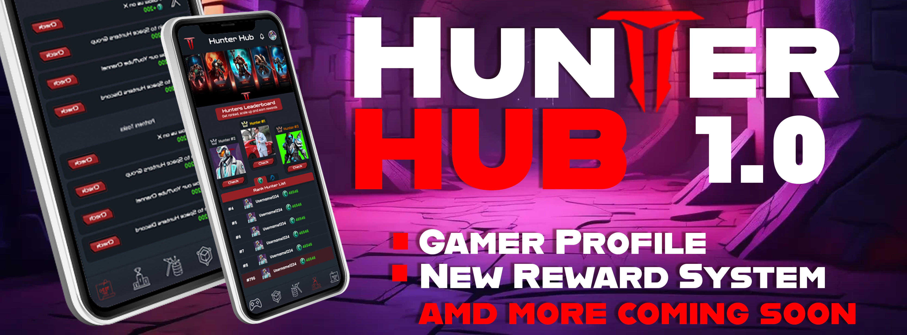

# Project Features

Balanced Token Economy: 
Space Hunters excels in maintaining a balanced token economy, ensuring **long-term stability** and fair rewards for committed players. The combination of **inflationary** and **deflationary** systems keeps the economy in check, providing a sustainable foundation for the game's ecosystem.

 Daily Social & Guild Missions: Engage in daily guild missions to collaborate with fellow players, strategize together, and earn valuable rewards. These missions foster teamwork, camaraderie, and a sense of community within the game, enhancing the overall gaming experience.  Complete social and special tasks to support the proyect and in exchange you will earn more items and tokens which can be obtained only from this kind of unique tasks  and also gives you advantage over the ones which not 

 Blockchain Integration: With blockchain integration, Space Hunters establishes a decentralized economy that empowers players to truly own their in-game assets. This integration enhances transparency, security, and trust within the ecosystem, setting a new standard for player-driven economies in the gaming industry. 

[Back to Index](../../../index.md)

> 🔧This site is still under development. More docs and languages will be available soon.

<a href="https://spacehunters.online" style="text-decoration:none;">
  

    🚀 Play Now!
  

</a>

****

###  Social Networks 

