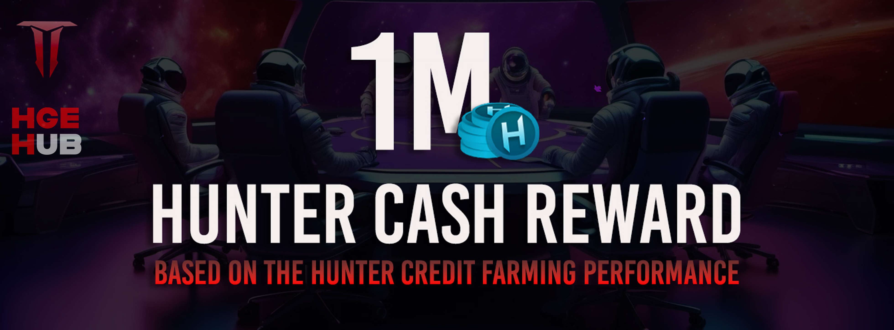

[Back to Index](../../../index.md)
# **Hunter Cash**
## **Index**
- [Economic Model](#economic-model)
- [Total Supply and Distribution](#total-supply-and-distribution)
- [Dual Economy](#dual-economy)
- [Mining and Recycling Model](#mining-and-recycling-model)
- [Key Token Features](#key-token-features)
- [Market and Fees](#market-and-fees)
- [Anti-Price-Drop System](#anti-price-drop-system)
- [Items for Sale](#items-for-sale)
- [Conclusion](#conclusion)
---
## **Economic Model** 
$HCASH is the main currency of the project, designed to foster a sustainable and attractive gaming economy. Below are the key aspects of its tokenomics.

[🔼 Scroll Up](#)

---
## **Total Supply and Distribution** 
### **Total Supply**
- **Fixed at 1 billion tokens**, strategically allocated over a 10-year period to support long-term economic stability.
### **Distribution Breakdown**
- **Game Modes**: 70% allocated to in-game rewards.
- **Marketing Strategy**: 6.5% dedicated to marketing efforts.
- **Token Liquidity Funds**: 3.5% reserved for liquidity funds.
- **Ecosystem Innovation**: 15% reserved for future innovations within the ecosystem.
- **Strategic Partners and Investors**: 5% allocated to strategic partners and investors.

[🔼 Scroll Up](#)

---
## **Dual Economy** 
### **Secondary Token ($HCREDIT)**
- **Description**: $HCREDIT is an auxiliary utility-focused currency that facilitates smoother transactions for frequent or smaller-scale activities within the game.
- **Community Engagement**: Encourages community interaction by rewarding participation, offering players free entry to games, and allowing them to progress and earn $HCASH.
- **Deflationary Model**: Every 30 days, all unused $HCREDIT balances are burned, resetting the secondary economy to prevent oversupply.
- **Recycling**: Fees collected from transactions contribute to currency recycling and periodic burns, preventing inflation and supporting the long-term value of both tokens ($HCASH and $HCREDIT).

[🔼 Scroll Up](#)

---
## **Mining and Recycling Model** 
### **Mint on-Demand**
- The supply of $HCASH is minted as it is mined by players.
- **Maximum Annual Supply**: Up to 9% of the total supply (90 million $HCASH) can be mined each year.
- **Gradual Distribution**: If certain game modes are underutilized or still in development, less than 9% may be mined annually, increasing the scarcity of $HCASH.
- **First Year**: It is expected that less than 30 million $HCASH will be mined, extending the supply and creating a solid economic foundation.
- **After the Tenth Year**: Unminted tokens from the annual supply will become part of the additional cycle after the 10th year, adding to the reserve supply starting from year 11.

[🔼 Scroll Up](#)

---
## **Key Token Features** 
### **Multi-Games**
- $HCASH will be the primary currency in all games within the ecosystem.
### **Auto-Liquidity**
- This token's algorithm includes a 4% auto-liquidity model with each on-chain buy/sell transaction.

[🔼 Scroll Up](#)

---
## **Market and Fees** 
### **Market Listing Fee**
- **First Time Free**: The first time a user lists an item, there is no fee.
- **Edit/Relist**: If the user edits, cancels, or relists the same item, a fee of 1% of the listed price will be charged.
- **Anti-Low-Price (APD)**: This security measure prevents price drops caused by unnecessary competition, bots intentionally lowering prices, and other harmful actions.
### **Market Sales Fees**
- **Sales Fee**: 10% of the sale, sent directly to the Treasury.
### **Black Market (NPC)**
- **Price Ratio**: NPCs offer prices based on factors such as economic activity and player activity.
- **Black Market Fee**: 8%, 2% lower than the regular market.

[🔼 Scroll Up](#)

---
## **Anti-Price-Drop System** 
- **Price Threshold**: Limits price selection to a maximum of 10% below the floor price of the item in the market, or 50% in the case of items sold in the in-game store.
- **Objective**: Prevent intentional price drops of items, protecting the value of players' and investors' assets.

[🔼 Scroll Up](#)

---
## **Items for Sale** 
- When an item is for sale, it is no longer available in the player's inventory and cannot be used in the game until it is removed from the market.
- To withdraw or modify an item, players must access the market and use the corresponding filter.

[🔼 Scroll Up](#)

---
## **Conclusion** 
The economic model of $HCASH is designed to ensure a sustainable, deflationary, and fair economy for all participants in the ecosystem. With features such as the dual model ($HCASH and $HCREDIT), optimized mining system, smart fees, and anti-exploitation measures, this project aims to create a balanced and profitable gaming environment for both casual players and dedicated investors.

[🔼 Scroll Up](#)

[Back to Index](../../../index.md)

---
---

