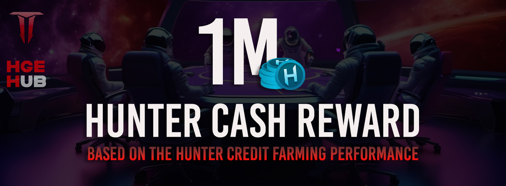

[Return to Index](../00-index.md)

# 🚀Hello Hunters! 👾

Here, and keeping it brief, we present the preliminary details for the distribution of the **1M $HCASH reward pool**, which will be distributed in the 3rd phase of the project before the TGE. This will allow participants to use the rewards to enhance their experience in the project, acquire and upgrade items, expand their profile and statistics, among other uses that will improve both their individual and collective standing in *Play-to-Earn*.

### 👉 Main Details

As mentioned earlier in the first post and banner released on our social networks, the distribution will mainly be based on your performance during this early stage, which is built around the mass adoption token **$HCREDIT**.

### 👉 Factors to Consider

The following metrics will be taken into account preferentially:

- ✅**Total $HCREDIT collected** up to the preliminary date (to be announced).
- ✅**EarlyPass:** Double points for EarlyPass members (not yet launched).
- ✅ **Participation in daily tasks** from our partners (coming soon).
- ✅**Check-ins** completed and streaks (consecutive days).
- ✅**Consecutive days using "Space Hunters" in your Telegram name**.
- ✅**Active generators**: Extra points for keeping your generators running.
- ✅**Engineers contributed**.
- ✅**Reactions and subscriptions** in our news channel (We reward your support!).
- ✅**Total active friends or users referred**.
- ✅**Tasks completed on Zealy**.
- ✅**Registered username in the bot**.
- ✅**Participation in airdrops (NFTs)**.
- ✅**Number of NFTs acquired** by any means.
- ✅**Participation in social activities**.
- ✅**Social tasks completed in the app**.
- ✅**Subscription to our social networks** (APIs will inform us of your subscription date, preventing last-minute sign-ups).

> These metrics are **not ordered** by priority. The points assigned to each will be announced later.

### 💵 Pool Expansion

If the number of users grows before the estimated date set by the team, the **1M $HCASH pool** will be increased proportionally, always maintaining the planned economy to ensure a healthy and long-term experience. All of this is adjusted to the pre-planned launch price of our token **$HCASH**.

### 👉 Important Information 👈

This announcement **will not be repeated**, so pay attention! You can find this message quickly from the *Guide* in our App: tap your user profile and select *Blog*. If the app is not available when you read this announcement, simply go to the BOT and tap the blue button that says "Guide" at the bottom left.

We hope you have a great week. Be active, support each other, and the results will come! Thank you for your cooperation and social support.

🚀**Space Hunters Team**🚀

## ✅ Our Whitepaper
For more detailed information about the entire project, you can read our [documentation](https://spaceheroes.gitbook.io/space-hunters).

## ✅ Social Media
Follow us on our social media

[Back to Index](../../../index.md)
