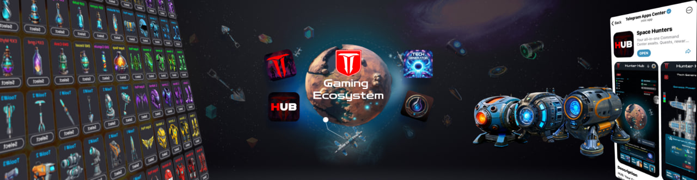
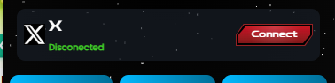
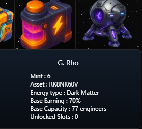

[Back to Home](../../../index.md)
💠
### 🚀 **New User Guide**

# Welcome, Hunter!

In this update, we’ll be brief. We will summarize and highlight the new features, changes, and adjustments to the SH ecosystem.

---
> Check the latest updates from the [main page](../../../index.md) in the Updates List.

---

> Read the [Tech Generators](../../../docs/eng/01-user-guides/generatorsenglish.md) game Whitepaper.

---

## What's New?
1. New Game Server (AWS)
2. HUB App Upgrades
   - UI/UX
   - Catalogue UI/UX
   - Designs
   - Language
   - Username + Referral Code
   - Store
   - Consumables UX
   - Engineer UX
   - Internal Transfers
   - Social Connect

3. Tech Generators
   - Pool Balancing
   - Cycle Patch
   - EXP Adjustment
   - Golden Parts
   - Tech Pass
   - Anomalies

4. Black Market  
5. Rewards & Bonuses
   - Discount & Gift Codes
   - Deposit Bonus

6. HCREDIT Cards  
7. New Easy-Commands

---

# New Game Server (AWS)

As many of you know, Space Hunters has been migrated to a new AWS server. It took time, but we successfully improved game performance and, most importantly, player security.

We also took the opportunity to push features that will be released soon. From now on, we won’t need to stop development due to server limitations, as all services are centralized now.

This wasn’t just a basic migration, but a full code refactor to improve structure and scalability. After several testing phases, we’re ready to open again, though many new features are still in progress.

---

# HUB App Upgrades

The user experience has been greatly improved in the mini app as well.

- Complete visual and code redesign. Better UX and room for new mechanics.

- Improved data organization and generator characteristic display.

- You can now see how many engineers are hired and active, as well as global consumable usage and upcoming stats.

### Unpack UX

We now limit how many packs can be opened simultaneously, depending on the item type. For example, Ticket redemption is capped at 1,000 per batch.

### Catalogue UI/UX

The new catalogue shows the game’s cover as a preview. Inside, you can see gameplay screenshots and a game summary. More content will be added soon.

### Design UI/UX

Over 300 in-game items and icons were redesigned for a more polished experience.

  

### Languages

We’ve added partial support for 24 languages in the mini app, nearly completing full translation. This improves user experience significantly.

### Username & Referral Code

  

Now you can edit your HUB username (10 HCASH fee) and your referral code (0.5 HCASH fee) directly in your profile.

---

### Store

The store now displays all items in $HCASH. Prices are currently fixed but will become dynamic based on supply and demand soon.

---

### Consumables UX

Buff consumables can now be applied 1 by 1 or in sets of 3. The "Apply All" button was removed to avoid triggering the fatigue effect by mistake.

---

### Engineer UX

In the Engineer Workshop, you can now see how many engineers are assigned and their total power per generator without leaving the view.

---

### Internal Transfer

You can now transfer HCASH to other accounts:
- Level 15 required to send
- No level required to receive
- 10% fee applies
- Done via the Wallet menu > Transfer

---

### Social Connect

Link your X account to auto-complete social tasks and receive passive $HCREDIT every time you mention the game.

---

# Tech Generators

We’re returning to our original roadmap, with some balance and quality-of-life improvements.

---

### Pool Balancing

Reward distribution changed:
- From 35% Owners / 65% Engineers  
- To 70% Owners / 30% Engineers

However, Engineers can now fight for their share using buffs and upcoming mechanics.

---

### Contract Cooldown

You must now wait a few minutes after a contract expires before rehiring in that same generator. This promotes rotation and fairer play.

---

### Cycle Patch

Igniting a generator now temporarily costs 80 $HCREDIT. Soon, this cost will switch to **Micro Energy Cubes**, generated by engineers from radioactive energy.

---

### Experience Adjustment

EXP requirements were adjusted based on current features and past patch issues.

---

### Golden Parts

The **Golden Hash Core** event will resume for the 24h that were left before maintenance. This part grants +4000 hash and is burned if removed.

---

### New Tech Pass Available

Available in 3-day, 7-day, 15-day, and 30-day versions. Buying multiples extends the expiry.

---

### Anomalies

Engineers can now be affected by anomalies (positive or negative), with effects ranging from 1% to 100%. Keep an eye on your radar!

---

# Black Market

The limit of 100 items per sale has been removed. You can now sell any quantity of items in the Black Market.

---

# Rewards & Bonuses

### Discount & Gift Codes

Influencers and community members will receive codes for discounts and gift rewards via the Gifts menu. More scalable features are coming.

---

### Deposit Bonus & Referral Bonus

- 5% bonus for Tech Pass users depositing HCASH
- 2% extra if your referrals deposit HCASH  
This system supports new users and investors as we expand the reward ecosystem.

---

# HCREDIT Cards

With $HCREDIT burning every 30 days, we've introduced **HCREDIT Cards**:
- Convert 100 or 500 $HCREDIT into cards
- Not reversible
- Can be traded between players
- Used in new upcoming mechanics (upgrades, crafting, training)
- Strengthens the dual token economy

---

# New Easy-Commands

A set of helpful Telegram bot commands now available:

- **/kboard**: Re-activate your lost quick-access buttons  

- **Inventory**: Access item list via buttons  

- **/user username**: View a player profile  

- **/top_grep**: Top 20 generators with best reputation  

- **/gview_code**: View generator data by code  

- **/gfind code**: Search generators by tag/type/owner  

---

# That’s all for now!

We’ll be posting more updates via announcements and new blog posts to keep the flow of information clean and structured. As new features are finalized, they’ll be shared with full guides to avoid confusion.

> Thank you for your support!

[🔼 Back to Index](#)

---

[Back to Home](../../../index.md)

---
---

