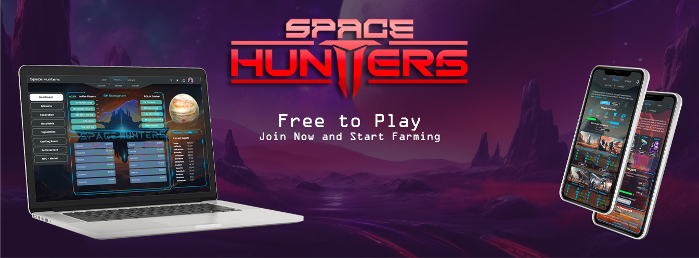
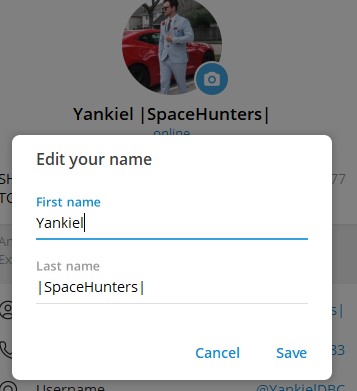

[Regresar al Índice](../00-index.md)

****

# 📜 Resumen y primeros pasos.

Guía de  Contenido
  - [¿Qué es Space Hunters?](#qué-es-space-hunters)
  - [¿Cuál es el estado actual del proyecto?](#cuál-es-el-estado-actual-del-proyecto)
  - [¿Hay actualmente algo en lo que pueda participar?](#hay-actualmente-algo-en-lo-que-pueda-participar)
  - [¿Qué es es $HCREDIT y como se puede obtener?](#qué-es-es-hcredit-y-como-se-puede-obtener)
  - [Propósitos y usos de $HCREDIT](#propósitos-y-usos-de-hcredit)
  - [Los ítems del juego.](#los-ítems-del-juego)
  - [¿Qué ventajas tengo hoy al formar parte de esta comunidad?](#qué-ventajas-tengo-hoy-al-formar-parte-de-esta-comunidad)
  - [¿Cómo puedo comenzar a ''farmear'' los $HCREDIT?](#cómo-puedo-comenzar-a-farmear-los-hcredit)
  - [¿Cómo puedo obtener los NFTs gratuitos?](#cómo-puedo-obtener-los-nfts-gratuitos)
    - [Wallets](#wallets)
  - [Nuestro Whitepaper](#nuestro-whitepaper)
  - [Redes Sociales](#redes-sociales)

****

Esta comunidad se centra en la presentación de un juego que ofrece entretenimiento, diversión y una economía sostenible y orientada a la comunidad; en la que los jugadores pueden disfrutar de una experiencia diversificada y obtener recompensas sin afectar la economía del juego. 

Este es un proyecto gratuito que promueve la participación activa, y el crecimiento a largo plazo.

## ✅ ¿Qué es Space Hunters?

**Space Hunters (SH)** es un juego estratégico imaginario, para la comunidad gamer, interesada o no en el *mundo criptográfico*.

SH utiliza varios estilos económicos y modos de juego, que le dan al usuario la posibilidad de elegir cómo jugar y crear sus propias estrategias basadas en la amplia variedad de posibilidades, tales como: 
* Involucrar a personas para que jueguen juntas explorando, extrayendo recursos y elementos importantes que se requieren para la elaboración (Crafting)
* Misiones básicas, secretas y de tiempo limitado
* Tareas diarias del juego, recompensas y logros que complementan la escalabilidad
* Modos Free-To-Play guiados por la comunidad y su actividad social
* Un token social que premia constantemente la interacción del jugador y la comunidad
* Recursos(materiales) para crear, construir y reparar activos y estructuras

> Y muchas otras maneras. Mantente al tanto!!

## ¿Cuál es el estado actual del proyecto?

**Space Hunters** aún está en desarrollo pero puedes ser parte de nuestros avances e ir adquiriendo NFTs y tokens gratis por participar y estar activo en nuestras comunidades. Nuestro sistema economico-social siempre esta recompensando estrategicamente a todos los miembros, no dejes pasar la oportunidad.

> **Actualización Oct/2024:** Acabamos de lanzar nuestra HUB App, aprende como usar nuestra app: [HUB App Guía Completa](/docs/esp/01-guias-de-usuario/02-HUBappES.md)

## ✅ ¿Hay actualmente algo en lo que pueda participar?

Primero que nada, como parte de nuestra comunidad puedes seguirnos en las redes, interactuar con otros miembros y compartir los enlaces y actualizaciones del juego en ellas y nuestro algoritmo te recompensara constantemente con tokens $HCREDIT. Puedes participar en los whitelist de NFTs gratis que damos todos los meses y otras actividades o eventos de tiempo limitado. Siguenos en nuestro canal de anuncios para que no te pierdas las oportunidades.

> Actualmente ya esta disponible la HUB App donde puedes comenzar a relacionarte con el proyecto en general a demás de obtener tokens mediante diferentes actividades y tu perfil gamer. Lee la [Guía del HUB App](/docs/esp/01-guias-de-usuario/02-HUBappES.md)

## ✅ ¿Qué es es $HCREDIT y como se puede obtener? 

$HCREDIT es un token de economía social dentro de **SH** que los puedes obtener al participar en actividades del proyecto y con tus amigos. El sistema económico que usa es sorprendentemente eficaz y recompensa constantemente a la comunidad mediante diferentes actividades.

### Actualmente puedes obtener $HCREDIT de las siguientes maneras:

  * Haciendo Check-in diario en nuestra app.
  * Con nuestro sistema de referidos de 2 niveles ganas tokens por el desempeño de tus amigos y sus amigos.
  * Agregando **SpaceHunters** a tu nombre en telegram generas hasta 2500 $HCREDIT por ciclo.
  * Chateando en nuestros grupos o en las Guilds asociadas al proyecto, la cantidad de tokens dependera de tu desempeño en los chats.
  *  Participando en los sorteos de NFTs y tokens que se realizan en nuestra app y grupos.
  * Completando tareas sociales y diarias.
  * Estar suscrito a nuestro canal de anuncios no solo te genera tokens adicionales sino tambien te otorga una bonificación al interactuar en los chats.

  > Muchas otras formas y actividades se detallan en nuestra [Guía del HUB App](/docs/esp/01-guias-de-usuario/02-HUBappES.md)

>Cada vez que un amigo se registre en el proyecto usando tu enlace de referido obtienes *100 $HCREDIT*, recibes *4 $HCREDIT* si tus amigos hacen Check-in diariamente y *1 $HCREDIT* si tus amigos recomiendan a otros amigos que también hacen Check-in diariamente.

>Si agregas SpaceHunter, Space Hunter, SpaceHunters o Space Hunters a tu nombre en telegram nuestro algoritmo lo detectará y te recompensará diariamente tokens $HCREDIT directos a tu cuenta. Mientras más días consecutivos lo lleves mas aumenta la recompensa hasta 28 días por un total de 2500 $HCREDIT y luego comienza otra vez.

**Ejemplo:**

 

## ✅ Propósitos y usos de $HCREDIT

Aquí encontrará una manera sencilla de comprender los propósitos y usos de $HCREDIT en uno de los modos de juego (gratuito).

Imagina una tierra donde necesitas trabajadores, pero esta tierra solo se puede comprar con $HCREDIT y tus trabajadores solo pueden participar potenciando una tierra con $HCREDIT. Cada hora los propietarios de tierras y trabajadores obtienen recompenzas en **$HCASH** (token principal del juego) por su participación.

Ahora, este modo de juego es GRATIS, proporciona a los jugadores activos y a sus seguidores los tokens $HCREDIT solo por ser participar y apoyar al proyecto en tareas sociales, check in, etc. Significa que cuanto más activo seas, más oportunidades tendrás.

El paquete “Generador” será limitado y costoso en tokens $HCREDIT y solo estará disponible en esa moneda. Porque es el modo de juego que se centra en el apoyo social y el compromiso de la comunidad Space Hunters y las comunidades de nuestos asociados, ejemplo: si apoyas a uno de nuestros asociados en un Stream que está realizando podrias generar tokens $HCREDIT, o por ser activo en sus grupos etc.. pero eso no es todo, hay más por venir, $HCREDIT será masivo y llegará a todas las comunidades con muchos formatos y utilidades... pero regresando al tema de los ´´Generadores´´, cada hora recibirás el 35% de los tokens que haya acumulado tu Generador y el 65% será distribuido entre todos los contribuyentes que no poseen Generadores pero potencian los tuyos. 

Los ´´Ingenieros´´ cuestan 100 $HCREDIT y expiran en 24H, puedes poner tantos como $HCREDIT tengas y generar el token principal del juego $HCASH cada 1H.
Para poder generar sin detenerte debes formar una estrategia que te permita generar $HCREDIT todos los días teniendo en cuenta todas las vías que te damos disponible.

> Aprende mas en nuestra [Guía del HUB App](/docs/esp/01-guias-de-usuario/02-HUBappES.md)

Las mecánicas que involucran **$HCREDIT** han sido minuciosamente analizadas para que los jugadores puedan obtener beneficios a largo plazo y que la economía del juego sea sostenible y no se vea afectada por la inflación.

Puedes obtener más detalles en el [documento técnico](https://spaceheroes.gitbook.io/space-hunters), pero para resumirlo quédate con la siguiente idea: La contribución a los propietarios de generadores se llama “Contrato de ingenieros”, vence después de 24 horas para incentivar la participación diaria de la comunidad, lo que significa que si un usuario no permanece activo, no ganará $HCREDIT, que a su vez implica que no obtendrá más $HCASH y a medida que existan menos jugadores involucrados en la Generación habrán más $HCASH para dividir.
La economia es respaldada por el algoritmo, las utilidades y formatos de adquisición enfocados en los jugadores.

> Algo parecido sucede con el **$HCREDIT**: cuanto más obtengas, más posibilidades tienes de adquirir **$HCASH**, apoyamos a los creadores de contenido, gamers y miembros de la comunidad.

Como propietario de un generador, puedes mejorar la capacidad del mismo para aumentar la cantidad de ingenieros (capacidad de ranuras) que pueden trabajar en él, ya que más ingenieros significan más potencia. Y solo es posible con **$HCREDIT**.

**En resumen:** $HCREDIT es el 50% del sistema deflacionario para $HCASH y al mismo tiempo $HCASH tiene su propio sistema de asignación y economía que recompenza a los usuarios por jugar y mantenerse activos.
enfócate en ganar, nosotros nos ocupamos del resto! 

> La principal diferencia entre **$HCREDIT** y **$HCASH** es que uno está dentro del juego y el otro es el objetivo final: Recibir un pago en tokens que permita monetizar el tiempo y esfuerzo invertido, lo que conocemos como **Play-To-Earn**.

## Los ítems del juego.

El 90% son gratuitos y se pueden obtener jugando o comprándolos con tokens. Además, cada ítem tiene sus propios cálculos de probabilidad y asignación, garantizando así que los montos circulantes y la demanda del propio ítem esté acorde a su importancia para el usuario y su uso dentro del juego.

## ✅ ¿Qué ventajas tengo al formar parte de esta comunidad?
Formar parte de la comunidad de **Space Hunters: The Reborn** ofrece varias ventajas:
* **Acceso Gratuito al Juego:** Puedes jugar sin costo inicial, con recursos y activos gratuitos para comenzar.
* **Recompensas Diarias:** Gana $HCREDIT y otros premios participando en actividades diarias, nuestras redes sociales y eventos.
* **Diversidad de Modos de Juego:** Disfruta de diferentes modos de juego que se adaptan a tu estilo y tiempo disponible. Aprovecha al máximo todo lo que puedas obtener antes del lanzamiento y comenzarás con ventaja sobre otros jugadores.
* **Economía sostenible:** Benefíciate de una economía de juego diseñada para ser justa y equilibrada, evitando inflación y maximizando las recompensas.
* **Participación en el Desarrollo:** Contribuye al crecimiento del juego y la comunidad a través de pruebas, feedback y actividades comunitarias, apoya tus creadores favoritos y gana tokens, invítalos a asociarse y gana tokens desde tus grupos favoritos.
* **Airdrops gratis:** Obten ítems y hasta tokens de forma gratuita, solo tienes que seguir nuestro [Canal de Anuncios]() para no perder las oportunidades.
* **Oportunidades de Crecimiento:** Únete a una comunidad activa y en crecimiento, con planes para nuevos modos de juego, expansiones y características futuras.
* **Embajador de Space Hunters:** ¿Eres creador de contenido? Envíanos tu información a través de esta aplicación [Formulario de Embajador](https://docs.google.com/forms/d/e/1FAIpQLSc5_EEXHWroFhF_1MJRga4z2y8gW5xZ5pVT1RDDqMOIutqO6g/viewform?usp=sf_link) para disfrutar de los beneficios que te ofrecemos y a tu comunidad. Dales una razón adicional pra estar activos!
## ✅ ¿Cómo puedo comenzar a ''farmear'' los $HCREDIT?

1. Para comenzar primero pídele a un amigo su link de referido o contacta con cualquier miembro de nuestra comunidad para que te facilite el suyo, necesitas un ´´patrocinador´´, debes ser invitado para poder activar tu cuenta en nuestro BOT.
> Si llegaste hasta aqui por tu cuenta puedes usar nuestro [enlace de referido](https://t.me/SpaceHuntersBot?start=NK1Y6ST3) del cual no obtendremos beneficios y solo existe para ayudar a los nuevos usuarios a iniciar esta aventura.  
2. Para aprender a usar nuestra HUB App lee nuestra Guía **[aquí](/)**

## ✅ ¿Cómo puedo obtener los NFTs gratuitos?

Space Hunters lanzará NFTs en varias Blockchains, pero inicialmente comenzamos con WAX Blockchain por sus transacciones gratuitas y ecosistema enfocado en gamers.

Lo primero es configurar tu billetera crypto.

> Asegúrate de que tu wallet sea compatible con WAX Blockchain. Hay varias opciones WaxCloud Wallet, Anchor y Wombat.

> Si eres latinoamericao, o te topas con restricciones debido a la región en la que te encuentras, prueba con Wombat.

### ✅ Wallets

* [Wax Cloud Wallet](https://www.mycloudwallet.com/)
* [Wombat](https://www.wombat.app/)

Luego de obtener una billetera, solo debes estar pendiente al [Canal de Anuncios](https://t.me/spacehuntersnews) para participar en actividades donde podrás reclamar tus NFTs gratis y usarlos para jugar **Space Hunters** despues de su lanzamiento.

<!-- TODO add change url when page is up-->
## ✅ Nuestro Whitepaper
Para más información detallada sobre todo el proyecto puedes leer nuestra [documentación](https://spaceheroes.gitbook.io/space-hunters).

## ✅ Redes Sociales
Síguenos en nuestras redes sociales

****

[Regresar al Índice](../00-index.md)
