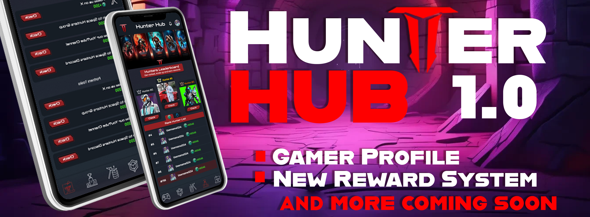
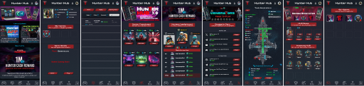
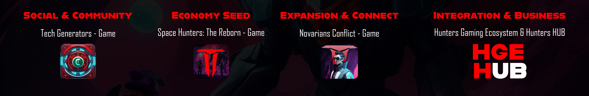
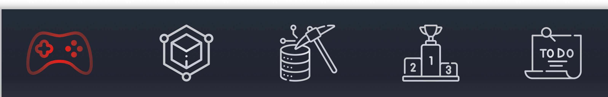
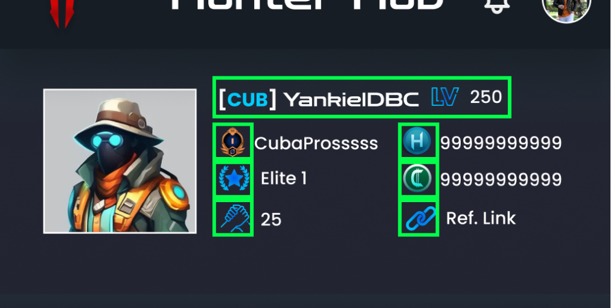
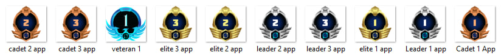
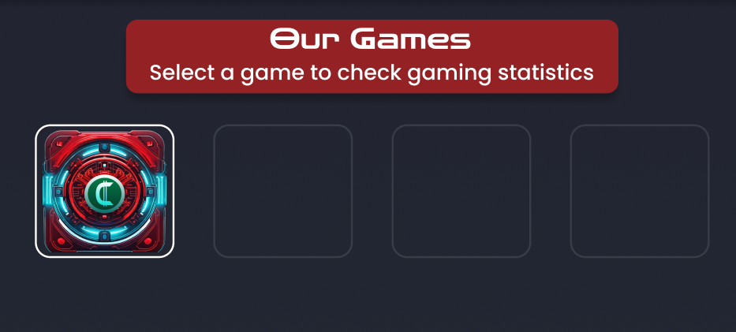
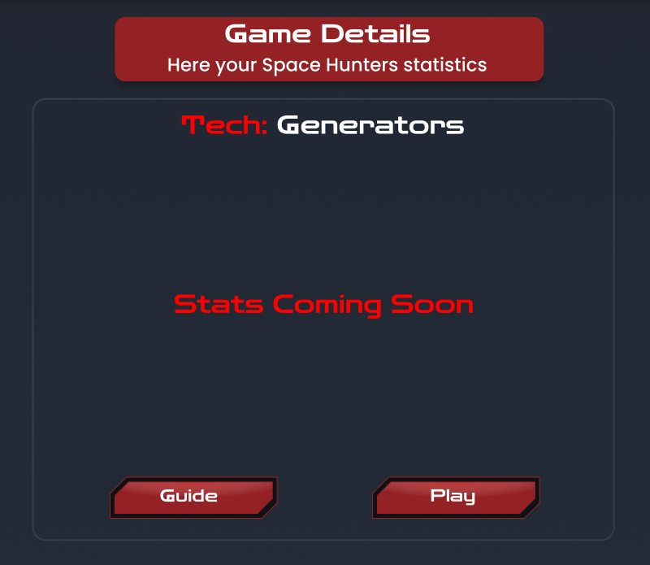
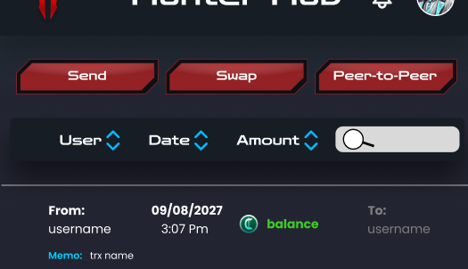

[Regresar al Índice](../00-index.md)

****

# 📱 HUB Mini-App: Guía completa

Antes de comenzar, nos gustaria dejar claro que no necesitas descargar ninguno de nuestros juegos y tampoco instalar ninguna aplicación adicional, solo tener Telegram en un dispositivo ( cualquier dispositivo que soporte Telegram App)

🔘 Resumen y primeros pasos
  - [¿Por qué una Mini-App?](#por-qué-una-mini-app)
  - [¿Qué es HUB y cuáles son sus ventajas?](#qué-es-hub-y-cuáles-son-sus-ventajas)
  - [¿Qué es Tech: Generators?](#qué-es-tech-generators)
  - [¿Cómo se generan los $HCREDIT?](#cómo-se-generan-los-hcredit)
  - [¿Qué es el Hunters Gaming Ecosystem?](#qué-es-el-hunters-gaming-ecosystem)
  
🔘 Barra de Navegacion
  - [Menú](#hub-guía-paso-a-paso)
  - [Catálogo](#catálogo)
  - [Transacciones Off-Chain](#transacciones-offchain)
  - [Tareas Diarias](#tareas-diarias)
  - [Lista de Jugadores Top](#lista-de-jugadores-top)
  - [Tareas Sociales](#tareas-sociales)

🔘 Sección: Perfil de Usuario
  - [Perfil](#perfil)
  - [Etiqueta del Clan](#etiqueta-del-clan)
  - [Nombre del Jugador](#nombre-del-jugador)
  - [Nivel del Jugador](#nivel-del-jugador)
  - [Nombre del Clan](#nombre-del-clan)
  - [Medalla de Rango](#medalla-de-rango)
  - [Total de Referidos](#total-de-referidos)
  - [Balance $HCASH & $HCREDIT](#hcash-balance)
  - [Link de Referidos](#link-de-referidos)
  - [Juegos y Estadísticas](#juegos-jugados-y-estadísticas)

🔘 Seccion: Historial de Transacciones
  - [Botones Superiores](#botones-superiores)
  - [Filtros y Navegacion](#filtros-y-navegación)
  - [Detalles de Transacciones](#detalles-de-las-transacciones)
  
🔘 Tareas de Compromiso Diario
  - [Check-in](#check-in)
  - [Nombra al Favorito](#nombre-al-favorito)
  - [Canal de Anuncios](#canal-de-anuncios)
  
🔘 Tabla de Clasificación
  - [Tipos de Clasificación](#)
  - [Planes para la clsificación](#)
  
🔘 Seccion: Historial de Transacciones
  - [Botones Superiores](#)
  - [Filtros y Navegacion](#)
  - [Detalles de Transacciones](#)
  
🔘 Seccion: Tareas Sociales
  - [Tipos de Tareas](#)
  - [Ventajas al Completar Tareas](#)
 
🔘 Seccion: Mini Tienda e Inventario
  - [¿Por qué una Mini-tienda?](#)
  - [Tipos de ofertas](#)
  - [¿Cómo abrir mis Cajas o Paquetes?](#)
  - [¿Qué significa Experiencia Compartida?](#)
  - [¿Qué items puedo ver en el inventario?](#)
  - [¿Que puedo hacer en el inventario?](#)
   
🔘 Seccion: Catálogo de Juegos
  - [¿Por qué un catálogo?](#)
  - [Tipos de juegos](#)

🔘 Guía de Juego Tech: Generators
  - [¿Por qué un juego integrado al HUB?](#)
  - *Gía completa de este juego **aquí***
  
****

Antes de sumergirte en nuestra app y explorar cada una de las características disponibles en esta versión, queremos compartir contigo un breve resumen de nuestra visión. Leer este artículo hasta el final te ayudará a comprender mejor nuestro proyecto y a maximizar tus oportunidades dentro de él.

## ¿Por qué una Mini-App?

Hemos eliminado las barreras entre dispositivos y capacidades económicas, ofreciendo a todos una app accesible desde cualquier dispositivo que tenga instalada la aplicación de Telegram. En resumen, HUB es una plataforma sin limitaciones que democratiza el acceso a nuestro ecosistema.

## ¿Qué es HUB y cuáles son sus ventajas?

Sin entrar en detalles técnicos, para nosotros, HUB representa un punto de encuentro masivo y una experiencia compartida. Todos los usuarios podrán conectarse dentro de una sola app, accediendo a nuestros productos y servicios relacionados con el entretenimiento gamer.

Este HUB permite a los jugadores gestionar su perfil de gamer web3, con acceso a todos los juegos en los que participan, estadísticas, inventario, control de tareas, notificaciones, mercado, tienda y mucho más. Así, ahorramos tiempo al evitar la necesidad de abrir cada juego por separado para revisar el progreso de tus tareas.

Además, el HUB incluye tareas sociales y diarias, donde el apoyo al proyecto es recompensado con nuestro token de adopción masiva, $HCREDIT. Este formato también se integra al juego Tech: Generators, donde tu participación social se convierte en una fuente de monetización.

Nuestra app también cuenta con un sistema de blogs de fácil acceso, donde podrás leer las últimas actualizaciones y anuncios directamente desde la pantalla principal, simplemente tocando las imágenes o banners.

## ¿Qué es Tech: Generators?
Nuestra app incluye Tech: Generators, un juego integrado Free-to-Play que transforma la actividad social en diversas comunidades y plataformas en una experiencia de monetización única. A diferencia de otras plataformas que imponen altos requisitos para monetizar, con Tech: Generators eliminamos estas barreras, permitiendo a todos los usuarios ganar recompensas.

El juego convierte $HCREDIT en $HCASH mediante un sistema interactivo y cooperativo en el que la comunidad colabora para optimizar los Generadores. Algunos usuarios poseen generadores, mientras que otros proporcionan ingenieros para su funcionamiento. Los jugadores pueden mejorar el rendimiento de los generadores mediante módulos, creación de partes, aprendizaje de profesiones únicas, ganancia de experiencia, y mucho más. Este enfoque convierte la monetización social en una experiencia entretenida, eliminando la tediosa tarea de cumplir con una lista de requisitos.

## ¿Cómo se generan los $HCREDIT?
✅ Consulta nuestra Guía para Nuevos Usuarios [aquí](../../../docs/esp/01-guias-de-usuario/01-primeros-pasos.md)

## ¿Qué es el Hunters Gaming Ecosystem?
Lee sobre nuestra innovadora estrategia web3 en nuestro plan estratégico [aquí].

**Ahora que conoces más sobre HUB, es momento de explorar la app. Te guiaremos paso a paso por las opciones y menús para que aproveches al máximo todo lo que ofrece.**

> # HUB: Guía paso a paso

Exploraremos los diferentes menús disponibles en la HUB Mini-App v1.0, centrados en maximizar tu experiencia dentro del ecosistema. A continuación, te mostramos cómo navegar a través de la barra de navegación y qué opciones ofrece cada botón.

## **Barra de Navegación (Menú Inferior)**

El menú inferior de la app incluye 5 botones principales, diseñados para facilitar el acceso a las funcionalidades más importantes:

1. ### **Catálogo:**
En el botón Catálogo, encontrarás una lista completa de los juegos, servicios y productos que hemos creado para el ecosistema de entretenimiento gamer. Desde aquí podrás:
- Explorar todos los juegos disponibles.
- Acceder a servicios adicionales y productos relacionados con el ecosistema web3.

2. ### **Transacciones Offchain:**
Este botón te lleva a la sección de Transacciones Offchain, donde podrás revisar tu historial de transacciones. Aquí, la transparencia es clave, ya que podrás navegar fácilmente por las transacciones de otros usuarios, proporcionando una experiencia completamente clara y accesible dentro de nuestro ecosistema híbrido.

3. ### **Tareas Diarias:**
En la sección de Tareas Diarias, tendrás acceso a tus compromisos diarios con el Comando Central. Al completar estas actividades diarias, serás recompensado con importantes beneficios. Mantenerte activo es clave para maximizar tus recompensas y progresar en el ecosistema.

4. ### **Lista de Jugadores Top:**
Este botón te lleva a la Lista de Jugadores Top, donde podrás ver las clasificaciones de los jugadores y guilds más destacados del ecosistema. La clasificación se basa inicialmente en la cantidad de $HCREDIT farmeado y el total de referidos. Pronto se incluirá más información sobre la clasificación de las guilds en una actualización futura.

5. ### **Tareas Sociales:**
Las Tareas Sociales ofrecen una manera adicional de obtener recompensas apoyando al proyecto. Inicialmente, las recompensas serán en $HCREDIT, pero con el tiempo se agregarán funciones como el drop de ítems, ganancia de experiencia, y otras características que te permitirán mejorar tu perfil de usuario. A medida que completes estas tareas, desbloquearás nuevas funciones y expandirás tu experiencia en el ecosistema, facilitando tu crecimiento personal dentro del HUB.

> # Sección del Perfil de Usuario
En esta sección, tendrás acceso a toda la información relevante sobre tu perfil de jugador dentro del ecosistema, junto con tus estadísticas, balances y opciones de personalización.

## Perfil

- ### **Etiqueta del Clan**

Las 3 letras que forman la etiqueta de tu clan o gremio, funcionando como un identificador simplificado y fácilmente reconocible dentro del ecosistema.

- ### **Nombre del Jugador**

El nombre de usuario que te representa en todos los juegos y actividades del ecosistema.

- ### **Nivel del Jugador**

Este es el nivel general de tu perfil, independiente del juego en el que estés involucrado. Las estadísticas son las mismas para todos los títulos, lo que unifica tu progreso.

- ### **Nombre del Clan**

Identifica el nombre completo del clan o gremio al que perteneces, reforzando tu identidad y alianzas dentro del ecosistema.

- ### **Medalla de Rango**

A medida que subes de nivel, tu rango se eleva, desbloqueando nuevas funciones y recompensas exclusivas. Los rangos más altos ofrecen acceso a características avanzadas dentro del ecosistema.

- ### **Total de Referidos**

Representado por el icono de dos manos entrelazadas, esta sección muestra cuántos usuarios has referido al ecosistema, una métrica clave de tu influencia y participación.

- ### **$HCASH Balance**

Tu billetera personal está directamente vinculada a tu perfil, mostrando tu balance total en $HCASH, la moneda principal del ecosistema.

- ### **$HCREDIT Balance**

Igualmente, tu perfil muestra el balance total de $HCREDIT, que puedes usar para acceder a diversas recompensas y características dentro de los juegos y actividades sociales.

- ### **Link de Referidos**

Al tocar el icono de las cadenas, copias tu enlace personal de referido, facilitando la invitación de amigos y nuevos usuarios para unirte en el ecosistema y juegos.

> # **Juegos Jugados y Estadísticas**

En esta sección podrás ver los juegos de nuestro ecosistema en los que has participado. Al seleccionar uno, obtendrás detalles como:

- ### **Estadísticas del Juego:** 
Una vista detallada de tu progreso, rendimiento y logros en ese juego específico.
Guía del Juego: Un botón que te lleva directamente a la guía para aprender más sobre el juego y optimizar tu rendimiento.

- ### **Acceso Directo al Juego:** Un botón que te permite iniciar el juego directamente desde la app, ahorrando tiempo y centralizando la experiencia.
Con esta sección del perfil de usuario, podrás gestionar fácilmente tu progreso, estadísticas y conexiones dentro del ecosistema HUB.

# Historial de Transacciones

En esta sección se presentan todas las transacciones realizadas, ya sean pagos, gastos o transferencias. Además, se puede navegar para ver específicamente otros usuarios o transacciones si se conoce el ID de la transacción. Se ofrece la posibilidad de ordenar las transacciones, facilitando así el control de movimientos y garantizando transparencia entre los miembros de la comunidad.

### **Botones Superiores**
- **Enviar:** Permite enviar tokens a otro usuario (Funcionalidad próxima).
- **Intercambiar (Swap):** Permite realizar intercambios en una pool del juego (Funcionalidad próxima).
- **Peer-to-Peer:** Opción para realizar transacciones directas entre usuarios con un costo mínimo de servicio. Sin embargo, esta opción implica riesgos, por lo que se recomienda utilizarla solo con usuarios conocidos o amigos.

### **Filtros y Navegación**
Los filtros permiten organizar los resultados o listar las transacciones de manera más eficiente.
La barra de búsqueda permite ir directamente a un usuario o transacción específica.

### **Detalles de las Transacciones**

Cada transacción muestra la siguiente información:

- **From:** Indica desde dónde provienen los ítems o tokens.
- **Memo:** Identificador o detalle de la transacción.
- **Fecha y Hora:** Momento exacto en que se realizó la transacción.
- **To:** Destino de la transacción; si aparece tu nombre, significa que fuiste el receptor.

> ### Aquí hay una imagen como referencia:

---
> # ESTA GUíA SIGUE EN PROCESO
---
****

> Este sitio web aún está en desarrollo. Pronto estarán disponibles más guías.

****
## ✅ Redes Sociales

****

[Regresar al Índice](../00-index.md)
