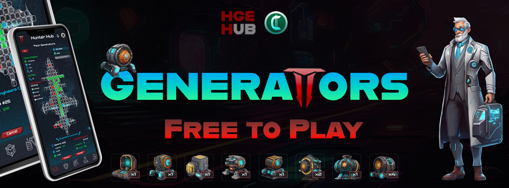
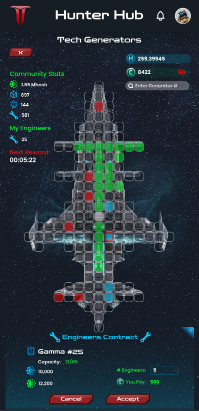
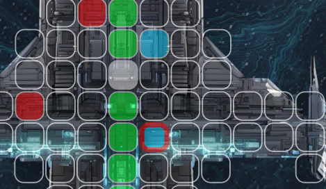
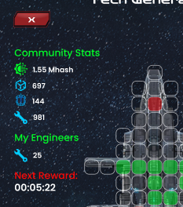
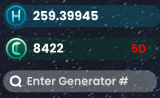
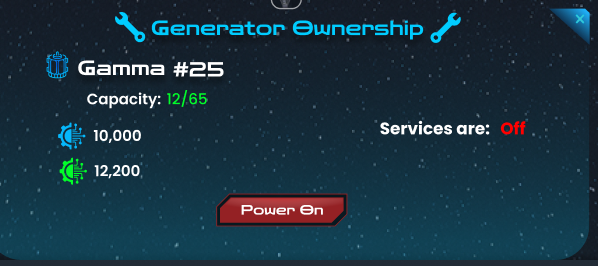
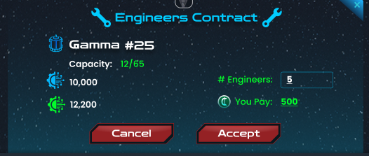

[Volver al Índice](../../../index.md)

# Juego: Tech Generators
> Este Whitepaper es solo para el juego Tech Generators, otros juegos tienen el suyo propio.
## Guía de Juego
  - [Introducción](#introduccion)
  - [Concepto y Objetivo](#concepto-y-objetivo)
  - [Requisitos y Compatibilidad](#requisitos-y-compatibilidad)
  - [Crear Cuenta](#crear-cuenta)
  - [Recorrido por nuestra App](#recorrido-por-la-app)
    - [Explicando la Interfaz del Juego](#recorrido-visual-por-el-juego)
  - [Ganar Tokens: Primeros pasos](#ganar-tokens-primeros-pasos)
  - [Aprendiendo a Jugar](#aprende-cómo-jugar)
  - [Todo sobre Generadores](#todo-sobre-generadores)
  - [Todo sobre Ingenieros](#ingenieros)
  - [Recompensas](#recompensas)
  - [Ganando $HCREEDITs](#ganar-hcredit)
  - [Sugerencias y Estrategias](#sugerencias-para-maximizar-ganancias-con-ingenieros)
  - [Economía del Juego](#impacto-y-equilibrio-de-la-economía)
  - [TechPass: Ventajas](#ventajas-del-techpass)
  - [Tokenomics](#tokenomics)
  - [Conclusión](#conclusión)

> ## Introducción
*En nuestro juego, los generadores tienen un papel crucial para ganar recompensas. A continuación, te explicamos cómo funciona el sistema de generadores, cómo se distribuyen las recompensas y cómo puedes maximizar tus ganancias.*

Este es un modo de juego **Free-to-Play** que recompensa a la comunidad por su interacción social, actividades diarias y también por invitar amigos. La actividad diaria de tus amigos referidos te otorga bonificaciones adicionales, hasta dos niveles de referencia y no es obligatorio tener ''referidos'' ni tampoco tu desempeño depende de ello.

> ## Concepto y Objetivo 
Este juego tiene como objetivo principal la adopción masiva de diferentes comunidades y recompensar el esfuerzo colectivo e individual de los gamers e influencers que buscan monetizar su contenido y brindamos a sus comunidades un incentivo para que apoyen y se involucren mas activamente. Esta recompenza es el token $HCREDIT que pueden acumular y convertir en $HCASH (nuestra criptomoneda) jugando al juego de Tech Generators, el cual paga cada 60 minutos una distribución perfectamente calculada por 10 años consecutivos convirtiendose en un sistema de monetizacion para todos y sin requisitos absurdos además de un sistema deflacionaro perfecto que te explicaremos mas abajo en este documento. Solo debes crear tu cuenta en nuestra app y comenzar a acumular tokens.

> ## Para iniciar:
Antes que nada
Solo tienes que hacer clic en **Check-in** una vez al dia para ganar $HCREDIT, además, enfriar generadores durante 45 minutos o 3 horas (180 min) te dará más $HCREDIT adicionales. Pueder leer nuesta guía completa sobre cómo farmear $HCREDIT aquí : [Guía de Farmeo de HCREDIT](/docs/esp/01-guias-de-usuario/hcreditguiacompleta.md)

Gana suficientes $HCREDIT para comprar generadores en la tienda del juego. La disponibilidad varía según la demanda, ¡intenta conseguir algunos rápidamente!

Si no puedes ganar suficientes $HCREDIT para comprar un generador, puedes gastar tus tokens contratando Ingenieros en un generador específico con capacidad disponible.

Los Ingenieros expiran después de 24 horas. No dejes de ganar $HCREDIT para poder contratar más Ingenieros y ponerlos a trabajar para ti generando ingresos pasivos por hora.

Si posees generadores, tu único trabajo es activarlos haciendo clic cada hora en el botón "Start All". Todos los generadores comenzarán a trabajar con un solo clic.

$HCREDIT es fundamental para mantener los ingresos fluyendo en este sencillo modo de juego.

Cada 45 días se quemarán todos los saldos de $HCREDIT de los jugadores para deflacionar la economía y mantenerla equilibrada. Si entras cuando el ciclo está por terminar, piensa en qué estrategia es mejor: ¿esperar el reinicio o intentar ganar $HCASH? ¡No te apresures! Hay otros modos de juego donde puedes jugar gratis mientras el ciclo de $HCREDIT se reinicia.

Y no, conservas todos tus generadores, solo se reinicia el saldo de $HCREDIT. Incluso mantienes los Ingenieros contratados el día del reinicio.

> ## Requisitos y Compatibilidad
- **Requisitos sobre Web:** Sugerimos cualquier navegador web moderno, **Ejemplo:** Chrome, Firefox, Safari, Edge...
Nuestro juego es compatible con casi todos los dispositivos y navegadores, esta construido sobre la idea de permitir el acceso sin restricciones gráficas, de dispositivos o de conección.

- **Requisitos  sobre Dispositivos:** Nuestro juego es compatible con casi cualquier dispositivo móvil, computadora personal, tabletas, etc. Solo debes poder instalar la app de Telegram para acceder a la Mini-app o directamente nuestra **HUB-App** ( proximamente ). Si no tienes esa posibilidad pueder usar un navegador.

> ## Crear Cuenta
Actualmente no requerimos la creacion de una cuenta por parte del usuario, este es un proceso dinamico que se vincula con tu usuario de Telegram App. Si ya tienes una cuenta con Telegram App solo debes abrir nuestra HUB-App y si entras por primera vez te pedirá que pongas el nombre de usuario con el que te identificarás en el juego, este nombre de usuario es tu ID en el juego y tambien tu Billetera para transferencias dentro del juego. Puedes leer la guía sobre el token $HCREDIT aquí [Guía Completa](/docs/esp/01-guias-de-usuario/hcreditguiacompleta.md).

> ## Recorrido por la App
Para conocer mas sobre nuestra **HUB-App** puedes leer aquí [HUB-App](/docs/esp/01-guias-de-usuario/02-HUBappES.md).

> ## Recorrido visual por el juego
**NOTA:** Todas las imágenes y números son solo representativos para hacer esta documentación, números reales estarán disponibles en el juego.

Si buscas un recorrido directamente sobre la representacion visual del juego en la siguiente imagen te presentare la primera vista que estrenamos en este lanzamiento **BETA** y los detalles que contiene y debes comprender.

> Esta es la Vista completa del juego en su primera etapa: **Asignación de dueños de Generadores y contratación de Ingenieros**
Luego tendremos mejoras de móodulos, especializaciones etc...

*Ahora te explicamos que es todo esto en detalles:*
> ### 1- Ubicación de los Generadores
Los generadores están ubicados en cada uno de esos espacios cuadrados, solo necesitas tocar uno para ver la información específica de ese generador.

> ### 2- Significado de los colores

Los generadores tienen 4 estados de actividad: 
- El **Verde** signífica que está **disponbible** y necesita mas ingenieros.
- El **Azul** representa que tu eres **el dueño** de ese generador y por lo tanto solo tú puedes ver ese color.
- El **Rojo** representa un generador **apagado**, es decir, su dueño no lo ha encendido u olvidó hacerlo.
- El **Azul con borde rojo** es tu generador apagado, debes encenderlo para que se muestre **Azul**.
- El **Blanco** representa un generador que ya esta repleto de ingenieros y completamente funcionnal.
- Sin colores significa que aún no tienen dueño esos generadores o no se han vendido.

> ### 3- Estadísticas Generales

En esta imagen vemos las estadíisticas generales que sería la suma de todos los participantes en tiempo real, es decir, el aporte de todos los jugadores representados en estos númeos.

- El ícono verde es la suma de toda la potencia de todos los generadores e ingenieros (sumados), observando estos númeos puedes tener una idea de que horas del día hay mas participación.
- El cuadrado azul representa la cantidad de pagos realizados desde que lanzamos el juego (Reward Blocks)
- El ícono del generador representa la cantidad de generadores trabajando en tiempo real.
- El ícono de la herramienta representa la cantidad total de ingenieros activos entre todos los generadores del juego.
- ''My Engineers'' representa tus ingenieros contratados en total entre todos los generadores donde los contrataste. Este número te ayda a controlar si aumenta o disminuye tu participación.
- ''Next Reward'' representa el tiempo restante, en forma regresiva, para la siguiente ronda de recompensas. Este cronómetro te muestra el tiempo entre pagos.

 **NOTA:** El botón rojo de arriba con una X cierra el juego si lo tocas, para regresar al juego ve a la ventana de perfil o de catálogo en HUB-App y toca el ícono del juego para abrirlo. Si aún o lees la guía de nuestra app la puedes [leer aquí](../../../docs/esp/01-guias-de-usuario/02-HUBappES.md).

> ### 4- Balance y Ciclo de Reinicio

- En esta parte te mostramos el balance de los tokens $HCASH (el azul) y $HCREDIT (el verde).
- El número en rojo dentro de la barra de balance de $HCREDIT significa el tiempo restante para que se reinicie la economía individual del token, creando así un ciclo perfectamente deflacionario y limpiando la inactividad en sel servidor, balanceando las estadísticas ajustándose a la participación de la comunidad activa.
- La barra de búsqueda se usa para encontrar un generador específico colocando el numero de serie. Este es un dato que debes tener de algun amigo o grupo donde colaboren entre todos por intereces en común.

**NOTA:** Puedes encontrar todo sobre la economia del token de gobernanza $HCASH [Aquí](../../../docs/esp/01-guias-de-usuario/whitepaperesp.md), en la sección específica de **Tokenomic**.

> ### 5- Ventana de informacón
En esta ventana vemos la información de un generador nuestro al tocar el cuadrado azul tal como explicamos arriba anteriormente. Los datos que necesitamos comprender en este **BETA**  es:
- El botón de encender el generador, lo tocamos y listo, verás como se pone en verde ''On'' esa palabra en rojo que dice ''Off'', significa que ya está activo el servicio.

Para los generadores de los que no eres dueño esta es la ventana que te muestra la opción de contratar ingenieros.
Solo debes poner la cantidad que quieres contratar basandote en tu balance $HCREDIT disponible. 
- Cada 1 Ingeniero pagas **100 $HCREDIT**, ahi debajo te dice **''You Pay''**, el monto que debes pagar y tocas en el botón **Aceptar** para asignarlos.
- Ten en cuenta que si al dar click en aceptar, alguien ya tomó el espacio disponible tendrás que buscar otro generador disponible.

> # Ganar tokens: Primeros pasos
*Para aprender como ganar tus primeros tokens te sugerimos leer* [HCREDIT: Guía Completa](/docs/esp/01-guias-de-usuario/hcreditguiacompleta.md) *para aprender a maximixar tus posibilidades y tu tiempo.*

- Adicional a las estrategias mostradas en esa guía, puedes ganar mas HCREDIT con tareas diarias On-chain. Estas tareas actualmente se encuentran en desarollo pero estarán disponibles pronto gracias a nuestros partners que nos proveen la opción de firmar transacciones con el gas proporcionado por ellos.

- Si alguna de estas tareas no tienen el gas cubuierto por nuestros socios en el futuro, aseguramos que serán ridiculamente factibles y bien recompensadas. No dejes pasar por alto todos los detalle y posibilidades, planifica bien tu estrategia.

- Mas formatos se iráan agregando a esta documentación a medida que avanzamos en el desarrollo e integración del juego y los contratos.

> # Aprende cómo jugar
Jugar es sencillo, ya tienes todo listo y te ganaste tus primeros tokens, ahora en pocas palabras te explico la mecánica de juego y estarás listo para jugar.

### Si no eres dueño de generador:
- Ve al juego de generadores
- Busca un generador en verde
- Tocalo y asigna tantos ingenieros como puedas, el límite que puedes poner es 10 en cada generador.
- Dale click en aceptar y list, durante 24h estarás ganando tokens $HCASH que se pagan cada 60 minutos fraccionalmente.

### Si eres dueño de generador:
- Ve a tu inventario
- Toca el henerador y toca en activar
- Tu generador ya esta dentro del juego de generadores
- Ve a tu generador marcado en azul
- Tócalo y toca el boton **''Power-On''** para ponerlo a trabajar.
- Cada 1h debes entrar al juego y tocar **''Power-On''** para mantenerlo trabajando, de lo contrario se apaga y no ganas tokens ni tus compañeros que contrataron ingenieros para tu generador tampoco.

> # Todo sobre Generadores
Interioricemos mas sobre el tema de los generadores un poco mas a detalle:

#### Comprar Generadores
-  Puedes comprar generadores en la tienda de nuestra app ( **HUB app** ) 
- Las **Cajas de Generadores** de la tienda proporcionan generadores aleatorios al abrirlas.
- Existen 25 generadores diferentes y cada uno con sus propias características.
- Los usuarios pueden tener 2 generadores máaximo, pero con la membresía mensual [TechPass](#ventajas-del-techpass) pueden tener tantos como puedan adquirir.

#### Dueño de Generador
- Los propietarios de generadores no pueden contratar ingenieros para sus propios generadores.
- Cada generador tiene un poder base que puede ser mejorado con la ayuda de ingenieros.
- Puedes generar ingresos por hora sin ingenieros, la ganancia adquirida se divide 35/65 y al no haber ingenieros ese 65% se regresa al tesoro del juego. Recomendamos encontrar compañeros en la comunidad que te apoyen o unirte a las Guilds.
- Los generadores son limitados, así que asegúrate de adquirirlos pronto. La disponibilidad va a depender de la cantidad de jugadores activos en promedio diario.
- La tienda funciona automaticamente, es deci los items agotados como los generadores pueden estar disponibles en cualquier momento, recomendamos que visites frecuentemente la tienda si planeas adquirir alguno de primera mano aunque puedes comprar en el mercado secundario proximamente diponible desde HUB app.
- Los dueños de generadores deben mantenerlo prendido para poder generar la potencia que les provee ganancias a ellos y los ingenieros contratados en ese generador.
- Si el generador está apagado no genera ingresos.
- Los generadores pueden ser mejorados con módulos.
- **Poder Base**: Cada generador tiene un poder base que contribuye a la recompensa total.
- **Poder Adicional**: El poder del generador aumenta con la asignación de ingenieros, mientras mas ingenieros mas aumenta su potencia.
- Los propietarios de generadores pueden compartir su número de generador para que sus amigos lo encuentren y se apoyen entre sí.
-El propietario del generador puede delegar el trabajo de encenderlo cada hora a un usuario específico si posee un [TechPass](#ventajas-del-techpass).

#### Ingenieros
- Los ingenieros se compran con $HCREDIT y permanecen asignados a un generador durante 24 horas. 
- El conteo de 24h es individual para cada unidad (**unidad = 1 ingeniero** ), lo que significa que no se van todos de golpe sino en el mismo orden que fueron cotratado a medida que transcurren las 24h.
- Puedes asignar ingenieros a los generadores para aumentar su poder y tus recompensas.
- Puedes asignar hasta 10 ingenieros por cada generador sin límite de generadores, es decir puedes poner 10 ingenieros en tantos generadores como te sea posible según tu balance $HCREDIT.
- Si tienes la membresía mensual [TechPass](#ventajas-del-techpass) puedes agregar hasta 20 ingenieros por generador.
- Los ingenieros asignados no pueden ser removidos
- Si asignas ingenieros a un generador encendido y el dueño no lo enciende cada 60 minutos, ese tiempo que se encuentra apagado no te genera ingresos, asegurate de utilizar generadores de dueños confiables.
- Puedes encontrar en la comunidad amigos o compañeros que tengan generadores y sean confiables y activos para maximizar tus posibilidades.
- La potencia proporcionada por 1 ingeniero es de 10 Khash

#### Recompensas
- **Recompensa Total**: La recompensa total por hora es de 353 $HCASH Tokens. Esta se distribuye entre los generadores según su participación en el poder total combinado.
- ##### **Distribución de Recompensas**:
  - **Propietario del Generador**: Recibe una porción fija del 35% de la recompensa total y si tiene [TechPass](#ventajas-del-techpass) obtiene un 15% bono adicional sobre el monto cobrado en esa ronda.
  - **Ingenieros**: Los ingenieros obtienen el 65% fijo de la distribución por ronda entre los ingenieros participantes, y si el usuario tiene [TechPass](#ventajas-del-techpass) obtiene 5% adicional del monto generado en cada ronda. Adicional a esto, dependiendo el generador en que asignas los ingenieros puedes obtener entre 1% y 5% por ronda. Si tienes ingenieros asignados en diferentes generadores los cálculos de recompensas son individuales por cada generador.

> ## Ganar $HCREDIT
Haz clic [aquí](/docs/esp/01-guias-de-usuario/hcreditguiacompleta.md) para leer todo sobre $HCREDIT.

## Sugerencias para Maximizar Ganancias con Ingenieros

1. **Diversifica tus Ingenieros**: Asigna ingenieros a una variedad de generadores para maximizar tus recompensas, mientras algunos generadores puedan fallar o atrasarse otros lo harán bien y esto balancea tus posibilidades en vez de arriesgar todo en un solo generador.
2. **Monitorea el Poder Base**: Considera el poder base de los generadores al asignar ingenieros. Los generadores con mayor poder base pueden ofrecer recompensas globales más grandes mientras que será mas difíil obtener esos espacios por la competitividad. Generadores con menor poder base ofrecen mas capacidad, si dispones de poco tiempo y mala conección para competir en velocidad esta es una gran opción aunque es de reconocer que un generador de alta capacidad a tope de ingenieros puede volverse poderoso.
3. **Aprovecha los Bonos**: Usa el bono progresivo de los generadores con menor poder base para obtener más recompensas por ingeniero, es decir, muchos de los generadores con poco poder base contienen mejores bonos, si pones muchos ingenieros y tienes el [TechPass](#ventajas-del-techpass) podrías asegurar una buena participación.
4. **Constancia**: Se constante con las tareas que te generan $HCREDIT, no te conformes con solo agrear un par de ingenieros, recuerda que luego de 24h necesitarás contratar nuevos ingenieros para seguir generando ingresos.
5. **Comunidad**: Encuentra compañeros leales o únete a **Guilds** donde puedes encontrar tanto generadores como ingenieros por parte de amigos activos.
6. **Sigue las noticias**: Próximamente planeamos lanzar actualizaciones sobre mas opciones y experiencias en el desarrollo de este juego agregando nuevas funciones y opciones, sigue nuestros canales de anuncios en nuestros grupos oficiales, suscribete a nuestros emails o infórmate en tu Guild para tener una mejor e inmediata reacción sobre las oportunidades que se apriximan.

> ## Impacto y Equilibrio de la Economía
El número de Generadores y la capacidad de contratar Ingenieros nunca será mayor al número de usuarios activos participantes. Esto asegura que el sistema sea equilibrado y justo para todos.

El algoritmo ajusta automáticamente y equilibra la disponibilidad en la tienda calculando los usuarios activos. Si aumentan los usuarios activos, la tienda pondrá nuevos generadores a la venta. Esto puede suceder en cualquier momento para asegurar la equidad. Recomendamos que visites la tienda ocasionalmente.

El ciclo de reinicio económico individual de este juego se asegura que nunca sobren los tokens y limpia el sistema de jugadores inactivos, multi cuentas abandonadas, bots etc... ajustando las estadísticas a la comunidad activa y distribuyendo las ganancias de la forma mas justa posible.

Todo funciona automático y sin intervención manual por parte del equipo de desarrollo.

> ## Ventajas del **TechPass**
#### Descripción
- El **TechPass** NO es obligatorio para jugar, todos los jugadores acceden a las mismas características de forma gratuita con la diferencia de mayor alcance o participación si eres un usario suscrito al pase mensual. 
- Este pase dura 30 días para evitar el compromiso innecesario de pagar algo caro por mucho tiempo como en otros juegos o proyectos. 
- Este pase se enfoca en la accesibilidad para todos los usuarios que desen involucrarse un poco mas que otros.
- Es ridiculamente económico y accesible a todos
- Su duración de 30 días y bajo precio deja oportunidad para que todos pueben sus ventajas y decidan si vale la pena o no, en comparación a otros juegos con altos costos que no es accesible para todos.
- El precio es de $2 representado en las monedas de pago que iremos agregando y eventualmente en $HCASH despues del TGE.

#### Ventajas
- Los jugadores pueden poseer tantos generadores como puedan adquirir en su misma cuenta, mientas el maximo free es de 2.
- Puedes asignar el doble de ingenieros que un usuario no suscrito. 
- Recibes una notificación 10 minutos antes de que la tienda pona disponible mas generadores.
- Recibes notificación 5 minutos antes de que tu generador se apague.
- Puedes delegrar un usuario para que te ayude a mantener tu generador encendido.
- Los propietarios de generadores reciven 15% adicional en las ganancias por hora.
- Los ingenieros que contratas cobran 5% adicional del pago individual (+5% del pago de cada ingeniero)
- Los propietarios de generadores con [TechPass](#ventajas-del-techpass) tienen más visibilidad en general (Proximamente)
- Los $HCREDITs generados son x2. [Guia $HCREDIT aquí](/docs/esp/01-guias-de-usuario/hcreditguiacompleta.md)
- Si eres creador de contenido tendrás acceso a un panel especial para controlar tus estadisticas, mas sobre esto en la **Guía para Creadores de Contenido**. No necesitas ser un super influencer para comenzar como creador de contenido, con nuestras herramientas puedes comenzar incluso con 10 seguidores.

> # Tokenomics
Lee todo sobre la economia general del proyecto en el documento   - [Tokenomics](/docs/esp/01-guias-de-usuario/whitepaperesp.md/#tokenomics) de la guía Whitepaper de Space Hunters nuestro otro juego que es la semilla del funcionamiento económico general.

> ## Conclusión
Nuestro sistema está diseñado para fomentar la asignación estratégica de ingenieros y la participación activa en el juego (DAU).

Free-to-Play, estrategias con $HCREDIT y una implementación de economía residual para crear adopción masiva sin excusas para empezar a jugar.

¡Explora todas las opciones para maximizar tus recompensas y disfruta del juego al máximo!

Para más información o asistencia, consulta la sección de ayuda en el juego o contacta a nuestro equipo de soporte.

***
> Este sitio web aún está en desarrollo. Pronto estarán disponibles más guías.

****
## ✅ Redes Sociales

[Volver al índice](../00-index.md)