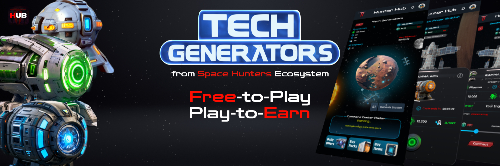

[Volver al Índice](../../../index.md)

# **Whitepaper: Tec: Generadores**
## **Índice**
- [Acerca de](#acerca-de)
- [¿Qué pueden hacer los jugadores?](#qué-pueden-hacer-los-jugadores)
- [Todo sobre los Generadores](#todo-sobre-los-generadores)
  - [Comprar Generadores](#comprar-generadores)
  - [Reglas para los Propietarios de Generadores](#reglas-para-los-propietarios-de-generadores)
- [Ingenieros](#ingenieros)
- [TechPass](#techpass)
  - [Descripción](#descripción)
  - [Ventajas](#ventajas)
- [Cómo Jugar](#cómo-jugar)
- [Ubicaciones de los Generadores](#ubicaciones-de-los-generadores)
- [Objetos y Mejoras](#objetos-y-mejoras)

---

## **Acerca de** 
**Tech: Generators** es una aplicación mini de Telegram impulsada por blockchain, donde los jugadores gestionan generadores de energía futuristas, entrenan ingenieros especializados y comercian recursos en un entorno competitivo pero colaborativo. Situado en un mundo impulsado por tecnología avanzada y civilizaciones interdependientes, los jugadores deben optimizar sus operaciones, explorar mejoras tecnológicas y colaborar entre razas para prosperar en un ecosistema dinámico y en constante evolución.

En resumen, este juego es una simulación perfecta de minería de tokens **$HCASH** con temática de ciencia ficción, convertida en un adictivo juego web3 con un algoritmo complejo que te da opciones para crear diferentes estrategias y maximizar tus ganancias por bloque. Es totalmente único y no tiene competencia en el sector gracias a nuestro propio algoritmo, que equilibra y ajusta en tiempo real cada fluctuación de potencia causada por Anomalías Espaciales, consumibles, efectos permanentes, efectos secundarios, contribuciones de los jugadores, número de ingenieros y muchos otros factores.

[🔼 Volver al Índice](#índice)

---

## **¿Qué pueden hacer los jugadores?** 
### **Gestionar Generadores**
Los jugadores poseen y operan generadores con atributos y características únicas, lo que requiere una planificación cuidadosa para equilibrar los ciclos de producción, mantenimiento y períodos de descanso. Estos generadores son extremadamente limitados y únicos en el mercado web3, equivalentes a poseer terrenos o incluso activos más poderosos.

### **Contratar Ingenieros**
Los jugadores pueden contratar ingenieros y asignarlos para trabajar en generadores. Los ingenieros pueden ser entrenados para volverse más eficientes. Inicialmente comunes, los ingenieros ganan valor a medida que aprenden habilidades especiales y eventualmente podrán ser intercambiados (próximamente) después de cumplir ciertos criterios.

### **Próximamente**
La próxima expansión, **Tech: Recyclers**, introducirá características adicionales y mecánicas de juego.

[🔼 Volver al Índice](#índice)

---

## **Todo sobre los Generadores** 

### **Comprar Generadores** 
- Puedes comprar generadores en la tienda de nuestra aplicación (**HUB App**) o en el mercado de otros jugadores.
- Las **Cajas de Generadores** en la tienda proporcionan generadores aleatorios cuando se abren.
- Hay **25 generadores diferentes**, cada uno con características únicas.
- Los usuarios pueden poseer hasta **1 generador** sin suscripción, pero con el **TechPass** mensual, pueden poseer tantos como puedan adquirir.

[🔼 Volver al Índice](#índice)

---

### **Reglas para los Propietarios de Generadores** 
- Los propietarios de generadores no pueden contratar ingenieros para sus propios generadores.
- Cada generador tiene una **potencia base** que puede mejorarse con la ayuda de ingenieros, eventos y efectos adicionales de objetos temporales o permanentes.
- Puedes generar ingresos por hora sin ingenieros.
- Las ganancias se dividen **35/65**, donde:
  - **35%** siempre es para el propietario del generador.
  - **65%** se divide entre los ingenieros. Sin ingenieros, el 65% se devuelve al tesoro del juego.
- Los generadores son limitados, así que asegúrate de adquirirlos pronto. La disponibilidad depende del número promedio diario de jugadores activos.
- Los propietarios de generadores deben mantener su generador encendido para producir energía y generar ingresos tanto para ellos como para los ingenieros asignados a ese generador.
- Si el generador está apagado, no genera ingresos.
- Los generadores pueden mejorarse con ranuras expandibles y equipando piezas, objetos consumibles o artículos especiales.
- Potencia Base: Cada generador tiene una potencia base que contribuye a la recompensa total.
- Potencia Adicional: La potencia del generador aumenta con la asignación de ingenieros. Cuantos más ingenieros asignados, mayor será el impulso. Los objetos de bonificación activados por los ingenieros pueden acumularse, mejorando aún más la capacidad del generador.
- Los propietarios de generadores pueden compartir su número de generador para que sus amigos lo encuentren y se apoyen mutuamente.
- El propietario del generador puede delegar la tarea de encenderlo cada hora a un usuario específico si posee un **TechPass**. Los propietarios pueden delegar a diferentes operadores si poseen más de un generador, pero un operador solo puede ser delegado por un propietario.

[🔼 Volver al Índice](#índice)

---

## **Ingenieros** 
- Los ingenieros se compran con **$HCREDIT** y permanecen asignados a un generador durante **24 horas**.
- La cuenta regresiva de 24 horas es individual para cada unidad (unidad = 1 ingeniero), lo que significa que no se retiran todos a la vez, sino en el orden en que fueron contratados a medida que expiran sus respectivas 24 horas.
- Puedes asignar ingenieros a generadores para aumentar su potencia y tus recompensas.
- Puedes asignar hasta **5 ingenieros por generador** sin suscripción, sin límite en el número de generadores.
- Con el **TechPass** mensual, puedes asignar hasta **20 ingenieros por generador**.
- Los ingenieros asignados no pueden ser retirados.
- Si asignas ingenieros a un generador que está funcionando, pero el propietario no lo mantiene encendido durante sus rondas, el tiempo de inactividad no generará ingresos para ti. Asegúrate de usar generadores propiedad de jugadores confiables.
- La potencia proporcionada por 1 ingeniero es **10 Khash** y puede aumentarse con objetos temporales y permanentes.

[🔼 Volver al Índice](#índice)

---

## **TechPass** 

### **Descripción** 
El **TechPass** no es necesario para jugar; todos los jugadores tienen acceso a casi las mismas funciones de forma gratuita, con la diferencia de un mayor alcance o participación si eres un usuario suscrito mensualmente. Algunas funciones y acceso al juego son exclusivos para los suscriptores de **TechPass**.

- Este pase dura **30 días** para evitar compromisos innecesarios a largo plazo.
- Se enfoca en la accesibilidad para todos los usuarios que deseen involucrarse más y filtra a los jugadores comprometidos dentro del proyecto.
- Es increíblemente asequible y accesible para todos.
- El precio actual es de **$2 en tokens TON**.

[🔼 Volver al Índice](#índice)

---

### **Ventajas** 
- Los jugadores pueden poseer tantos generadores como puedan adquirir en su cuenta, mientras que el máximo gratuito es **2**.
- Puedes asignar **3 veces más ingenieros** que un usuario no suscrito.
- Recibes una notificación **5 minutos antes de que tu generador se apague**.
- Aumenta las ganancias durante el tiempo de reactivación prolongado del generador de **25% a 100%** (pago completo).
- Puedes delegar a un usuario para que te ayude a mantener tu generador en funcionamiento.
- Los propietarios de generadores reciben un **15% adicional en las ganancias por hora**.
- Los ingenieros que contratas cobran hasta un **5% más por pago individual**, dependiendo del generador en el que contrates ingenieros (un **+5% adicional por pago de ingeniero**).
- **El $HCREDIT generado es x2 en todas partes**. ([Guía de HCREDIT aquí](#))
- **Tarea GetRich** exclusiva para suscriptores, otorgando **150k $HCREDIT en 30 días**, además de **2k de bonificación por Check-in** y más de **3 veces más en tareas de Guardian**, lo que significa que puedes contratar toneladas de ingenieros y ganar mucho más **$HCASH** que los jugadores F2P.

[🔼 Volver al Índice](#índice)

---

## **Cómo Jugar** 
Después de ganar **$HCREDIT** de las tareas de nuestra aplicación y otras formas, simplemente abre el juego desde nuestro **Catálogo HUB** y encontrarás la pantalla principal del juego.

[🔼 Volver al Índice](#índice)

---

## **Ubicaciones de los Generadores** 
- Los generadores están ubicados en cada uno de estos espacios cuadrados sobre el mapa de la nave espacial. Para encontrarlos, haz clic en **'Genesis Station'** en la pantalla principal.
- Haz clic en los cuadrados verdes y desliza para seleccionar el número de contratos y haz clic en **'Contratar'** para completar el proceso.
- También puedes usar el código de generador de un amigo para pegarlo en la barra de búsqueda y encontrar directamente su generador marcado con una **'X'**.
- Los propietarios de generadores con nombres dorados significan que son suscriptores de **TechPass**, y esto te da más ganancias en el ciclo de **11 horas**.
- Para estrategias y más detalles, pregunta y aprende de la comunidad en nuestros chats.

[🔼 Volver al Índice](#índice)

---

## **Objetos y Mejoras** 
- Si posees generadores, puedes mejorarlos comprando ranuras y equipando **Partes Hash**.
  - El costo de las ranuras aumenta con cada compra en un **4.2%**, y el costo inicial depende del generador que poseas. Este mecanismo garantiza la equidad entre las clases de generadores según su potencia base.
- Si no posees generadores, aún puedes usar **objetos consumibles** (los propietarios también pueden usarlos), que proporcionan efectos temporales dependiendo del objeto que uses, y muchos de ellos pueden acumular el efecto (la duración del efecto no se acumula).
- Hay **3 tipos diferentes de objetos equipados (partes)**:
  - **Hash Basic**: 12 de potencia base permanente.
  - **Hash Plus**: 50 de potencia base permanente.
  - **Hash Rotor**: 180 de potencia base permanente.
  - Estos objetos equipados no se pueden desequipar. Si deseas eliminarlos, se queman. Puedes combinar 4 del mismo objeto para crear 1 de la siguiente rareza.
- Puedes obtener objetos gratis con **Tech Tickets**. Los tickets se pueden ganar completando tareas (**10% de probabilidad**), comprando en la tienda (**80% de probabilidad**), chateando en nuestros grupos o completando tareas sociales.
- Puedes comprar paquetes de tickets y partes desde nuestra tienda de juegos o el mercado.

[🔼 Volver al Índice](#índice)

[Volver al Índice](../../../index.md)

---
---

