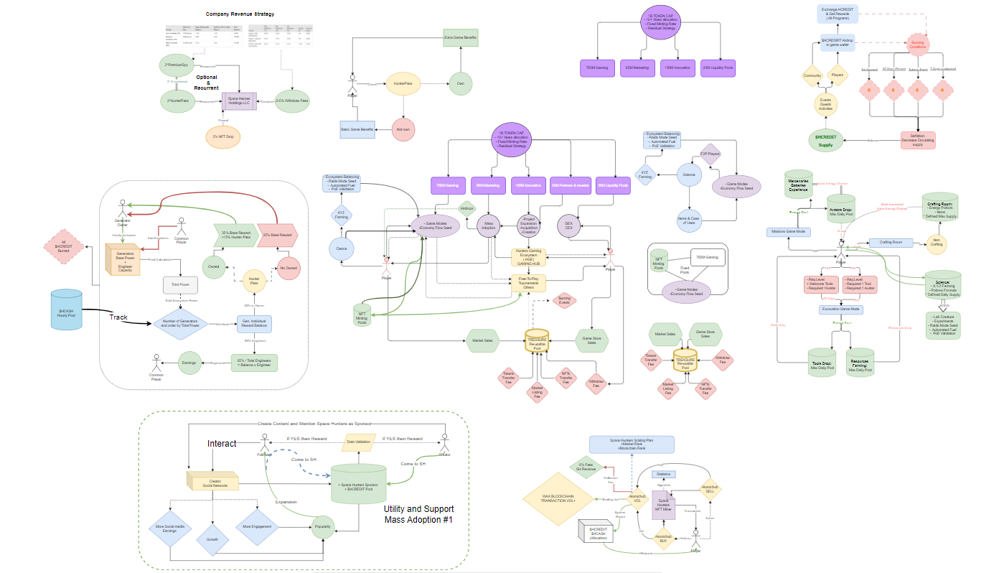

[Volver al Índice](../../../index.md)
# Whitepaper de Space Hunters

> ### Este Whitepaper es solo para el juego Space Hunters: The Reborn, otros juegos tienen el suyo propio.
- [🔘 Problemas resueltos por Space Hunters](#problemas-resueltos-por-space-hunters)
- [🔘 **Tokenomics**](#tokenomics)
  - [¿Qué es Hunter Cash ($HCASH)?](#sobre-hunter-cash-hcash)
  - [Suministro Total y Escasez](#suministro-total-y-escasez)
  - [Distribución del Token](#distribución-del-token)
  - [Distribución de la Asignación de Juego](#cómo-se-distribuye-la-asignación-de-juego)
  - [Precio de lanzamiento de $HCASH](#cuál-es-el-precio-de-lanzamiento-de-hcash)
  - [Gráfico del Flujo Económico](#gráfico-del-flujo-económico)
  - [¿Dónde se emitirá $HCASH?](#dónde-se-emitirá-hcash)
- [🔘 **Ecosistema de Space Hunters**](#ecosistema)
  - [Concepto: Experiencia Compartida](#experiencia-compartida)
  - [Flujo de HGE (Ecosistema de Juegos de Cazadores)](#flujo-hge)
  - [Estrategia de Ingreso de HGE](#estrategia-de-ingreso-de-hge)
  - [Estrategia de Salida de HGE](#estrategia-de-salida-de-hge)
  - [Retiro](#retiro)
- [🔘 **Mercado y Comisiones**](#mercado-y-comisiones)
    - [Listados](#tarifa-de-listado-en-el-mercado)
    - [Ventas](#tarifa-de-ventas-en-el-mercado)
    - [Subastas](#tarifas-de-subasta)
    - [Mercado NPC](#mercado-npc)
- [🔘 **Mercado en Tiempo Real**](#datos-del-mercado-en-tiempo-real)
    - [Suministro Circulante](#datos-del-suministro-circulante)
    - [Oferta y Demanda](#oferta-y-demanda)
    - [Tasas de NPC](#mercado-npc)
    - [Mercado](#mercado)
    - [Sistema Anti-Caída de Precios](#sistema-anti-caída-de-precios)
    - [Regla del Suelo](#regla-del-suelo)
- [🔘 **Misiones Básicas**](#misiones-básicas)
   - [Cómo Funcionan las Misiones](#cómo-funcionan-las-misiones)
   - [Nivel de Jugador](#nivel-de-jugador)
   - [Energía](#energía)
   - [Suerte](#suerte)
   - [Puntos de Influencia](#puntos-de-influencia)
   - [Puntos de Entrenamiento](#puntos-de-entrenamiento)
   - [Factor de Coraje](#factor-de-coraje)
   - [Multiplicador de Tareas](#multiplicador-de-tareas)
   - [Mercenarios](#mercenarios)
   - [Pociones de Experiencia](#pociones-de-experiencia)
   - [Baterías de Energía](#baterías-de-energía)
   - [Caja de Energía](#caja-de-energía)
   - [Núcleo de Energía](#núcleo-de-energía)
   - [Sistema de Recompensas](#sistema-de-recompensas)
 - [🔘 **Excavación**](#excavación)
      - [¿De qué se trata la Excavación?](#de-qué-se-trata-el-modo-excavación) 
      - [¿Qué recursos se pueden excavar?](#qué-recursos-se-pueden-excavar) 
      - [¿Qué puedo hacer con los recursos?](#qué-puedo-hacer-con-los-recursos) 
      - [¿Cómo funciona la excavación?](#cómo-funciona-la-excavación) 
      - [Estadísticas de Herramientas y Avatares S1](#estadísticas-de-herramientas-y-avatares-para-la-temporada-uno) 
         - [Estadísticas de Herramientas S1](#herramientas) 
         - [Estadísticas de Avatares S1](#avatares) 
  - [🔘 **Creación**](#creación)
   - [🔘 **Logros**](#lista-de-logros)
        - [Misiones](#logros-de-misiones)
        - [Limitados](#logros-limitados)
        - [Referidos](#logros-por-referencias)
        - [Entrenamiento](#logros-de-entrenamiento)
        - [Estadísticas](#logros-de-estadísticas)
        - [Coleccionista](#logros-de-coleccionista)
        - [Bonificación](#logros-de-bonificación)
        - [Mejoras](#logros-de-aumento)
  - 🔘 **Cazando Bestias** (Soon)
  - 🔘 **Exploración** (Soon)
  - 🔘 **Ciencia** (Soon)

>  
> # **Problemas Resueltos por Space Hunters**

- **Economías insostenibles en juegos blockchain**

Muchos juegos blockchain tienen dificultades para mantener una economía sostenible. Los tokens a menudo se emiten en exceso o se distribuyen con demasiada libertad, lo que lleva a la inflación, reducción de valor y descontento de los jugadores. **Space Hunters** aborda esto implementando un sistema de tokenomics cuidadosamente equilibrado que controla el suministro de tokens y activos, asegurando estabilidad económica a largo plazo.

- **Barreras de entrada**

Los juegos blockchain tradicionales a menudo requieren inversiones iniciales significativas o la compra de NFTs, lo que puede disuadir a los nuevos jugadores. **Space Hunters** elimina esta barrera siendo free-to-play, permitiendo a los jugadores comenzar sin costos iniciales, haciéndolo accesible a una audiencia más amplia.

- **Utilidad insuficiente de los activos del juego**

En muchos juegos, los activos o tokens tienen una utilidad limitada, lo que lleva a la falta de interés una vez que los jugadores los han adquirido. **Space Hunters** introduce activos versátiles con múltiples usos en diferentes modos de juego, asegurando que los activos permanezcan valiosos y atractivos a lo largo del juego.

- **Desequilibrio entre jugabilidad y rentabilidad**

Algunos juegos se centran demasiado en los aspectos financieros, lo que puede restar valor a la experiencia de juego. **Space Hunters** equilibra la rentabilidad con una jugabilidad divertida y diversa, asegurando que los jugadores sean recompensados sin comprometer el disfrute del juego.

[Subir al índice](#)

> # Tokenomics

La economía de tokens en el sector de los juegos, especialmente en Web3, ha sido un aspecto desafiante para cada equipo de proyecto que intenta crear una estrategia duradera para el ciclo de vida de su proyecto.

## $HCASH: El Token de Gobernanza de Cazadores

### Sobre Hunter Cash $HCASH
Normalmente, los tokens de juego se identifican con el nombre del proyecto o algo similar. Pero, ¿y si lo hacemos de manera diferente? Ahí es donde surgió la idea divertida: nombrar nuestra moneda del juego en función de lo que todos buscan: ¡dinero! Seamos honestos, a todos nos gusta ganar buenas ganancias, ¿verdad? Por eso decidimos que, si estamos creando todo un ecosistema o "metaverso", ¿por qué no llamarlo **Hunter Cash ($HCASH)**? Es algo hermoso y fuera de lo común.

### Bloque de Recompensa
La asignación diaria se combina con el algoritmo del juego, dando a los jugadores la capacidad de ser los únicos que pueden minar y extraer el token $HCASH. Similar a los bloques de recompensa de blockchain como $ETH en el pasado, donde 2 $ETH por bloque se distribuían entre los mineros según su hashrate, **Space Hunters** funciona como tu pool de minería. Todos los jugadores se reúnen para extraer tokens jugando. Cuanto más crezcas y participes estratégicamente en diferentes modos de juego, más posibilidades tendrás de minar una parte de la asignación.

Pero no te confundas, este no es un modelo de Play-to-Airdrop. Aquí ganarás tokens tan pronto como se completen tus tareas o actividades. El algoritmo se encargará del resto, calculando y equilibrando cada milisegundo para mantener la sincronía con nuestro plan de 10 años.

## Suministro Total y Escasez
El suministro es un factor importante a considerar con cuidado. Las especulaciones son buenas, pero un suministro corto no necesariamente significa que el precio se dispare, y un suministro alto no significa fracaso. Todo se trata de estrategia.

El suministro total de $HCASH es de 1 mil millones (1B), con una estrategia de minería que lo asigna y adjudica con el tiempo, similar a cualquier pool de minería bien conocido que utiliza un sistema de bloques.

El suministro está planeado estratégicamente para más de 10 años de desarrollo y experiencia en el juego. Para evitar la inflación, nuestro sistema asegura que no se "mine" más de lo que se asigna mensualmente a los jugadores. El suministro circulante será el número clave en el que enfocarse, ya que nadie poseerá más de lo que actualmente se recompensa.

[Subir al índice](#)

## Distribución de Tokens
Nos enfocamos en el sector de los juegos, por lo que un gran porcentaje se asigna a recompensas en el juego. Lo distribuimos de acuerdo con la planificación a largo plazo, con el equipo renunciando a cualquier $HCASH asignado.

- Modos de Juego: 70%
- Estrategia de Marketing: 6.5%
- Liquidez de Pools de Tokens: 3.5%
- Innovación del Ecosistema: 15%
- Socios e Inversores Estratégicos: 5%

### ¿Por qué la Liquidez de Pools es del 3.5%?
Creemos que un lanzamiento justo se acerca más al concepto que estamos buscando. El 3.5% de liquidez es un número perfecto para sincronizar la tasa de asignación fija con la demanda de la comunidad. A medida que los jugadores están "minando" $HCASH, los pools se ajustarán automáticamente en función de la oferta y la demanda. Los poseedores y participantes decidirán la trayectoria del precio en función de la utilidad y otros factores.

### ¿Cómo se Distribuye la Asignación para Juegos?
El suministro asignado para recompensas en el juego se distribuye entre los modos de juego lanzados y los próximos con una planificación previa. Cada modo de juego estará respaldado por una asignación de 10 años.

### Asignación Diaria
Los tokens se pre-calculan para ser asignados y extraídos por los jugadores. Las recompensas se calculan en función de la participación de los jugadores; en resumen, funciona como acciones: cuanto más poderoso sea el jugador, más acciones ganará, además de recompensas adicionales al cumplir diferentes criterios según el juego que esté jugando y otros requisitos, o al poseer un pase especial como HunterPass, Earlypass, SpyPass, etc.

### ¿Cuál es la Estrategia de Innovación?
Tenemos grandes planes y una visión amplia. A medida que la tecnología y las tendencias evolucionen, nuestro objetivo es mantener una porción de $HCASH para adaptarnos a los cambios y crear nuevos productos que respalden nuestra estrategia planificada y los productos lanzados.

### ¿Cuál es el Precio de Lanzamiento de $HCASH?
En este momento, esta información está en evaluación. Aunque existen especulaciones, el valor final se compartirá tan pronto como sea posible. Somos conscientes tanto de la Comunidad como de la Vida del Proyecto, asegurándonos de proporcionar una opción que beneficie a todos.

### ¿Dónde se Emitirá $HCASH?
Hemos seleccionado algunas blockchains como candidatas. La decisión final se tomará después de consultar a nuestros socios para encontrar la mejor opción para la satisfacción de la comunidad y la eficiencia del proyecto. La comunidad puede participar en este paso, ya que siempre valoramos su opinión.

### ¿El Proyecto Lanzará Otros Tokens?
Hay planes para lanzamientos de monedas secundarias en el futuro. Aunque no será inmediato, nuestra intención es lanzar una moneda secundaria que apoye directa e indirectamente la moneda principal del proyecto. Por ahora, todas las utilidades están enfocadas en $HCASH.

[Subir al índice](#)

### Gráfico del Flujo Económico
Aquí hay un gráfico que ayuda a ilustrar el flujo económico:

>  # **Ecosistema**

HGE se basa en la idea de crear un lugar donde los jugadores se encuentren e interactúen al jugar, intercambiando diferentes activos y compartiendo experiencias o servicios completamente enfocados en GameFi.

## HGE: Ecosistema de Juegos Hunters

Hay algunos pilares que formarán la base de todo en el futuro. Podemos decir que el juego *Space Hunters: The Reborn* es la semilla de la economía. La combinación de diferentes algoritmos, jugabilidad, actividades de los jugadores, asignaciones diarias fijas y flujo residual simula lo que la minería de tokens criptográficos puede ser: divertirse mientras se gana.

Así, podemos afirmar que **$HCASH** es extraído tanto por jugadores como por entusiastas de la tecnología Blockchain.

## Experiencia Compartida

**Experiencia Compartida** es el concepto que hemos creado para un sistema que utiliza un único perfil personal (app) vinculado a todos los juegos. Tu progreso en cada juego se reporta directamente a tu perfil de jugador. Por ejemplo, si alcanzas el nivel 20 como jugador en el ecosistema, ese mismo perfil refleja tu progreso en todos nuestros juegos. En algunos casos, esto proporciona ventajas, mientras que en otros, puede no ser muy relevante. Sin embargo, todo lo que haces en cada juego se registra en tu perfil como una tarjeta o ID personal que te representa en términos de rango, rendimiento y otras características.

Este sistema también afecta tu **inventario, tareas pendientes, tareas en curso y más**. Puedes ver tu inventario a través de todos los juegos desde tu perfil de jugador en una única mochila compartida, ahorrándote tiempo y mejorando tu experiencia como jugador.

Podrás ver tareas en curso en la app, junto con notificaciones y otros datos.

[Subir al índice](#)

## Flujo HGE

### Introducción al Concepto

El flujo económico comienza a partir de dos pilares: **Salida** y **Entrada**. Muchos proyectos tienen diseños e ideas increíbles, pero un detalle que causa que los proyectos de GameFi fallen es la mala gestión del flujo económico.

Es fácil dar tokens del juego por varias actividades, pero el principal desafío es recuperar esos tokens mientras se proporcionan beneficios, sin afectar negativamente el flujo económico.

### Estrategia de Salida de HGE

Como se explicó anteriormente, el concepto y la estrategia de minería de $HCASH es la semilla de la economía, donde los jugadores extraen la moneda del proyecto al jugar el primer juego lanzado.

El juego *Space Hunters* está diseñado para recompensar a los jugadores con $HCASH basado en su progreso y estadísticas. Las dapps y productos lanzados en el futuro tomarán tokens del **Tesoro** y de la oferta asignada.

#### Tesoro (Explicación Breve)

Cada tarifa de juego y token no distribuido va directamente al tesoro. El tesoro se utiliza para recompensar a los usuarios que participan en torneos, eventos por tiempo limitado, programas para poseedores, y más.

En resumen, la salida se basa estratégicamente en recompensar a los jugadores y participantes por interactuar con el proyecto. La imagen a continuación proporciona un breve ejemplo de validación de salida (Prueba de Eficiencia + Prueba de Participación). Ambos sistemas trabajan juntos para proporcionar una validación rápida, permitiendo al sistema monitorear y equilibrar la salida en tiempo real si es necesario.

### Estrategia de Entrada de HGE

Las estrategias de entrada se basan en los principios de una economía real.

Todas las blockchains tienen sus propias tarifas de transacción basadas en varias actividades. Estas tarifas son parte del flujo económico que sostiene el proyecto a largo plazo, dando valor a la moneda y otros elementos involucrados.

Mezclamos conceptos **Off-chain** y **On-chain** para crear beneficios para nuestra comunidad mientras preservamos sus activos tanto como sea posible. Este enfoque también beneficia a nuestro proyecto al añadir valor a la moneda del juego.

[Subir al índice](#)

#### Cómo Funciona

Todas las transacciones Off-chain se llevan a cabo dentro de nuestro ecosistema del proyecto utilizando nuestra propia dirección de billetera. Cada transacción tiene una tarifa muy baja. Puedes ganar, gastar y pagar transacciones utilizando el mismo saldo y moneda sin ninguna acción externa o firma con una billetera externa, lo que también mejora la seguridad.

La mejor parte es que todas las tarifas van directamente al **Tesoro**, creando un flujo circulante.

La recolección de tarifas Off-chain es uno de los métodos que planeamos utilizar en el sistema deflacionario. A continuación se muestra una representación simple de qué tarifas van directamente al Tesoro.

Este sistema puede parecer complicado a primera vista, pero fomenta el mantenimiento de un flujo de efectivo y evita transacciones innecesarias de cuentas como BOTs. Aunque se permiten los BOTs (ya que no nos afectan), hemos implementado medidas de precaución automáticas, incluidas tarifas.

## Retiro

*Space Hunters* está diseñado como un juego Free-To-Play que también permite a los usuarios crear múltiples cuentas o participar en becas. Para mantener el equilibrio, hemos establecido la siguiente regla para los retiros:

Los jugadores pueden retirar su saldo después de alcanzar el nivel 15.

La tarifa de retiro disminuye con el tiempo (11 días), y la cuenta regresiva comienza una vez que el jugador alcanza el nivel 15 o después de cada retiro.

### Estructura de Tarifas de Retiro:

- **Primeros 4 días:** tarifa del 5%
- **Próximos 4 días:** tarifa del 4%
- **Próximos 3 días:** tarifa del 3%
- **Después de 11 días:** la tarifa se fija en un 2%

> **NOTA:** Esto es solo para nuestro juego **Space Hunters: The Reborn**, otros juegos como **Tech: Generators** tienen reglas diferentes, lee la guía respectiva del juego para informarte.

Esta es una estrategia simple diseñada en sincronía con el plan económico más amplio. Agrega valor a los poseedores, apoya la economía dentro del juego y anima a los jugadores a proceder con una planificación estratégica.

[Subir al índice](#)

>  # **Mercado y Tarifas**

**Las tarifas de transferencia** y **las tarifas de retiro** se establecen con la misma ideología en mente. A veces, las personas realizan transacciones innecesarias, pero estas transacciones generan flujo de efectivo que enriquece los fondos del Tesoro. Estos fondos se redistribuyen posteriormente a la comunidad de varias maneras. Esta es una verdadera situación de ganar-ganar: añadir valor a todo lo involucrado, fomentar la deflación y proporcionar más recompensas sin acuñar más tokens.

Se permite a los jugadores que quieran usar múltiples cuentas hacerlo. Sin embargo, si intentan explotar el sistema transfiriendo elementos avanzados entre cuentas para repetir y repetir procesos, se aplicarán tarifas. Puedes transferir y crear múltiples cuentas, pero todas las acciones incurren en tarifas.

## Tarifa de Listado en el Mercado

Estamos comprometidos a proteger los activos de los jugadores y coleccionistas de tramposos, explotaciones y otras acciones negativas que pueden dañar el mercado, el valor de los activos y los esfuerzos del equipo para entregar un gran producto.

Cuando los usuarios quieran listar un artículo, se cobrará una pequeña tarifa. Si el jugador tiene la intención genuina de vender el artículo, esta tarifa es mínima en comparación con la protección que proporciona para el valor del activo. Esto se llama **Anti-Precio-Bajo (APD)**. APD es una medida de seguridad diseñada para prevenir caídas de precios causadas por competencia innecesaria, BOTs que intencionalmente bajan los precios y otras acciones dañinas de jugadores negativos.

Cuanto más un usuario liste, elimine y realiste un artículo, más tarifas pagará continuamente. Esta estrategia tiene como objetivo desincentivar comportamientos negativos al agotar los fondos del usuario si intenta explotar el sistema.

Es simple: lista tu artículo cuando estés verdaderamente listo para venderlo. No hay tarifas dobles; la tarifa se divide en una pequeña porción para prevenir abusos de listado, con el resto aplicado cuando se realiza la venta.

### Tarifas

La tarifa de listado se basa en el tamaño de los datos involucrados. Con el tiempo, a medida que más tokens sean extraídos por los jugadores, esta tarifa se estabilizará.

## Tarifa de Ventas en el Mercado

La tarifa de venta se calcula solo después de que el artículo se venda. Esta tarifa es del 2.5% de la venta y se envía directamente al **Tesoro**.

## Tarifas de Subasta

Las tarifas de subasta funcionan de manera similar a las tarifas de listado y ventas.

## Mercado NPC

Este es Rax-07, el pirata espacial NPC que siempre está listo para comprar los recursos que extraes. Si necesitas dinero rápido, este es el mejor lugar para vender tus recursos. Los precios varían dependiendo de la oferta y la demanda.

Cada vez que los jugadores comercian o excavan recursos, la oferta cambia. Cuando los recursos son excavados, la oferta aumenta, y cuando se venden a Rax-07 (NPC), se queman. Este mecanismo simple equilibra eficazmente la oferta y la demanda, permitiendo a los jugadores la oportunidad de comprar y vender recursos para obtener ingresos adicionales o usarlos para crear nuevos activos del juego en la Sala de Creación.

Puedes vender recursos en el mercado estableciendo tu propio precio por unidad, y aseguramos que los precios estén respaldados por la oferta del NPC como un muro de precios. Esto significa que será difícil intentar hacer dumping de recursos, ya que si los jugadores intentan vender por debajo del precio del NPC, se abre una oportunidad de reventa para otros.

El algoritmo detrás de este método es inteligente: simplemente sigues el precio y vendes a la mejor tarifa. Las tarifas diarias cambian según factores que no podemos divulgar para evitar la explotación.

[Subir al índice](#)

> # Datos del Mercado en Tiempo Real

Nuestro mercado en tiempo real actualiza la información a intervalos muy cortos para mantener a los jugadores informados sobre los cambios económicos en nuestro ecosistema.

### **Datos de Oferta Circulante**

Este sistema calcula en tiempo real la cantidad de recursos en circulación, y esta información es utilizada por otros algoritmos y se muestra en el panel de control. Esta información es importante; ahorra tiempo a los jugadores y les ayuda a seleccionar una estrategia. Los recursos están siendo constantemente extraídos mientras se queman a través de su uso, como en la creación de objetos o vendiéndolos a NPCs a cambio de $HCASH. El aumento y disminución de la oferta de recursos impacta el ecosistema de diferentes maneras. El propósito principal de la minería es la asignación perfecta de tokens $HCASH para un ecosistema mejor equilibrado.

### **Oferta y Demanda**

Los precios de los recursos cambian constantemente, dependiendo de la oferta y la demanda. Nuestro sistema te muestra gráficos minimalistas de la variación de precios en tiempo real, así como la oferta en circulación (como se mencionó antes). Además de ser beneficioso para el ecosistema del proyecto, los jugadores pueden formar estrategias con esta información, esperando el mejor momento para comerciar o conociendo el valor actual de sus posesiones para planificar su próximo movimiento en términos de economía personal.

En el futuro, incluiremos gráficos más detallados, como el historial de precios a los que se han vendido los artículos y las funciones de oferta/demanda de recursos.

### **Tarifas del NPC**

La proporción de precios que ofrecen los NPCs por los recursos varía según factores que preferimos mantener en secreto para evitar el abuso del sistema por parte de jugadores tramposos. Esencialmente, el concepto de proporción de precios se basa en la actividad del flujo económico y la actividad de los jugadores, teniendo en cuenta que más jugadores significan más estabilidad y una proporción promedio a largo plazo.

### **Mercado**

En el mercado del juego, ofrecemos subastas por parte de los jugadores y el sistema (los creadores). También proporcionamos acceso al historial de artículos vendidos y la capacidad de vender/comprar, así como enviar ofertas a otros jugadores.

[Subir al índice](#)

### **Sistema Anti-Bajada de Precios**
---
Lee sobre esto en nuestra sección de Mercado y Tarifas, encuéntralo aquí: [Anti-Bajada de Precios](#market-and-fees)

### **Regla de Piso**

Hemos creado una regla simple pero importante y útil. Se basa en la idea de prevenir la caída intencional del precio de los artículos, en beneficio de la economía y para proteger el valor de las posesiones de los jugadores y/o inversores. Esta regla limita la selección de precios a un umbral por debajo del precio promedio mínimo al que se ha definido y vendido un artículo en el mercado; no es complejo de entender. La competitividad no puede confundirse con la desesperación. Una mala gestión por parte de un usuario puede dañar el trabajo y esfuerzo de muchos otros; por esta razón, aplicamos varias reglas simples pero estratégicas. Esta regla se combina con otras estrategias que hemos implementado en la economía, como la Tarifa de Listado, y juntas crean un flujo más serio y considerado por parte de los jugadores en general.

Hemos creado muchas formas de monetizar tu progreso y esperamos un juego limpio a cambio.

> # Misiones Básicas

Este modo de juego ayuda a los nuevos jugadores a comenzar a probar el juego en un formato free-to-play (F2P). Como jugador, podrás avanzar completando misiones básicas y ganando experiencia antes de progresar a otros modos de juego.

## Cómo Funcionan las Misiones
Completa misiones para subir de nivel, ganar Puntos de Misión (M.Points) que se convierten en $HCASH cada hora y desbloquear objetos. Factores como puntos de influencia y entrenamiento afectan tus recompensas, mientras que los puntos de suerte te permiten descubrir objetos.

Cada misión tiene requisitos específicos como nivel e influencia. Los números en rojo muestran lo que se necesita para comenzar la misión, y los números en verde muestran lo que se añadirá a tus estadísticas, como experiencia, coraje y Puntos de Misión.

Después de hacer clic en "START", comenzará el tiempo de espera, y se descontarán puntos de energía. Recuerda, solo puedes realizar una tarea a la vez, así que elige con cuidado.

---
[Subir al índice](#)

## Nivel de Jugador
Tu perfil subirá de nivel a medida que ganes experiencia, y muchas características requerirán un nivel mínimo específico.

## Energía
Los jugadores comienzan con 100/100 puntos de energía, que se requieren para seguir jugando. La barra de energía se recupera 1 punto cada 10 minutos o usando potenciadores. Los puntos de suerte también ayudan: los jugadores pueden ganar potenciadores de una sola vez al completar misiones, que se pueden aplicar instantáneamente o almacenar si el jugador posee una Caja de Energía. Los jugadores pueden intercambiar objetos que proporcionen potenciadores de energía o comprarlos en la tienda del juego (limitados).

## Suerte
Cada vez que los jugadores completan tareas o misiones, el sistema RNG calcula su suerte y otorga recompensas si corresponde. Algunas recompensas son gratuitas, mientras que otras son de Prueba de Participación (PoP). Los puntos de suerte también se pueden usar para acuñar nuevos activos que son exclusivos de este modo de juego y dependen del factor de suerte.

## Puntos de Influencia
Representan tu influencia como capitán. Más influencia significa más oportunidades, recompensas, acceso a otros modos de juego, misiones desafiantes y nuevos objetos. Cuanta más influencia tengas, mayor será tu parte de las recompensas en las misiones.

## Puntos de Entrenamiento
Los jugadores deben mantener el entrenamiento para evitar fallos en las misiones. A medida que aumentes tu influencia, podrías ganar menos si descuidas el entrenamiento. Asegúrate de que tus puntos de entrenamiento no estén demasiado lejos de tus puntos de influencia. Piensa en los puntos de entrenamiento como una forma de equilibrar a los capitanes que se enfocan únicamente en aumentar la influencia sin invertir en sus tropas.

## Factor de Coraje
Este factor adicional afecta algunas tareas y misiones. Los capitanes que ignoran el entrenamiento y continúan completando tareas pueden ver un impacto negativo en el cálculo de recompensas. Cuando notes que esta estadística aumenta, deja de ser codicioso y entrena a tu escuadrón. También puedes reducir esta estadística reclutando más tropas, invirtiendo en armas o acuñando nuevos activos que proporcionen puntos de entrenamiento adicionales.

## Multiplicador de Tareas
Cada tarea tiene un multiplicador interno. Cuantas más veces un jugador complete la misma misión, más difícil se vuelve. El contador se reinicia cada 24 horas. Repetir la misma tarea con demasiada frecuencia aumenta la dificultad y reduce las recompensas. Recomendamos equilibrar diferentes tareas diarias para evitar afectar negativamente tus ganancias. Utiliza tu tiempo y energía estratégicamente.

## Mercenarios
Tropas temporales que te siguen aleatoriamente durante el juego. Los mercenarios se pueden encontrar completando misiones básicas y permanecerán con tu escuadrón entre 6 y 12 horas, aumentando temporalmente tus puntos de influencia. La cantidad de mercenarios depende de tu suerte e influencia.

## Pociones de Experiencia
Este consumible aumenta la experiencia que ganas. Los multiplicadores varían según la poción que consumas. Estos objetos están limitados diariamente en la tienda del juego y su disponibilidad depende de la actividad actual de los jugadores, siempre entre el 10-30% de los jugadores activos, dependiendo de la rareza del objeto.

## Baterías de Energía
Existen dos tipos de baterías disponibles en el modo Misiones durante la primera temporada del juego:
- **Mini-Batería:** Rellena 15 puntos de energía al instante con un 40% de probabilidad de caer. No se puede almacenar.
- **Batería 🔋:** Rellena completamente tu energía con un 12.48% de probabilidad de caer. Se puede almacenar si tienes una Caja de Energía. Cada Caja de Energía puede almacenar 1 Batería 🔋, y puedes aplicarla haciendo clic en "Usar". Si tu Caja de Energía está llena, la batería se aplicará automáticamente.

## Caja de Energía
Esta caja tiene la capacidad de almacenar una potente batería de energía, lo que te permite rellenar completamente tus puntos de energía una vez. Si encuentras una batería y la caja está vacía, se almacenará automáticamente. Si la caja está llena, la batería se usará automáticamente para recargar tus puntos de energía. Puedes tener tantas cajas como desees; más cajas significan más energía almacenada, lo que te permite jugar durante más tiempo de forma continua.

## Núcleo de Energía
Este objeto recarga completamente tu energía una vez cada 24 horas. Se puede activar a voluntad y puedes tener más de uno. Si activas el Núcleo de Energía con la energía al máximo, la energía no se acumula, solo puedes tener 100 puntos de energía como máximo, por lo que estarías desperdiciando su uso innecesariamente.

## Sistema de Recompensas
Cada misión recompensa a los jugadores con experiencia, mercenarios y objetos del juego según las recompensas estacionales y eventos limitados. Los jugadores acumulan puntos de misión, que se convierten en tokens del juego cada hora. Algunos objetos son exclusivos del modo Misiones Básicas y pueden ser limitados por tiempo o basados en eventos específicos.

Los jugadores solo reciben experiencia para subir de nivel completando misiones en este modo, con algunas excepciones como logros o objetos consumibles.

[Subir al índice](#)

---
> # Excavación

El modo de juego **Excavación** está enfocado en encontrar los recursos que forman la base de todo el juego. Después de alcanzar el nivel requerido completando misiones, los jugadores desbloquearán el modo de juego **Excavación**.

**NOTA:** Para desbloquear la capacidad de encontrar los 12 recursos diferentes, los jugadores deben alcanzar el nivel determinado por la temporada o actualización actual. Este requisito de nivel puede variar según varios factores, pero siempre será justo para los jugadores genuinos y estará diseñado para evitar trampas.

## ¿De qué se trata el modo Excavación?

En este modo, puedes usar las herramientas y avatares necesarios para encontrar recursos que se clasifican por tipo, rareza, probabilidad y otros factores como la dificultad de extracción. Estos recursos forman la base de todo en el juego y se usan para fabricar nuevas tecnologías y comerciar entre jugadores o NPCs.

## ¿Qué recursos se pueden excavar?

| Nombre del Recurso | Probabilidad % |
| ------------------ | -------------- |
| Chatarra           | 11.3%          |
| Helionita          | 19%            |
| Volcanium          | 16.7%          |
| Nebulita           | 13.5%          |
| Crisalio           | 11%            |
| Galvanita          | 9%             |
| Estelario          | 7%             |
| Radiante           | 4.9%           |
| Xenorita           | 3.5%           |
| Celestium          | 2.1%           |
| Lumio              | 1%             |
| Fasio              | 0.8%           |
| Eterio             | 0.2%           |

## ¿Qué puedo hacer con los recursos?

Como se mencionó antes, los recursos son la base para fabricar, construir estructuras, hacer reparaciones, y más. Sin embargo, si como excavador prefieres no convertirte en artesano y solo quieres que te paguen por completar el trabajo, puedes vender directamente los recursos en el mercado o a los NPCs.

## ¿Cómo funciona la excavación?

Cada recurso representa un ítem único (objetos de fantasía no ligados a la realidad) con una probabilidad de obtención, lo que significa que cada vez que excaves, los recursos que obtengas pueden variar según las herramientas y estadísticas de tu avatar. Cuanto menor sea la probabilidad de obtención, más difícil será excavar el recurso. Al mismo tiempo, su costo base y su suministro en circulación serán excepcionales en comparación con otros recursos.

La estrategia gira en torno a la combinación de herramientas y avatares. Cada intento de excavación cuesta 15 puntos de energía.

Los jugadores recibirán recursos cuando se complete la excavación. Sin embargo, dependiendo de la suerte, algunas veces encontrarás ítems especiales en lugar de recursos. Estos ítems se obtienen exclusivamente en este modo de juego y no se pueden encontrar en ningún otro modo de juego.

## Estadísticas de Herramientas y Avatares para la Temporada Uno

### Herramientas:

- **Enfriamiento:** El tiempo individual que mide el período de espera antes de que la herramienta pueda volver a usarse.
- **Suerte Base:** Un valor que representa la suerte utilizada para calcular las probabilidades de obtención.
- **PoE (Prueba de Eficiencia):** Mide el poder de extracción. Se calcula tanto individualmente como globalmente entre todos los jugadores que están excavando al mismo tiempo para proporcionar resultados precisos de recompensa y reequilibrar los recursos de un planeta o región donde los jugadores están excavando.

### Avatares:

Los avatares funcionan como multiplicadores de:

- **Enfriamiento**, **Suerte** y **PoE**. Estos multiplicadores se aplican a los valores base de las herramientas del jugador. Por ejemplo, si tus herramientas tienen un total de 3 puntos de suerte y el multiplicador de tu avatar es 2, entonces tu suerte base final será 6.

- **Influencia Base** y **Puntos de Entrenamiento Base** se usan principalmente en el modo de juego de misiones. Visita la sección de [Misiones Básicas](#misiones-básicas) para aprender más sobre los conceptos de influencia, entrenamiento y las probabilidades de obtención de avatares.

## Referencia de Iconos
Para entender los iconos en el modo Misiones, por favor [lee aquí](link-a-documentación-de-iconos).

[Subir al índice](#)

> # Creación

Una de las principales formas de quemar activos, crear nuevos y mejorarlos.

Todos los jugadores que alcancen el nivel requerido desbloquearán la capacidad de crear nuevos activos que mejoren su experiencia al aumentar estadísticas y/o ganancias.

Usa esta **Sala de Creación** para crear nuevos ítems. Cada receta requiere diferentes recursos y te proporciona más estadísticas, haciéndote más poderoso. Algunos ítems están limitados por tiempo, suministro o número de usos.

En esta **Sala de Creación** encontrarás toda la información que necesitas. Al seleccionar una receta, los detalles aparecerán a la derecha. El botón **Crear** estará disponible si tienes todos los recursos requeridos. Si no los tienes, el botón permanecerá en gris.

> # Lista de Logros

Los logros secretos, eventos y logros por tiempo limitado no están incluidos; estos se anunciarán y descubrirán al jugar. Se agregarán más logros en próximas actualizaciones.

## Logros de Misiones

| Nombre de la Misión                   | Requerimiento                        | Recompensa              |
|---------------------------------------|-------------------------------------|-------------------------|
| Maestría Básica                      | 10 Tareas Simples                   | 100 EXP                 |
| Cazador de Bestias                   | 10 Misiones de Caza de Bestias     | 200 EXP                 |
| Guardián Nocturno                    | 10 Misiones de Seguridad Nocturna   | 500 EXP                 |
| Logrador Implacable                  | 10 Misiones Imparables              | 900 EXP                 |
| Trabajador Profesional                | 10 Misiones de Trabajo Serio        | 1000 EXP                |
| Conquistador Diario                  | 10 Misiones de Otro Día             | 1300 EXP                |
| Jugador de Alto Riesgo               | 10 Misiones de Trabajo Arriesgado   | 2300 EXP                |
| Veterano de Tareas                   | 50 Tareas Simples                   | 200 EXP                 |
| Cazador de Bestias Experto           | 50 Misiones de Caza de Bestias      | 400 EXP                 |
| Defensor Nocturno                    | 50 Misiones de Seguridad Nocturna    | 1000 EXP                |
| Fuerza Imparable                     | 50 Misiones Imparables              | 1800 EXP                |
| Especialista en Trabajo               | 50 Misiones de Trabajo Serio        | 2000 EXP                |
| Maestro Diario                       | 50 Misiones de Otro Día             | 2600 EXP                |
| Experto en Alto Riesgo               | 50 Misiones de Trabajo Arriesgado   | 4600 EXP                |
| Leyenda de Tareas                    | 100 Tareas Simples                  | 1000 EXP, 200 Influencia |
| Maestro de Bestias                   | 100 Misiones de Caza de Bestias     | 1000 EXP, 100 Influencia, Suerte +1 |
| Comandante Guardián                  | 100 Misiones de Seguridad Nocturna   | 1000 EXP, 200 Influencia, Suerte +2 |
| Campeón Implacable                   | 100 Misiones Imparables             | 1000 EXP, 300 Influencia, Suerte +2 |
| Maestro de Trabajo                   | 100 Misiones de Trabajo Serio       | 1000 EXP, 400 Influencia, Suerte +2 |
| Conquistador Diario Supremo           | 100 Misiones de Otro Día            | 1000 EXP, 400 Influencia, Suerte +2 |
| Tomador de Riesgos Extraordinario     | 100 Misiones de Trabajo Arriesgado  | 1000 EXP, 500 Influencia, Suerte +2 |

[Subir al índice](#)

## Logros Limitados

### Recompensas NFT

| Nombre de la Misión                   | Requerimiento                                       | Recompensa                      |
|---------------------------------------|----------------------------------------------------|---------------------------------|
| Primeros Pasos I                     | Alcanzar el nivel 5                                | 5 Influencia                    |
| Primeros Pasos II                    | Ser uno de los primeros 10,000 jugadores en alcanzar el nivel 10 | 15 Influencia                   |
| Primeros Pasos III                   | Ser uno de los primeros 10,000 jugadores en alcanzar el nivel 20 | 20 Influencia                   |
| Primeros Pasos IV                    | Ser uno de los primeros 10,000 jugadores en alcanzar el nivel 30 | 100 Influencia, 2 Puntos de Entrenamiento |
| Medalla de Honor I                   | Ser uno de los primeros 1,000 jugadores en alcanzar el nivel 40 | 5 Puntos de Suerte, 300 Influencia, 10 Puntos de Entrenamiento |
| Medalla de Honor II                  | Ser uno de los primeros 500 jugadores en alcanzar el nivel 50 | 10 Puntos de Suerte, 500 Influencia, 15 Puntos de Entrenamiento |
| Medalla de Honor III                 | Ser uno de los primeros 250 jugadores en alcanzar el nivel 100 | 20 Puntos de Suerte, 1500 Influencia, 25 Puntos de Entrenamiento |
| Medalla de Gloria                    | Ser uno de los primeros 100 jugadores en alcanzar el nivel 200 | 50 Puntos de Suerte, 5000 Influencia, 100 Puntos de Entrenamiento |

[Subir al índice](#)

## Logros por Referencias

**Respaldado por 5M $HCASH Capital**  
*(Detener después de alcanzar el límite de 5M)*

| Nombre de la Misión                   | Requerimiento                                       | Recompensa                      |
|---------------------------------------|----------------------------------------------------|---------------------------------|
| Novato Amistoso I                    | 1 Amigo alcanzó el nivel 10                        | $HCASH 1, 15 Mercenarios, 1 Barril de Energía |
| Novato Amistoso II                   | 3 Amigos alcanzaron el nivel 10                     | $HCASH 3, 50 Mercenarios         |
| Novato Amistoso III                  | 9 Amigos alcanzaron el nivel 10                     | $HCASH 6, 50 Mercenarios, Suerte +1, 1 Barril de Energía |
| Novato Amistoso IV                   | 14 Amigos alcanzaron el nivel 10                    | $HCASH 10, 25 Mercenarios, Suerte +1 |
| Novato Amistoso V                    | 49 Amigos alcanzaron el nivel 10                    | $HCASH 30, 10 Mercenarios, Suerte +1, 1 Caja de Energía |

[Subir al índice](#)

## Logros de Entrenamiento

| Nombre de la Misión                   | Requerimiento                                       | Estadísticas                    |
|---------------------------------------|----------------------------------------------------|---------------------------------|
| Novato en Entrenamiento               | Completar 10 Entrenamientos                         | 100 EXP, 1 Punto de Entrenamiento |
| Aprendiz de Entrenamiento             | Completar 50 Entrenamientos                         | 200 EXP, 10 Puntos de Entrenamiento |
| Adepto en Entrenamiento               | Completar 100 Entrenamientos                        | 500 EXP, 20 Puntos de Entrenamiento |
| Experto en Entrenamiento              | Completar 500 Entrenamientos                        | 1000 EXP, 100 Puntos de Entrenamiento, Suerte +2 |
| Maestro en Entrenamiento              | Completar 1000 Entrenamientos                       | 2000 EXP, 200 Puntos de Entrenamiento, Caja de Energía |
| Leyenda en Entrenamiento              | Completar 5000 Entrenamientos                       | 2000 EXP, 500 Puntos de Entrenamiento, Núcleo de Energía |

[Subir al índice](#)

## Logros de Estadísticas

| Nombre de la Misión                   | Requerimiento                                       | Recompensa                      |
|---------------------------------------|----------------------------------------------------|---------------------------------|
| Principiante Influyente               | Alcanzar 10 puntos de Influencia                   | 100 EXP                         |
| Influencer Ascendente                 | Alcanzar 50 puntos de Influencia                   | 200 EXP                         |
| Figura Notable                        | Alcanzar 100 puntos de Influencia                  | 300 EXP                         |
| Líder Respetado                      | Alcanzar 200 puntos de Influencia                  | 500 EXP                         |
| Autoridad Prominente                 | Alcanzar 500 puntos de Influencia                  | 500 EXP                         |
| Jugador Poderoso                      | Alcanzar 1000 puntos de Influencia                 | 700 EXP                         |
| Influencer Élite                      | Alcanzar 2000 puntos de Influencia                 | 700 EXP                         |
| Titán Influyente                     | Alcanzar 5000 puntos de Influencia                 | 1000 EXP                        |
| Influencer Supremo                    | Alcanzar 10,000 puntos de Influencia                | 2000 EXP                        |
| Influencer Legendario                 | Alcanzar 50,000 puntos de Influencia                | 5000 EXP                        |
| Maestro de Influencia                 | Alcanzar 100,000 puntos de Influencia               | 5000 EXP                        |

[Subir al índice](#)

## Logros de Coleccionista

| Nombre de la Misión        | Requisito                             | Recompensa                   |
|----------------------------|---------------------------------------|------------------------------|
| Coleccionista Común        | Completar un set de equipo común (4 piezas) | 5 Puntos de Entrenamiento    |
| Recolector Raro            | Completar un set de equipo raro (4 piezas) | 15 Puntos de Entrenamiento   |
| Buscador Épico             | Completar un set de equipo épico (4 piezas) | 35 Puntos de Entrenamiento   |
| Cazador Legendario         | Completar un set de equipo legendario (4 piezas) | 80 Puntos de Entrenamiento   |
| Conquistador Mítico        | Completar un set de equipo mítico (4 piezas) | 200 Puntos de Entrenamiento  |
| Coleccionista Completista   | Adquirir la 5ª pieza de set común    | 5 Puntos de Entrenamiento    |
| Perseguidor Raro           | Adquirir la 5ª pieza de set raro      | 10 Puntos de Entrenamiento   |
| Logrador Épico            | Adquirir la 5ª pieza de set épico     | 20 Puntos de Entrenamiento   |
| Búsqueda Legendaria        | Adquirir la 5ª pieza de set legendario | 60 Puntos de Entrenamiento   |
| Aspirante Mítico           | Adquirir la 5ª pieza de set mítico    | 150 Puntos de Entrenamiento  |
| Salón de la Fama: Guardián | Coleccionar las 5 piezas de todos los sets de rareza | 500 Puntos de Entrenamiento, 500 Influencia, 10 Suerte |

[Subir al índice](#)

## Logros de Bonificación

| Nombre de la Misión        | Requisito                             | Recompensa                   |
|----------------------------|---------------------------------------|------------------------------|
| Recluta Explorador I       | Contratar 10 Reclutas                | 1 Recluta                    |
| Recluta Explorador II      | Contratar 50 Reclutas                | 5 Reclutas, 1 Influencia     |
| Recluta Explorador III     | Contratar 100 Reclutas               | 10 Reclutas, 5 Influencia    |
| Recluta Explorador IV      | Contratar 200 Reclutas               | 20 Reclutas, 5 Influencia    |
| Recluta Explorador V       | Contratar 500 Reclutas               | 50 Reclutas, 20 Influencia   |
| Recluta Explorador VI      | Contratar 2000 Reclutas              | 100 Reclutas, 100 Mercenarios, 50 Influencia |
| Recluta Explorador VII     | Contratar 5000 Reclutas              | 250 Reclutas, 300 Mercenarios, 50 Influencia |
| Recluta Explorador VIII    | Contratar 10,000 Reclutas            | 1000 Reclutas, 50 Puntos de Entrenamiento, 100 Influencia |

[Subir al índice](#)

## Logros de Aumento

| Nombre de la Misión        | Requisito                             | Recompensa                   |
|----------------------------|---------------------------------------|------------------------------|
| Aumento de Experiencia I    | Aumentar tu experiencia durante 12h   | 10 EXP                       |
| Aumento de Experiencia II   | Aumentar tu experiencia durante 12h 3 veces | 50 EXP                     |
| Aumento de Experiencia III  | Aumentar tu experiencia durante 24h   | 30 EXP                       |
| Aumento de Experiencia IV   | Aumentar tu experiencia durante 24h 5 veces | 200 EXP                     |
| Aumento de Experiencia V    | Aumentar tu experiencia durante 6 días consecutivos | 100 EXP                    |

[Subir al índice](#)

## ✅ Redes Sociales
Síguenos en nuestras redes sociales

****

[Regresar al Índice](../00-index.md)
