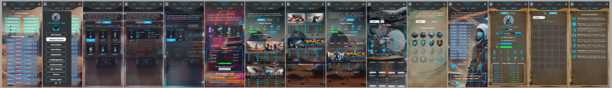
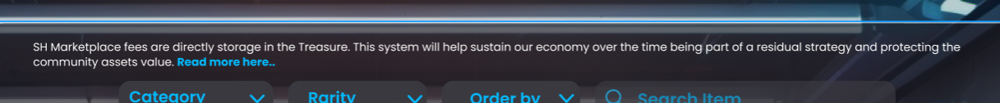
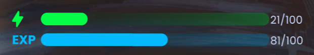
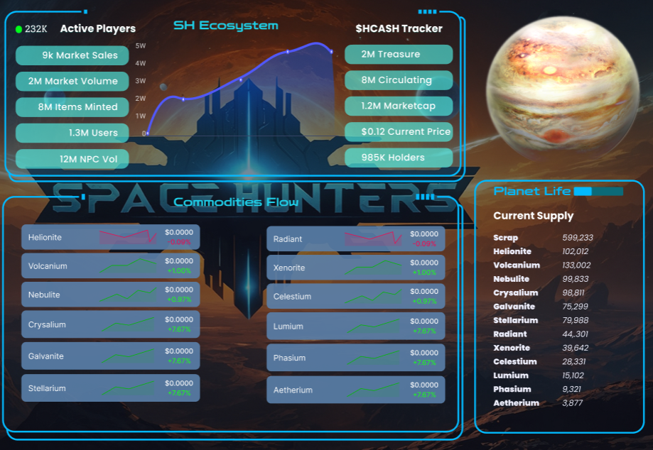
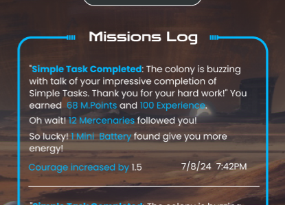

# 
 Interfaz de Usuario del Juego
[Volver al Índice](../00-index.md)

 UI del Juego y Experiencia  

Estamos construyendo una **interfaz de usuario** intuitiva y visualmente atractiva que captura la esencia de **Space Hunters: The Reborn**. La UI está diseñada para ofrecer una navegación fluida con clics simples, imágenes vibrantes y botones dinámicos que sumergen a los jugadores en un **mundo temático espacial divertido y emocionante**.

## **Clasificación de Space Hunters**

En su núcleo, Space Hunters es un juego de **estrategia virtual** MMORPG, SCI-FI que prospera en la creatividad y la imaginación. Los jugadores participarán en una aventura espacial donde se toman **decisiones estratégicas** utilizando **imágenes, botones y mecánicas únicas**. Con el concepto de **Jugar Gratis y Ganar al Jugar**, los jugadores pueden desarrollar **estrategias diversas** para tener éxito. Pronto, lanzaremos **torneos** donde los jugadores competirán para subir en la tabla de clasificación. Para más detalles, consulta nuestra **sección de Torneos**.

 UI del Juego – Primer Vistazo  

Nuestro **lanzamiento inicial** es un campo de pruebas para varias **mecánicas, modos de juego y sistemas de recompensas**. Está diseñado para ayudarnos a ajustar el equilibrio del juego. Ten en cuenta que, aunque este es un **diseño Alpha**, estamos en constante mejora. La **fase Beta** traerá una **nueva experiencia de textura UI** que será más pulida.

#### **Ejemplo de UI en PC y Móvil**

## **Textos Útiles de la UI**

Hemos añadido **guías cortas** para nuevos jugadores en cada ventana en la parte superior. Un enlace de "Leer más aquí" dirige a los usuarios a nuestra **guía completa del juego**.

## **Una Guía Corta para Nuevos Jugadores**

Cada acción del juego muestra una descripción seguida de un **lore del juego**. Estos lore mejoran la experiencia del jugador, ofreciendo un conjunto rotativo de lore para que los jugadores no encuentren el mismo texto repetidamente.

 Diseño Minimalista y Amigable  

Nuestro **diseño minimalista** asegura **compatibilidad con todos los dispositivos** y entrega información crítica con unos pocos clics. A continuación se muestra una muestra de cómo aparecen los artículos en nuestro **mercado**, el de la derecha es la vista estática y el de la izquierda es la vista al pasar el cursor o seleccionada; al hacer clic en ''ver'' verás los detalles del artículo evitando textos innecesarios que saturen la UI.

## **Barras de Experiencia y Energía**

- Todos los jugadores comienzan con **100% de energía** (100 puntos).
- **Recuperación de Energía**: 1 Punto cada 10 minutos.
- No todos los modos de juego requieren energía, pero **solo puedes realizar una tarea que consuma energía a la vez**.
- Algunos modos de juego no recompensan con puntos de experiencia, fomentando la toma de decisiones estratégicas.
- **Misiones y Logros** ofrecen las mejores recompensas de experiencia.
- **Elaboración** y **Logros** proporcionan oportunidades para **Pociones de Energía**.
- **Ciencia** permite a los jugadores elaborar pequeñas pociones de cualquier tipo.

### **Recompensas Semanales**: Los jugadores pueden ganar recompensas gratuitas a través de **actividad semanal en la tabla de clasificación**, incluyendo pociones.

## **Todos los Datos en un Solo Lugar: Tablero del Juego**

Nuestro **tablero** proporciona **toda la información esencial** de un vistazo: **estadísticas de recursos** en tiempo real, **detalles del token** y otra información relevante como **suministro circulante** para ayudar a los jugadores a concentrarse en sus estrategias.

## **Ventana del Tablero de Space Hunters**

El **tablero** ayudará a los jugadores a tomar decisiones informadas para un rendimiento óptimo.

## **Registros Personales del Juego**

Nuestro **sistema de registros** rastrea tus últimos resultados con **marcas de fecha y hora**. Es una forma simple de revisar acciones pasadas y preparar tu estrategia en consecuencia.

[Volver al Índice](../00-index.md)

> 🔧Este sitio aún está en desarrollo. Más documentación e idiomas estarán disponibles pronto.

<a href="https://spacehunters.online" style="text-decoration:none;">
  

    🚀 ¡Jugar Ahora!
  

</a>

****

### Redes Sociales

