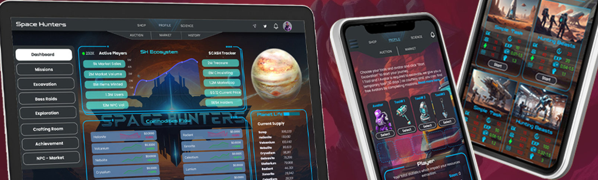

# 
 Crafting Room
[Volver al Índice](../00-index.md)

## **Sala de Creación**

*Bienvenido a la **Sala de Creación**, donde los jugadores pueden quemar recursos, crear nuevos ítems y mejorar sus tropas y equipo. La creación te permite mejorar tu experiencia al aumentar tus estadísticas y tu potencial de ganancias. A continuación, se presentan las **recetas BETA** para la creación de **Tropas Robot**. Se añadirán más recetas en futuras actualizaciones a medida que el juego crezca y se expanda. Ten en cuenta que las recetas están sujetas a ajustes para adaptarse a la economía en evolución, asegurando un equilibrio a largo plazo y resultados óptimos.*

---

### **Estrategias de Creación**
- **Quemar Recursos para Obtener Poder**: La creación es uno de los principales métodos para quemar recursos excedentes, evitando la inflación y haciendo que tus activos restantes sean más valiosos. Enfócate en crear robots de alta demanda para obtener estadísticas poderosas y una ventaja competitiva.
- **Equilibrio entre Recursos y Suministros**: Aunque al principio los recursos puedan parecer abundantes, el suministro de los objetos creados suele ser limitado. Cronometra bien tus creaciones para evitar desperdiciar materiales valiosos.
- **Ítems de Tiempo Limitado**: Mantente atento a las recetas de creación disponibles por tiempo limitado o con un límite de suministro. Crear estos ítems temprano te dará una ventaja sobre otros jugadores.

---

### **Recetas de Creación: Tropas Robot**
Las recetas para las diversas **Tropas Robot** ofrecen beneficios únicos en términos de **Influencia**, **Entrenamiento**, **Suerte**, y limitaciones de suministro. Estas tropas se vuelven progresivamente más poderosas a medida que inviertes recursos más raros en la creación.

---

### **Consejos para el Éxito en la Creación**
- **Comienza Pequeño, Crece Gradualmente**: Enfócate en crear robots de nivel inferior como **ScrapBot** y **HelioBot** para recolectar recursos de manera eficiente. Una vez que hayas construido una base sólida, comienza a crear bots más avanzados como **XenorBot** y **AetherBot**.
- **Prioriza los Recursos Raros**: A medida que progreses, los recursos raros como **Aetherium** y **Phasium** serán cruciales. Recolecta estos recursos a través del modo **Excavación** o comerciando en el mercado.
- **Equilibrio entre Influencia y Entrenamiento**: Los bots de nivel superior proporcionan aumentos significativos a tus estadísticas de **Influencia** y **Entrenamiento**. Prioriza estos bots si deseas dominar las misiones y obtener mayores recompensas.
- **Optimiza la Creación para la Suerte**: Algunos robots como **RadiantBot** y **XenorBot** ofrecen grandes mejoras en **Suerte**. Usa estos bots estratégicamente para aumentar tus posibilidades de encontrar ítems raros en misiones y excavaciones.
- **Bots de Suministro Limitado**: Bots como **AetherBot** y **PhasiumBot** tienen suministros muy limitados, lo que los hace extremadamente valiosos. Intenta crearlos lo antes posible para asegurar sus beneficios antes de que se agoten.

---

### **Cómo Crear**
1. **Selecciona Receta**: En la interfaz de creación, elige la receta que deseas crear de la lista a la izquierda.
2. **Verifica los Recursos**: Asegúrate de tener los recursos necesarios para el ítem. Si te faltan materiales, necesitarás reunir más a través de misiones, excavación o el mercado.
3. **Botón de Creación**: Una vez que tengas todos los recursos necesarios, el botón **Crear** estará disponible. Si faltan recursos, el botón permanecerá en gris.
4. **Disfruta de tu Mejora**: Los ítems creados se agregarán automáticamente a tu inventario. Equípalos para mejorar tus estadísticas y optimizar tu jugabilidad.

Utiliza la Sala de Creación sabiamente para obtener la ventaja en **Space Hunters: The Reborn**. ¡Mantente atento a más recetas y actualizaciones a medida que el juego se expande!

[Volver al Índice](../00-index.md)

> 🔧Este sitio aún está en desarrollo. Más documentación e idiomas estarán disponibles pronto.

<a href="https://spacehunters.online" style="text-decoration:none;">
  

    🚀 ¡Jugar Ahora!
  

</a>

****

### Redes Sociales

