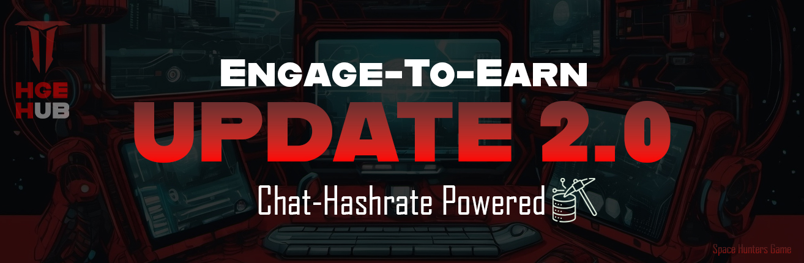

> Lee la actualización aquí: [Actualización 2.0](https://t.me/spacehuntersnews/124)

[Volver al Índice](../../../index.md)

## 💠 ¡Impulsa el Compromiso de tu Comunidad con Nuestro Algoritmo!💠

¡Hola cazadores! Estamos emocionados de invitarte a unirte a nuestro programa de asociación, donde los miembros de tu grupo de Telegram pueden ganar tokens $HCREDIT pasivos simplemente chateando como de costumbre. Nuestro algoritmo no solo fomenta la participación activa, sino que también reengancha a los miembros inactivos, fomentando una comunidad vibrante y activa.

💠 **Al integrar nuestro BOT, tus miembros:**
  * Ganarán $HCREDIT sin esfuerzo a través de chats diarios.
  * Disfrutarán de sorteos y recompensas exclusivas para mantenerlos motivados.
  * Tendrán acceso a ítems especiales para usar en nuestro juego free-to-play, mejorando su experiencia general.

💠 **Tú como líder de la Guild:**
  * Tendrás prioridad en nuestros lanzamientos y eventos limitados.
  * Recibirás spots de whitelist para ti y algunos más para regalar a tu comunidad.
  * Accederás a nuestro programa de monetización que te permite ganar mientras creas contenido en tus redes sociales preferidas, y si tu comunidad apoya tu contenido, también será recompensada. Este programa se enfoca en brindar incentivos y apoyar los sueños de nuestros embajadores y los esfuerzos de la comunidad.
  * El logo de tu Guild aparecerá en nuestro sitio web después de iniciar nuestro proceso de renovación web, y también planeamos incluir una lista de embajadores (Guilds) en nuestra app.

  > Hay más beneficios y planes próximamente, y esta lista se actualizará a medida que avancemos en el desarrollo y expansión.

Como socio, te beneficiarás de un aumento en la participación de tu comunidad, impulsando la participación y fortaleciendo la lealtad de los miembros. Los $HCREDIT ganados pueden usarse para generar $HCASH, nuestra criptomoneda, brindando un valor real a tus usuarios. **Space Hunters, HEB, HUB, Tech Generators** son nuestras marcas free-to-play y tienen un fuerte enfoque en la construcción de comunidades y el compromiso.

No te pierdas la oportunidad de revitalizar tu comunidad y ofrecer a tus miembros nuevas y emocionantes formas de interactuar y ganar. ¡Únete a nosotros como embajador y lleva tu comunidad al siguiente nivel!

## ✅ Conoce las Características Económicas Principales de Space Hunters
*Control de Suministro & Quema de Tokens*

✅**Sistema Deflacionario Perfecto e Innovador**

Uno de los pilares de la economía es un mecanismo de quema diseñado para garantizar que tanto $HCREDIT como $HCASH mantengan su valor con el tiempo. Cada vez que un jugador usa $HCREDIT **(para crear, comprar o mejorar)**, una parte se quema, lo que significa que el suministro total del token disminuye gradualmente. Esto es crucial para prevenir la inflación y mantener una economía equilibrada.

**Adicionalmente**, quemas a gran escala periódicas aseguran que cualquier exceso de tokens en circulación se elimine del sistema. Por ejemplo, cada 45 días, un porcentaje fijo de todos los $HCREDIT en circulación se quema automáticamente, creando una presión deflacionaria que incrementa el valor del token.

✅**Modelo de Membresía e Ingresos**
La principal fuente de ingresos del juego no será el token en sí, sino las membresías ofrecidas a los jugadores. Las membresías brindan acceso a misiones adicionales, ítems exclusivos, aumentos en las ganancias de $HCREDIT, y más. Las membresías se pagan con fiat o criptomonedas, pero están separadas de la economía del token, lo que permite una clara distinción entre los ingresos de la empresa y los activos del juego.

✅**Modelo Play-to-Earn**
Si bien los jugadores pueden ganar tokens a través del juego, incluidos $HCREDIT y, a veces, incluso $HCASH, el enfoque principal está en las micro-inversiones realizadas por la comunidad para sostener la economía. La empresa proporcionará liquidez inicial para los tokens, pero las inversiones impulsadas por la comunidad, las transacciones y las quemas de tokens serán las que impulsen el precio del token.

Este modelo evita las trampas típicas de los mecanismos "pay-to-win" al garantizar que, aunque los miembros obtengan beneficios, los jugadores free-to-play aún puedan tener éxito, aunque quizás a un ritmo más lento.

✅**Flujo de Tokens Equilibrado**
- **Ganar**: Los jugadores ganan principalmente $HCREDIT participando en misiones del juego, staking, participación en la Guild y actividad diaria.
- **Gastar**: Pueden gastar los $HCREDIT ganados en una variedad de características que mejoran el juego, como crear ítems, comprar artículos y hacer staking para ingresos pasivos.
- **Quemar**: Cada transacción reduce la oferta en circulación a través de quemas, aumentando la escasez con el tiempo.
- **Convertir**: La conversión de $HCREDIT a $HCASH ocurre dentro del ecosistema del juego, lo que permite la participación en la gobernanza y el acceso a contenido premium.
- **Invertir**: Los jugadores pueden reinvertir sus tokens en pools de staking o en infraestructura de la Guild, asegurando que el flujo de tokens siempre esté circulando de vuelta al juego.

✅**Economía Impulsada por la Comunidad**
La economía de Space Hunters **está diseñada** para prosperar a través de la **participación de la comunidad**. Las contribuciones de los jugadores a sus Guilds, guerras de Guilds, el mercado y las votaciones de gobernanza impactan directamente en cómo evoluciona la economía. Los miembros de la comunidad que poseen $HCASH tienen el poder de proponer o votar cambios en la tokenomía, asegurando que el juego siga siendo una experiencia colaborativa con transparencia en todos los niveles.

✅**Pensamientos Finales**
Al incorporar **fuertes mecanismos de quema**, participación de la comunidad y una distribución equilibrada de recompensas, Space Hunters: The Reborn crea una economía sostenible dentro del juego. El equilibrio entre **free-to-play** y **pay-to-earn** asegura que jugadores de todo tipo puedan participar de manera significativa sin desestabilizar el valor del token del juego. A través del uso estratégico tanto de $HCREDIT como de $HCASH, el juego fomenta la inversión y el crecimiento a largo plazo de los jugadores, asegurando un ecosistema saludable por años.

El ecosistema de Space Hunters ofrece beneficios gratuitos para las comunidades al recompensar la interacción y el compromiso a través de nuestro token **$HCREDIT**. Diseñado para la adopción masiva, el propósito de $HCREDIT es unir a las comunidades web3, recompensando a los miembros activos mientras se crea una experiencia compartida. A medida que los jugadores interactúan y se involucran dentro de sus propios grupos, también se conectan con otros, construyendo un círculo de comunidades interconectadas que convergen en el universo de Space Hunters. Las comunidades pueden promocionarse a través de nuestra plataforma, aprovechando las nuevas funciones que estamos desarrollando. Después de nuestro lanzamiento, este ecosistema creará un centro para la colaboración, el crecimiento y el éxito compartido.

¡Nos vemos pronto, cazadores!

## ✅ Nuestro Whitepaper
Para más información detallada sobre todo el proyecto puedes leer nuestra [documentación](https://spaceheroes.gitbook.io/space-hunters).
****

> Este sitio web aún está en desarrollo. Pronto estarán disponibles más guías.

****
## ✅ Redes Sociales

[Volver al índice](../00-index.md)
