[Volver al Inicio](../../../index.md)
💠
### 🚀 **Guía para Nuevos Usuarios**

# ¡Bienvenido, Cazador!

En esta actualización seremos breves. Te explicamos de forma clara y resumida los nuevos detalles, cambios y ajustes del ecosistema SH.

---
> Consulta las últimas actualizaciones desde la [página principal](../../../index.md)

---

> Lee el Whitepaper del juego [Tech Generators](../../../docs/eng/01-user-guides/generatorsenglish.md)

---

## ¿Qué hay de nuevo?
1. Nuevo Servidor de Juego (AWS)
2. Mejoras en la HUB App
   - UI/UX
   - Catálogo
   - Diseños
   - Idiomas
   - Nombre de Usuario y Código de Referido
   - Tienda
   - Consumibles UX
   - Ingenieros UX
   - Transferencias Internas
   - Conexión Social

3. Tech Generators
   - Rebalanceo de Recompensas
   - Ajuste de Ciclo
   - Ajuste de Experiencia
   - Partes Doradas
   - Tech Pass
   - Anomalías

4. Mercado Negro  
5. Recompensas y Bonificaciones
   - Códigos de Descuento y Regalo
   - Bonos por Depósito

6. Tarjetas de HCREDIT  
7. Nuevos Comandos Fáciles

---

# Nuevo Servidor de Juego (AWS)

Como muchos saben, Space Hunters fue migrado a un nuevo servidor en AWS. Esta mejora mejora la seguridad, el rendimiento y nos libera de depender de múltiples servicios externos.

Además de la migración, hicimos una **refactorización completa del código** para mejorar la estructura y preparar nuevas funciones. Tras varias pruebas, estamos listos para abrir nuevamente.

---

# Mejoras en la HUB App

La experiencia en la mini app se mejoró visual y funcionalmente.

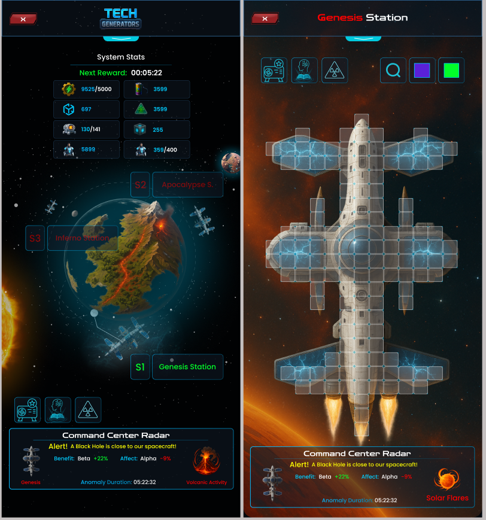

- Rediseño visual completo. Mejor experiencia y base para futuras mecánicas.

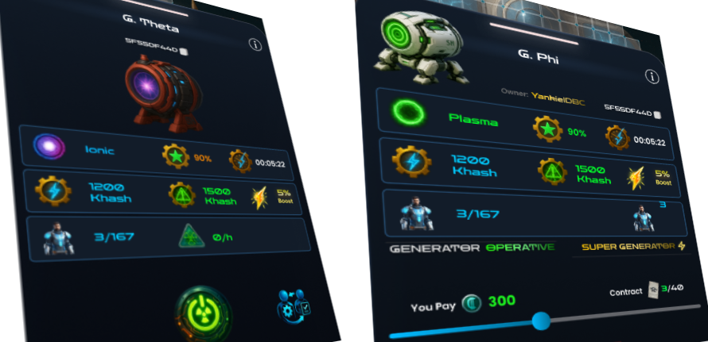

- Datos de generadores ahora mejor organizados y representados.

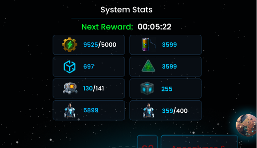

- Ahora puedes ver el total de ingenieros contratados y activos, consumibles activos en toda la nave y nuevas estadísticas.

### UX de Paquetes

Se ajustó la cantidad máxima de paquetes que se pueden abrir simultáneamente. Por ejemplo, los Tickets ahora pueden canjearse en lotes de hasta 1000.

### Catálogo de Juegos

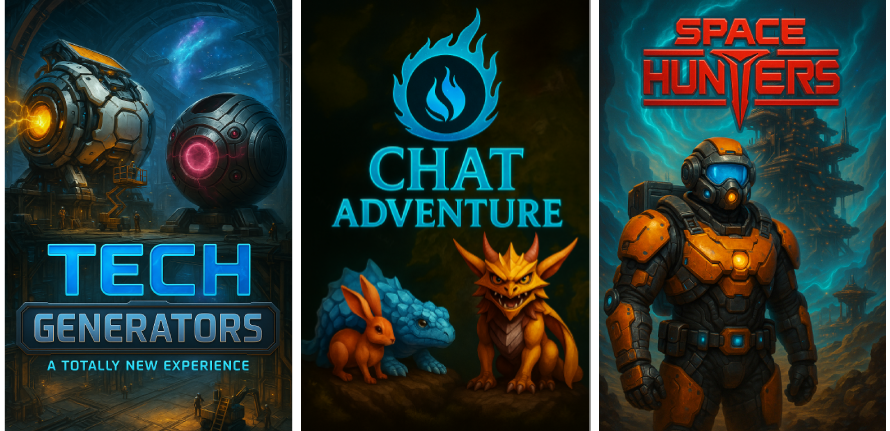

El nuevo catálogo es visual, minimalista e informativo. Muestra portada del juego, resumen y gameplay. Se irá ampliando con guías.

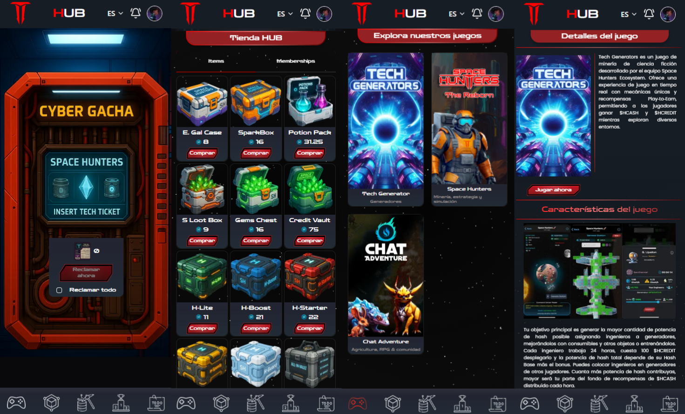

### Rediseño Visual

Más de 300 íconos y objetos rediseñados para una experiencia visual más atractiva.

  

### Idiomas

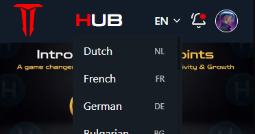

Agregamos 24 idiomas parcialmente a la app. Esto mejora mucho la experiencia de los jugadores no hispanohablantes.

### Edición de Nombre y Código de Referido

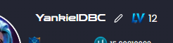  

- Cambiar nombre de usuario: 10 HCASH  
- Cambiar código de referido: 0.5 HCASH  

---

### Tienda

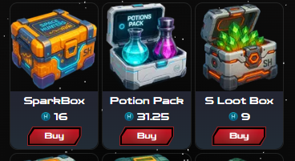

La tienda usa solo $HCASH. Los precios son fijos, pero en la próxima actualización serán dinámicos según oferta y demanda.

---

### Consumibles UX

Los "Buffs" ahora se aplican de 1 en 1 o en grupos de 3. Se eliminó el botón "Aplicar todo" para evitar desperdicio por fatiga.

---

### UX de Ingenieros

Desde el Taller puedes ver cuántos ingenieros tiene cada generador y su potencia total, sin salir al mapa.

---

### Transferencias Internas

Ahora puedes transferir $HCASH a otros usuarios:
- Requiere nivel 15 para enviar
- Sin mínimo para recibir
- 10% de comisión
- Se realiza desde Wallet > Transferir

---

### Conexión Social

Conecta tu cuenta de X (Twitter) para validar tareas sociales automáticamente y ganar $HCREDIT pasivo al mencionar el juego.

---

# Tech Generators

Volvemos a las raíces del plan original, con ajustes clave.

---

### Rebalanceo de Recompensas

Antes: 35% Dueño / 65% Ingenieros  
Ahora: 70% Dueño / 30% Ingenieros

Los ingenieros podrán competir por su parte usando buffs y nuevas mecánicas.

---

### Enfriamiento de Contratos

Ahora deberás esperar unos minutos tras la expiración de un contrato antes de volver a contratar en ese generador. Promueve rotación justa.

---

### Parche de Ciclo

Encender un generador cuesta temporalmente 80 $HCREDIT. Muy pronto se usará **Micro Cubos de Energía** en lugar de HCREDIT.

---

### Ajuste de Experiencia

Se ajustaron los puntos necesarios por nivel según las funciones actuales.

---

### Partes Doradas

El evento **Golden Hash Core** se reanudará por las 24h restantes. Esta parte da +4000 hash y se quema si se intenta remover.

---

### Nuevo Tech Pass

Disponible en duraciones de 3, 7, 15 y 30 días. Comprar varios extiende la duración automáticamente.

---

### Anomalías

Ahora los ingenieros también pueden verse afectados por anomalías (positiva o negativamente), entre 1% y 100%. Usa el radar y consumibles adecuados.

---

# Mercado Negro

Ya no necesitas tener mínimo 100 unidades. Ahora puedes vender cualquier cantidad en el Black Market.

---

# Recompensas y Bonificaciones

### Códigos de Regalo y Descuento

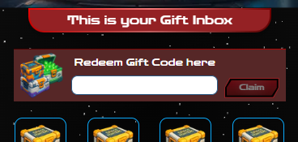

Sistema de recompensas para creadores de contenido y comunidad. Los códigos se canjean en el menú de regalos. Más funciones en camino.

---

### Bonos por Depósito y Referido

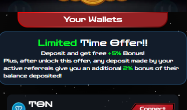

- 3% de bono de tus depósitos en HCASH  
- 2% extra de tus referido cuando depositan HCASH  

Esto impulsa el crecimiento de nuevos usuarios.

---

# Tarjetas de HCREDIT

El $HCREDIT se quema cada 30 días, así que ahora puedes convertirlos en **Tarjetas**:
- De 100 o 500 HCREDIT
- No se pueden revertir
- Se pueden intercambiar
- Serán usadas para mejoras, crafteo y entrenamiento

---

# Nuevos Comandos Fáciles

Nuevos comandos en el bot:

- **/kboard**: Reactiva el teclado rápido 

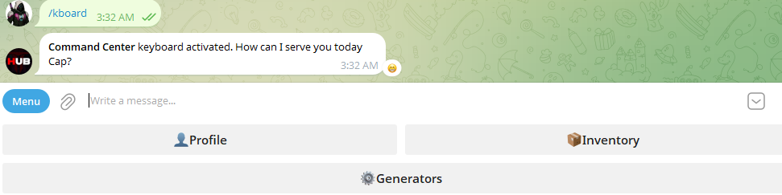

- **Inventory**: Muestra todos tus ítems  

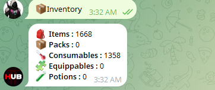

- **/user username**: Muestra el perfil del jugador  

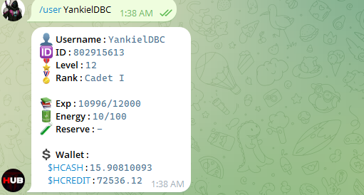

- **/top_grep**: Muestra el top de generadores con mejor reputación 

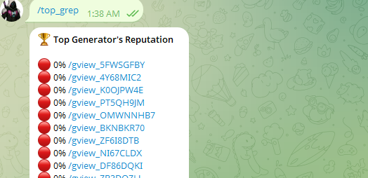

- **/gview_code**: Muestra datos de un generador específico  

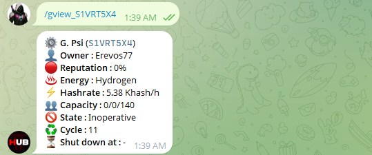

- **/gfind code**: Encuentra generadores por tipo, clase o dueño  

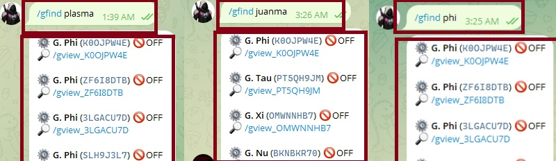

---

# Eso es todo por ahora

Seguiremos actualizando vía anuncios y nuevos blogs para mantener la información organizada. A medida que nuevas funciones estén listas, las explicaremos con detalle.

> ¡Gracias por tu apoyo!

[🔼 Back to Index](#)

---

[Back to Home](../../../index.md)

---
---

