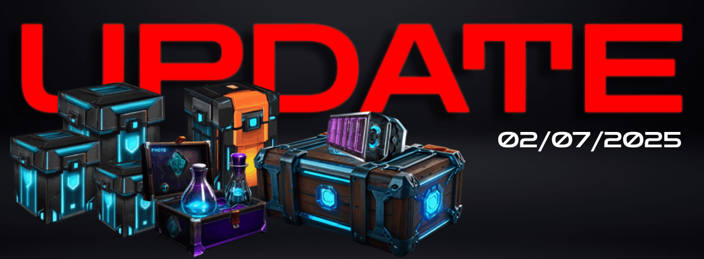

[Volver al Inicio](../../../index.md)
💠
# 🚀 **Actualización 02/07/2025**
### Mejoras y Nuevas Funcionalidades
¡Bienvenidos a una nueva actualización de nuestro ecosistema de juegos! En esta ocasión, hemos trabajado arduamente para mejorar la experiencia de nuestros jugadores, optimizando funciones clave y agregando nuevas mecánicas emocionantes. A continuación, te detallamos todas las novedades:

---

## Índice
1. [La Tienda del HUB](#la-tienda-del-hub)
2. [El Tech Pass](#el-tech-pass)
3. [El Ciclo de Quema del HCREDIT](#el-ciclo-de-quema-del-hcredit)
4. [El Inventario](#el-inventario)
5. [La Gacha Machine](#la-gacha-machine)
   -  [Uso de los Consumibles](#uso-de-ítems-consumibles)
   -  [Lista de Consumibles](#lista-de-consumibles-disponibles)
6. [Black Market](#black-market)
7. [Marketplace HUB](#marketplace-hub)
    - [Elementos](#elementos)
8. [Mecánicas del Marketplace](#mecánicas-del-marketplace)
9. [Wallets](#wallets)
10. [Energía y Experiencia](#energía-y-experiencia)
11. [Tech: Generators](#tech-generators)
    - [Ganancias de los Ingenieros](#ganancias-de-los-ingenieros)
    - [Anomalías](#anomalías)
    - [Mecánica de Anomalías](#mecánica-de-las-anomalías)
    - [Mejoras de Generadores](#mejoras-de-generadores)
    - [Venta de Generadores](#venta-de-generadores)
12. [Delegación de Generadores](#delegación-de-generadores)

[🔼 Subir al Índice](#)

---

### **La Tienda del HUB** 
La tienda dentro del HUB es un espacio centralizado donde puedes encontrar ítems de todos los juegos y expansiones de nuestro ecosistema. Aunque por ahora solo jugamos **Tech: Generators**, es importante destacar que esta tienda está diseñada para crecer junto con el ecosistema.

#### **Mejoras realizadas:**
- **Nueva vista mejorada:** Los ítems ahora se muestran más grandes, dándoles mayor protagonismo. Esto facilita la identificación visual y mejora la experiencia de navegación.
- **Nuevos artículos disponibles:** Hemos añadido nuevos ítems para diversificar las opciones de compra.
- **Futuros filtros:** A medida que aumente la cantidad de ítems disponibles, implementaremos filtros para facilitar la búsqueda. Por ahora, no son necesarios debido a la cantidad actual.

#### **Nuevos artículos en la tienda (Ofertas mensuales y de temporada):**
Estos artículos están diseñados para brindar un impulso inicial a los jugadores, especialmente en **Tech: Generators**. Son ofertas limitadas que pueden cambiar o desaparecer según el crecimiento del juego y la demanda del token después del TGE.

- **H. Credit Vault:** 35,000 HCREDIT  
- **S. Gems Chest:** 9,000 HCREDIT  
- **Commander Vault:** 130,000 HCREDIT, 60 Tech Ticket, 5 Crazy Potion Pack, 10 SparkBox  
- **Starter Bundle:** 15,000 HCREDIT, 5 Tech Ticket, 1 Crazy Potion Pack  
- **Standard Bundle:** 30,000 HCREDIT, 10 Tech Ticket, 2 Crazy Potion Pack, 2 SparkBox  
- **Premium Bundle:** 55,000 HCREDIT, 20 Tech Ticket, 2 Crazy Potion Pack, 5 SparkBox  

Otros artículos destacados:
- **Energy Disruptor:** Apaga instantáneamente un generador, interrumpiendo su operación y reiniciando su ciclo actual.  
- **Cycle Reinitializer:** Reinicia el ciclo actual del generador al primero. Ideal para optimizar la producción de energía.  
- **Auto-PowerUp x1/x3:** Enciende automáticamente tu generador 5 minutos después de apagarse. Se consume directamente desde el inventario.  
- **Crew Permit:** Aumenta la capacidad de ingenieros del generador en 12.  
- **SparkBox:** Restaura instantáneamente el 50% de tu energía. Perfecto para emergencias.  
- **Parts Pack:** Contiene 3 piezas de mejora para generadores.  
- **Crazy Potion Pack:** Contiene 2 pociones aleatorias para aumentar energía o habilidades de aprendizaje.  

### **Tipos de pociones disponibles:**

| Nombre          | Descripción                                                                 |
|------------------|-----------------------------------------------------------------------------|
| Energy Capsule   | Restaura el 25% de tu energía total.                                        |
| Energy Vessel    | Restaura el 50% de tu energía total.                                        |
| Energy Cask      | Restaura el 100% de tu energía total.                                       |
| EXP Wisdom       | Aumenta la capacidad de aprendizaje en un 20% durante 12 horas.              |
| EXP Jnymn        | Aumenta la capacidad de aprendizaje en un 30% durante 1 día (24 horas).      |
| EXP Schlr        | Aumenta la capacidad de aprendizaje en un 40% durante 2 días (48 horas).     |
| EXP Sage         | Aumenta la capacidad de aprendizaje en un 50% durante 3 días (72 horas).     |
| EXP Elder        | Aumenta la capacidad de aprendizaje en un 60% durante 5 días (120 horas).    |
| EXP Champ        | Aumenta la capacidad de aprendizaje en un 70% durante 7 días (168 horas).    |
| EXP Hero         | Aumenta la capacidad de aprendizaje en un 80% durante 10 días (240 horas).   |
| EXP Lgnd         | Aumenta la capacidad de aprendizaje en un 90% durante 12 días (288 horas).   |
| EXP Myth         | Aumenta la capacidad de aprendizaje en un 100% durante 15 días (360 horas).  |

> **Nota:** Algunos artículos estarán disponibles solo en **$HCASH** y otros solo en **TON**.

[🔼 Subir al Índice](#)

---

### **El Tech Pass** 
El **Tech Pass** sigue siendo una herramienta esencial para maximizar tus ingresos y progreso en el juego. En esta actualización, hemos realizado ajustes para brindarte mayor flexibilidad.

#### **Cambios destacados:**
- **Compra ilimitada:** Ahora puedes comprar tantos Tech Pass como desees, y estos se acumularán automáticamente. Por ejemplo, si tienes un pase activo y compras 2 más, el período de tu pase se extenderá por 2 meses adicionales.
- **Seguridad económica:** Esta mejora asegura que tu progreso no se detenga, incluso si enfrentas dificultades económicas o simplemente olvidas renovar tu pase.

> **Nota:** El Tech Pass no es un artículo comerciable entre jugadores. Cada compra está ligada al jugador hasta la fecha de expiración.

[🔼 Subir al Índice](#)

---

### **El Ciclo de Quema del HCREDIT** 
Hemos ajustado el ciclo de quema del **HCREDIT** para optimizar su uso y dinamismo en el ecosistema.

#### **Cambios realizados:**
- **Reducción del ciclo:** El ciclo de quema pasó de **45 días** a **30 días**. Este cambio fue determinado por nuestro equipo tras analizar que los 15 días adicionales no eran necesarios.

[🔼 Subir al Índice](#)

---

### **El Inventario** 
El inventario es un componente crucial de tu experiencia en el juego, ya que alberga todos tus ítems de forma centralizada. Hemos realizado varias mejoras para optimizar su funcionalidad.

#### **Novedades:**
- **Vista mejorada:** Al igual que en la tienda, los ítems ahora se muestran más grandes y claros.
- **Filtros añadidos:** Dado que el inventario es compartido entre todos los juegos, hemos implementado filtros para facilitar la búsqueda de ítems específicos.
- **Botones de acción:**
  - **"Vender":** Envía directamente el ítem al marketplace.
  - **"Acción":** Ofrece opciones adicionales según el uso que desees darle al ítem.

[🔼 Subir al Índice](#)

---

### **La Gacha Machine** 

La **Gacha Machine** es una mecánica emocionante que te permite obtener ítems consumibles gratis para usar en **Tech: Generators**. La encuentras en el menú desplegable al hacer clic en tu foto de perfil.

#### **Características principales:**
- **Probabilidades:** 80% de éxito y 20% de fallo.
- **Tickets gratuitos:** Puedes obtener tickets completando tareas diarias, participando en grupos y gremios, chateando, y comprando en la tienda (con un 80% de probabilidad de recibir un ticket por cada compra).

### **Uso de Ítems Consumibles**  

Antes de utilizar los ítems consumibles, es importante conocer el proceso adecuado para aplicarlos correctamente:  

1. **Accede al taller:**  
   - Debajo del mapa de la nave, encontrarás un botón llamado **"Ingenieros"**.  
   - Al tocarlo, ingresarás a la sección del taller (Alpha), donde verás dos pestañas:  
     - **Inventario:** Muestra los consumibles disponibles para su uso.  
     - **Suministros:** Una mini tienda dentro del juego donde puedes comprar más suministros sin cerrar la partida.  

2. **Aplicación de consumibles:**  
   - Para usar un ítem con efecto **directo** (aplicado a un generador específico), primero debes seleccionar el generador en la parte superior de la pantalla.  
   - **Importante:** Si no tienes ingenieros contratados en generadores, el consumible **no surtirá efecto** y se perderá. Asegúrate de contratar ingenieros antes de aplicarlos.  

3. **Tipos de efectos:**  
   - Algunos ítems tienen efectos **globales**, afectando a **todos** los generadores o ingenieros.  
   - Otros tienen efectos **directos**, impactando solo a un generador específico.  
   - Ciertos ítems están diseñados para **contrarrestar efectos negativos** y solo funcionarán si los ingenieros o generadores están bajo la influencia de dicha anomalía.  

## **Lista de consumibles disponibles:**
Lee detenidamente la descripción del ítem antes de usarlo para asegurarte de aprovechar al máximo su efecto.  

| Nombre                  | Descripción                                                                 |
|-------------------------|-----------------------------------------------------------------------------|
| Energy Boost            | Aumenta la potencia base del generador en un 2% durante 1 hora.             |
| Energy Crystal          | Aumenta la potencia base del generador en un 10% durante el próximo ciclo.  |
| Production Boost        | Aumenta la potencia base del generador en un 15% durante los próximos 3 ciclos. |
| Energy Reinforcement    | Aumenta la potencia base del generador en un 15% durante 10 horas.          |
| Reinforcement Battery   | Aumenta la potencia base del generador en un 15% durante 1 hora.            |
| Temporary Overcharger   | Aumenta la potencia base del generador en un 20% durante 3 ciclos.          |
| Nexus Generator         | Aumenta la potencia base de todos los generadores en un 20% durante 2 horas.|
| Advanced Energy Core    | Aumenta la potencia base del generador en un 30% durante 2 horas.           |
| Supreme Power Crystal   | Aumenta la potencia base del generador en un 50% durante 1 hora.            |
| Experimental Additive   | Aumenta la potencia base del generador en un 25% durante 1 hora.            |
| Cycle Controller        | Reduce la duración del próximo ciclo en un 10%.                            |
| Flow Controller         | Reduce la duración del ciclo del generador en un 10% durante 6 horas.       |
| Cooling Device          | Reduce la duración del ciclo del generador en 2 horas.                      |
| Failure Reduction Device| Reduce la duración del próximo ciclo en un 5%.                             |
| Thermal Protector       | Restaura hasta un 25% del hashrate del generador durante un evento anómalo. |
| Anti-Overload System    | Previene el aumento de sobrecarga durante los próximos 2 ciclos de descanso.|
| Protection Crystal      | Restaura hasta un 15% del hashrate del generador durante 2 horas.           |
| Energy Shield           | Restaura el hashrate del generador durante 30 minutos.                      |
| Invisibility Cloak      | Restaura el hashrate del generador durante 1 hora.                          |
| Infinite Substance      | Restaura el hashrate del generador durante 1 hora.                          |
| Autonomous Repairer     | Restaura hasta un 10% del hashrate del generador hasta el final del ciclo actual. |
| Repair Nanobots         | Restaura hasta un 20% del hashrate del generador durante 30 minutos.        |
| High-Performance Nanobots| Restaura hasta un 50% del hashrate del generador durante 1 hora.            |
| Elite Repairer          | Restaura el hashrate del generador durante 1 hora.                          |
| Ray of Hope             | Restaura el hashrate del generador hasta el final del ciclo actual.         |
| Stabilizer Reactor      | Fuerza al generador a producir un 10% más de hashrate durante 4 horas.      |
| High-Energy Fuse        | Elimina la sobrecarga durante el próximo ciclo medio.                       |
| Advanced Control Interface| Restaura el hashrate del generador hasta que se resuelva la anomalía.       |
| Stabilization Powder    | Restaura el hashrate del generador durante 1 hora.                          |
| Energy Injector         | Aumenta el hashrate del ingeniero en un 5% durante 8 horas.                 |
| Automatic Repairer      | Aumenta el hashrate del ingeniero en un 5% durante 24 horas.                |
| Toolkit                 | Aumenta el hashrate del ingeniero en un 5% durante 30 minutos.              |
| High-Efficiency Pills   | Aumenta el hashrate del ingeniero en un 10% durante 1 hora.                 |
| Stabilization Crystals  | Restaura hasta un 5% del hashrate del ingeniero durante 2 horas.            |
| Precision Gear          | Aumenta el hashrate del ingeniero en un 20% durante 2 horas.                |
| Maximum Efficiency Additive| Aumenta el hashrate del ingeniero en un 40% durante 1 hora.                |
| Virtual Contractor      | Reduce los costos de contratación de ingenieros en un 50% en el próximo contrato. |
| Contract Extender       | Extiende los contratos actuales en 5 horas.                                 |
| Automated Contracts     | Extiende los contratos actuales en 10 horas.                                |
| Resilience Supplement   | Restaura hasta un 15% del hashrate del ingeniero durante 1 hora.            |
| High-Tech First Aid Kit | Restaura hasta un 30% del hashrate del ingeniero durante el contrato actual.|
| Safety Device           | Restaura hasta un 10% del hashrate del ingeniero durante 30 minutos.        |
| Energy Link             | Aumenta el hashrate del ingeniero en un 15% durante 12 horas.               |
| Energy Boost Battery    | Aumenta el hashrate del ingeniero en un 15% durante 1 hora.                 |
| Engine Boost            | Aumenta el hashrate del ingeniero en un 20% durante 1 hora.                 |
| Emergency Charge        | Restaura el hashrate del ingeniero durante 30 minutos.                      |

[🔼 Subir al Índice](#)

---

### **Black Market** 
El **Black Market** es una nueva mecánica diseñada para ofrecer una alternativa **play-to-earn**, permitiendo a los usuarios monetizar rápidamente algunos de sus ítems. Esta función se lanzó inicialmente con los 4 elementos básicos del juego **Chat-Adventure**.

#### **Cómo funciona:**
- **Venta en grupos de 100:** Solo puedes vender ítems si tienes al menos 100 unidades. Si tienes menos, deberás esperar hasta alcanzar esa cantidad.
- **Precio por unidad:** El precio mostrado es por unidad, no por el grupo completo.
- **Precios dinámicos:** El precio varía según el suministro circulante del ítem.
- **Gráficos de referencia:** La gráfica muestra el suministro actual y su variación en comparación con el día anterior.
- **Comisión (fee):** El Black Market tiene una comisión fija del **8%** sobre cada transacción.

[🔼 Subir al Índice](#)

---

### **Marketplace HUB** 
El **Marketplace HUB** es un mercado centralizado donde puedes comprar y vender todos los ítems de todos los juegos de nuestro ecosistema. Para facilitar la experiencia, hemos implementado filtros que te permiten navegar y encontrar lo que necesitas rápidamente.

#### **Cómo vender un ítem:**

1. Ve a tu **Inventario**.
2. Selecciona el ítem que deseas vender.
   - Si ves el botón **"Sell"**, haz clic directamente.
   - Si ves **"Action"**, haz clic primero en ese botón y luego selecciona **"Sell"**.
3. Ingresa el precio de venta y confirma haciendo clic en **"Sell"** nuevamente.

---

#### **Elementos:**
Para vender Elementos en el Marketplace, primero debes decidir la cantidad que quieres vender. Si quieres vender por unidad, puedes hacerlo, o puedes agrupar 100 elementos iguales en un nuevo ítem llamado "Pot" o "Box", que representa las 100 unidades. Esto lo puedes hacer desde el inventario tocando el botón **"Action"** y luego seleccionando **"Bulk"**. Si deseas revertir el proceso, sigue los mismos pasos, pero en lugar de seleccionar **"Bulk"**, elige **"Split"** para dividir el ítem nuevamente en sus unidades individuales. En resumen, puedes vender de uno en uno o de 100 en 100.

> Action :

> Bulk:

Todas las ofertas del mercado están ordenadas por precio de menor a mayor automáticamente.

> **NOTA:** De momento, los artículos del proyecto solo pueden ser comercializados y no transferibles, pero próximamente agregaremos esa función e incluso modelos de becas para los usuarios que deseen crear becas.

[🔼 Subir al Índice](#)

---

### **Mecánicas del Marketplace** 
Este Marketplace es único en su clase y fue diseñado específicamente para proteger tus activos. A continuación, te explicamos las reglas que garantizan un comercio justo y equilibrado.

#### **Reglas de protección contra "price dumping":**
1. **Límite mínimo de precio:** No puedes poner un precio inferior al **10% del Floor Price** del mismo ítem.
2. **Protección frente a la tienda oficial:** Si el ítem está disponible en la tienda, no puedes poner un precio inferior al **50% del precio de la tienda**.
3. **Fee por venta:** Colocar un ítem en venta no tiene costo, pero una vez vendido, el sistema deducirá un **10%** como comisión.
4. **Fee por cancelación:** Si decides cancelar un listado, el sistema tomará un **1%** del precio anterior.
5. **Fee por ajuste de precios:** Cada vez que modifiques el precio de un ítem, el sistema deducirá un **1%** del precio anterior.

[🔼 Subir al Índice](#)

---

### **Wallets** 
En esta actualización, hemos simplificado la gestión de wallets. Ahora, solo puedes vincular wallets relacionadas con **TON**. Esto garantiza una experiencia más segura y fluida al realizar compras en nuestra plataforma.

#### **Futuras mejoras:**
Planeamos agregar más funciones dentro de este menú en futuras actualizaciones. Por ahora, el enfoque principal es permitirte vincular tu wallet para realizar compras sin problemas.

[🔼 Subir al Índice](#)

---

### **Energía y Experiencia** 
La energía y la experiencia son dos nuevas características que ya activamos en esta actualización. Como saben muchos de ustedes, se ha mencionado montones de veces que son dos características muy importantes en su perfil único de experiencia compartida, ya que el nivel que tengas y la experiencia que ganes funciona para todos nuestros juegos. Comencemos hablando de los detalles:

#### **La Energía:**
No todas las acciones del ecosistema consumirán energía, pero muchas de ellas sí para complementar el equilibrio y eliminar la explotación en cualquier aspecto posible, pero también fomentar una base sólida de distribución de trabajo entre las diferentes actividades. Es importante que comprendas cómo distribuir eficientemente tu energía para optimizar tu desempeño.

A continuación, te doy datos sobre las actividades que de momento consumen energía:
- **Las expediciones de Chat-Adventure:** 8 puntos de energía.
- **Contratar Ingenieros:** 1 punto de energía. No es por cada ingeniero, sino por cada acción. Es decir, si contratas 5 ingenieros juntos, eso cuenta como 1 acción. Si luego vas y contratas 2 en otro, cuenta como otra acción.
- **Encender el Generador en el ciclo 11:** Consume 2 puntos de energía, pero si tienes Tech Pass, será solo 1 punto de energía. Este consumo es únicamente en el ciclo 11.

De momento, estas son todas las acciones que consumen energía, super simple y básico para ir introduciendo esta mecánica en el ecosistema.

#### **La Experiencia:**
La experiencia es básica y necesaria para desbloquear muchas cosas del proyecto, específicamente alcanzar el rango de confianza para retiros, que sería el nivel 15. Las actividades que proveerán experiencia en esta primera actualización son:
- **Las tareas diarias:** Otorgan 1 punto de experiencia cada vez que completas una tarea. Si tienes Tech Pass, obtienes 5 puntos.
- **Si tienes Tech Pass, cada compra en la tienda te da un punto de experiencia.**
- **Contratar ingenieros:** 2 puntos y con Tech Pass, 8 puntos de experiencia.
- **Encender el generador:** Otorga 5 puntos de experiencia y con Tech Pass, 10 puntos. Igual que la energía, esto ocurre al llegar al ciclo 11 únicamente.
- **Expandir el generador (Slots):** Otorga 1 punto de experiencia y con Tech Pass, 5 puntos, por cada slot.
- **En las Expediciones de Chat-Adventure, al regresar con algún material, obtienes experiencia:**
  - **Yggdrasil Wood:** 2 puntos de experiencia.
  - **Celestite Stone:** 15 puntos de experiencia.
  - **Orichalcum Metal:** 150 puntos de experiencia.

Estas son todas las actividades de momento. Iremos integrando más a medida que avanzamos en el desarrollo.

[🔼 Subir al Índice](#)

---

### **Tech: Generators** 

#### **Botón de salida:**
Agregamos un botón para una salida inmediata del juego hacia el HUB, mejorando la experiencia de usuario y el consumo de tiempo.

#### **Ganancias de los Ingenieros:**
Ahora, la distribución de ganancias de los ingenieros va a depender de la eficiencia. De momento, el único modelo que altera la eficiencia es a través del uso de consumibles. Mientras más potenciados estén tus ingenieros, más ganancias obtendrán.

Para explicarlo en forma simple, el **65%** que se divide entre los ingenieros usará el mismo modelo de pools de los generadores. Mientras más eficientes sean tus ingenieros, más porcentaje de ese pool ganarás. Cuanto más potenciados estén los ingenieros, mayor porcentaje de ganancia recibirán.

---

#### **Anomalías:**
- Hay **41 tipos de anomalías diferentes**.
- Las anomalías pueden durar hasta **12 horas consecutivas**.
- Tienen efectos negativos o positivos sobre uno o más generadores, afectando su eficiencia base entre un **10% y un 30%**.
- Después de una anomalía, hay un **50% de probabilidad** de experimentar efectos colaterales (**Side Effects**) que pueden ser positivos o negativos.

#### **Mecánica de las Anomalías**

El sistema notificará en el chat principal cuando una anomalía esté próxima a ocurrir, alertando a los jugadores sobre su posible impacto. En el juego, un mini radar mostrará el nombre de la anomalía y los tipos de generadores que serán afectados, ya sea de manera positiva o negativa.

Al interactuar con el símbolo amarillo de alerta en los generadores afectados, se desplegará una ventana con información detallada, incluyendo:

- **Efectos colaterales:** Si corresponden, tanto durante como después de la anomalía.
- **Efectos actuales:** Consumibles aplicados por el jugador o por otros participantes.

#### **Codificación de colores en la ventana de efectos:**
- 🟢 **Verde:** Indica una anomalía con efectos positivos.
- 🔴 **Rojo:** Representa una anomalía con efectos negativos.
- 🔵 **Azul:** Señala la presencia de un efecto secundario.
- 🟣 **Morado:** Identifica una parte equipada en el generador.
- 🟡 **Amarillo:** Indica consumibles aplicados por el propio jugador.
- ⚫ **Gris:** Muestra consumibles aplicados por otro usuario.

El algoritmo que estamos desarrollando para las anomalías trabaja con muchos datos buscando simular inteligencia, por lo que se irá mejorando en la práctica. Buscamos que no sea abusivo y que se vuelva bastante aleatorio simulando la creación de eventos de forma natural realista. Es decir, trataremos de que no afecte de forma sofocante a ningún generador de forma negativa ni favorezca abusivamente de forma continua a ningún generador.

---

#### **Mejoras de Generadores:**

Para mejorar los generadores, debes entrar en la opción de **Upgrade** debajo del mapa de la nave y seguir estos pasos:
1. Selecciona el generador que deseas mejorar.
2. Toca la pestaña central **"Equipped"**.
3. Compra slots adicionales para expandir la capacidad mecánica del generador. El precio de los slots incrementa exponencialmente con cada expansión para mantener un juego equilibrado. Todos los generadores tienen precio de slots acorde a su potencia base original. Los slots son permanentes.
4. Equipa partes obtenidas en **Parts Pack** para mejorar el hashrate del generador.

##### **Partes disponibles:**
- **Hash Basic:** Provee +12 Hashrate (0.012).
- **Hash Plus:** Provee +50 Hashrate (0.050).
- **Hash Rotor:** Provee +180 Hashrate (0.180).

Estas partes se pueden obtener abriendo **Parts Pack**. Puedes comprar esos packs en la tienda del juego. Las partes obtenidas son basadas en probabilidad.

También puedes expandir la capacidad de ingenieros que trabajan en tu generador con los **Crew Contracts** disponibles en la tienda, estos aumentan en **+12** la capacidad de espacio para ingenieros.

- **Todas estas mejoras son permanentes y transferibles al cambiar de dueño.**
- **Las partes equipadas no pueden ser desequipadas, solo quemadas.**
- **Próximamente agregaremos una función de combinar 4 partes iguales para crear una del siguiente nivel.** Esto ayuda a crear piezas poderosas ocupando menos espacio y reutilizando las partes que obtuviste en tus packs o las no deseadas por otros jugadores conseguidas en el mercado.
- **No existe un límite de mejora, puedes mejorar tanto desees.**

---

#### **Delegación de Generadores:**

Esta actualización introduce una nueva mecánica de trabajo compartido, la cual llamamos **"Delegación"**. En términos simples, se trata de asignar a un jugador el rol de Operador y que este se encargue de operar tu generador, es decir, encenderlo durante el tiempo establecido en el contrato y mientras lo hace, obtiene un porcentaje de las ganancias que genera tu generador.

##### **Detalles:**
- Para delegar, ambos **Dueño** y **Operador** deben tener Tech Pass.
- El dueño establece los detalles del contrato.
- La propuesta se envía al postulante a Operador y debe ser aceptada o rechazada.
- Si el postulante a operador no responde la propuesta, debe ser cancelada si deseas enviarla a alguien más.
- Si la propuesta es aceptada y el contrato entra en efecto según las condiciones de la fecha, el generador dejará de aparecer como tuyo y el nuevo operador lo verá en el mapa de la nave en azul como si fuera de él.
- Los costes de energía, coste operativo (10 HCREDIT por encendido) y la experiencia serán manejadas por parte del actual operador.
- Las ganancias se dividen en el porcentaje establecido automáticamente.
- Si el operador no incumple con las reglas del contrato, el dueño no tiene opción disponible para cancelar.
- Si el operador no cumple con las reglas, el dueño verá la opción de cancelar el contrato dentro de las opciones de delegación.

##### **Paso a paso de la delegación:**
Para delegar, debes tocar dentro de tu generador la opción que está a la derecha del botón de encendido, luego debes establecer los términos:
- **Username del Operador (HUB Username):** El nombre de usuario del operador.
- **Round:** Cantidad de bloques que va a trabajar.
- **Fails:** Cuántas veces le permitirás fallar en el encendido.
- **Inactividad:** El tiempo de retraso que entiendes que puede tener para encender el generador. Luego de ese tiempo, aunque lo encienda, se considera un **"Fail"**.
- **Fechas:** Determina cuándo deseas que comience y termine el contrato, debe ser acorde a la cantidad de bloques como mínimo. Puedes incluso programar con antelación cuándo quieres que comience a trabajar.
- **Ganancias:** Establece qué porcentaje quieres darle de tus ganancias con ese generador.

Dicho esto, creo que está todo claro. El resto es ponerlo en práctica para dominar la mecánica.

---

#### **Venta de Generadores:**
En la tienda se pondrán a la venta una nueva ronda de generadores, los detalles se anunciarán pronto pero básicamente será enfocada en usuarios que no tengan Generadores y otros requisitos buscando diversificar los dueños para mejorar la eficiencia de la nave mediante la disponibilidad de mas generadores encendido dada la actual irresponsabilidad de algunos dueños.

Pero, si actualmente eres dueño, para vender un generador, deben cumplirse los siguientes requisitos:
- Tiene que estar apagado.
- No puede tener ingenieros contratados. Si se apagó con ingenieros, tiene que esperar que se venzan los contratos.
- No puede estar delegado.

Si el generador tiene mejoras, todo es transferible al próximo dueño, es decir, slots e ítems equipados están ligados al generador y se transfieren al nuevo dueño. Con respecto al ciclo, el nuevo dueño obtiene el generador reiniciado en el ciclo #1.

[🔼 Subir al Índice](#)

---

[Volver al Inicio](../../../index.md)

---
---

