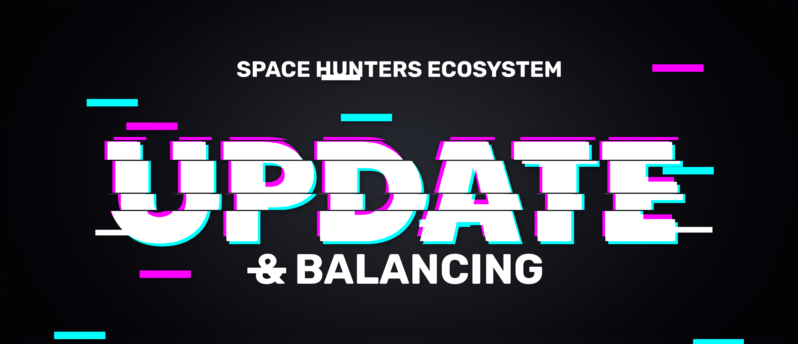

[Menú Principal](../../../docs/esp/00-index.md)💠

### 🚀 **Actualización 03/26/2025**

# Visión General de Space Hunters

Space Hunters es un ecosistema basado en blockchain que combina juegos inmersivos, gestión estratégica y una economía interconectada. Los jugadores exploran un universo galáctico, gestionan recursos, completan tareas y participan en una experiencia impulsada por la comunidad.

---
Este índice proporciona la visión general necesaria para que los nuevos usuarios comprendan los mecanismos del juego y el ecosistema de Space Hunters. Es un recurso clave para los nuevos jugadores.

## Visión General del Proyecto
1. [Conceptos Clave](#conceptos-clave)
2. [Juegos en Space Hunters](#juegos-en-space-hunters)
3. [TechPass](#techpass)
4. [HCASH & HCREDIT](#hcash--hcredit)
5. [Comunidad & Economía](#comunidad--economía)
6. [Marketplace y Black Market](#marketplace-y-black-market)
7. [Tareas Diarias y Sociales](#tareas-diarias-y-sociales)
8. [Logros y Recompensas Gratuitas](#logros-y-recompensas-gratuitas)
9. [Máquina Gacha](#máquina-gacha)
10. [Listado del Token y Estrategia de Liquidez Próximos](#listado-del-token-y-estrategia-de-liquidez-próximos)
11. [Actualizaciones y Mantenimiento Recientes](#actualizaciones-y-mantenimiento-recientes)

---

## Nueva Actualización 03/26/2025
- [Programa H-Vault](#programa-h-vault)
- [El Super Pase](#el-super-pase)
- [Ingenieros Especializados](#ingenieros-especializados)
- [Programa de Pre-Contratos](#programa-de-pre-contratos)
- [Entrenamiento de Ingenieros](#entrenamiento-de-ingenieros)
- [Expansiones: Recicladores](#expansiones-recicladores)
- [Integración de Nuevas Piel](#integración-de-nuevas-piel)
- [Partes Doradas](#partes-doradas)
- [Nuevos Artículos de la Tienda](#nuevos-artículos-de-la-tienda)
- [NFT Derechos de Propiedad](#nft-derechos-de-propiedad)
- [Pase de Acceso](#pase-de-acceso)
- [Econimía Intelligente](#economía-inteligente)
- [Etiqueta de Reputación](#etiqueta-de-reputación)  
- [Anomalías - 2do Parche](#anomalías---2do-parche)  
- [Lista de Favoritos](#lista-de-favoritos)  
- [Publicación de Tareas (Comunidad)](#publicación-de-tareas-comunidad)  
- [Próximo Juego: Chat-Adventure](#próximo-juego-chat-adventure)  

---

## Conceptos Clave
Aquí hay una visión general para nuevos usuarios:
- **Generadores:** Los jugadores poseen y operan generadores para producir recursos.

- **Ingenieros:** Esenciales para mejorar el rendimiento de los generadores. Los ingenieros pueden ser contratados y gestionados para una producción óptima.

- **HCASH & HCREDIT:** Los tokens principales de la economía de Space Hunters, utilizados para pagos, staking y recompensas.

- **TechPass:** Una suscripción mensual que proporciona beneficios mejorados y contenido exclusivo.

[🔼 Regresar al Índice](#)

---

## Juegos en Space Hunters
1. **Generadores Técnicos:** Juego de minería de $HCASH de estilo Web2 con un toque de estrategia y gestión de recursos.
2. **Aventuras de Chat-RPG:** Sumérgete en experiencias narrativas, juego basado en RPG donde los jugadores cazan criaturas, exploran y compiten en PVP.
3. **SH The Reborn:** Embárcate en exploraciones planetarias en busca de recursos raros y valiosas recompensas.
4. **Novarians Conflict:** Juego de estrategia PVP en tiempo real donde los jugadores compiten por la dominación en la galaxia.

[🔼 Regresar al Índice](#)

---

## TechPass
El **TechPass** es una suscripción opcional que proporciona ventajas significativas a los jugadores dedicados. Ofrece:

- Propiedad de múltiples generadores (ilimitados frente a uno para usuarios gratuitos).
- 3 veces más asignaciones de ingenieros.
- Notificaciones 5 minutos antes del apagado del generador.
- Ganancias completas durante el período de reactivación.
- Opciones de delegación para mantener los generadores en funcionamiento.
- 15% extra en las ganancias por hora de los generadores.
- Los ingenieros generan 5% más de HCREDIT por pago.
- Doble generación de HCREDIT en toda la plataforma.
- Acceso exclusivo a la **Tarea GetRich** con recompensas de 150k HCREDIT durante 30 días.

**Costo del TechPass:** $2 en tokens TON, durando 30 días.

[🔼 Regresar al Índice](#)

---

## HCASH & HCREDIT
El ecosistema de Space Hunters cuenta con dos tokens clave:

- **$HCASH:** Token de gobernanza y utilidad con un valor de lanzamiento de $0.16.
- **$HCREDIT:** Herramienta principal para la minería de $HCASH, utilizada principalmente en los Generadores Técnicos.

### Estadísticas Clave (a partir de ahora)
- **$HCREDIT Acuñados:** 70M, con el 96% (67M) quemados.
- **$HCASH Extraídos:** 819K, con el 58.2% (476K) reinvertidos en el ecosistema.
- **$HCASH en Circulación:** 342K.

>**NOTA:** Después del 1 de abril, estará disponible la retirada (unas horas después) con un 10% de comisión que se utilizará para recompensar a los Titulares, Stakers y para devolver al Tesoro. El saldo del Tesoro se utilizará para aumentar la liquidez de DEX y otras actividades financieras. No hay un mínimo de retirada. Las comisiones de la blockchain correrán a cargo del usuario.

Los tokens $HCASH son minados por los jugadores y puestos en circulación por las retiradas, lo que significa que no hay una preventa, venta privada ni ningún otro tipo de asignación externa de tokens hasta ahora ni previamente. Este modelo aumenta el valor del token y del ecosistema en su conjunto. El equipo de Space Hunters quiere asegurar el éxito a largo plazo del proyecto.

Al proporcionar liquidez, te conviertes en inversor, usa tus tokens retirados para aumentar tu posición de liquidez utilizando la estrategia mencionada en el [Listado del Token y Estrategia de Liquidez Próximos](#listado-del-token-y-estrategia-de-liquidez-próximos)

Se estima que menos de 5M $HCASH circularán en la cadena en el primer año, garantizando una dinámica de alta demanda y baja oferta.

[🔼 Regresar al Índice](#)

---

## Comunidad & Economía
La comunidad de Space Hunters prospera mediante la participación activa, el comercio y la competencia. El ecosistema está respaldado por:

- **Gobernanza Comunitaria:** Los titulares de tokens votan en decisiones importantes (Próximamente)
- **Pools de Liquidez:** Los jugadores contribuyen a la liquidez, ganando ingresos pasivos.
- **Tableros de Clasificación:** Competir por los primeros puestos y recompensas exclusivas.
- **Eventos & Alianzas:** Eventos frecuentes en el juego y multiplataforma.
- **Gremios:** Únete o crea grupos para colaborar y crecer juntos.

[🔼 Regresar al Índice](#)

---

## Marketplace y Black Market

- **Marketplace:** Accesible a partir del Nivel 12, los usuarios pueden comerciar recursos, objetos y consumibles.
- **Black Market:** Diseñado para el próximo juego de **Chat-Adventure**, este área admitirá el comercio de ítems exclusivos y la gestión de activos en el juego.

[🔼 Regresar al Índice](#)

---

## Tareas Diarias y Sociales

Los jugadores pueden ganar $HCREDIT a través de los siguientes métodos:

- **Tareas Diarias:** Completa tareas para ganancias consistentes.
- **Tareas Sociales:** Participa con la comunidad de Space Hunters en plataformas sociales.
- **Programa de Referidos:** Gana comisiones perpetuas de los usuarios referidos.

[🔼 Regresar al Índice](#)

---

## Logros y Recompensas Gratuitas

Al desbloquear logros, los jugadores pueden obtener objetos gratuitos como:

- Pociones de Energía
- Paquetes de Ítems
- Boletos para la Máquina Gacha
- Elementos
- Materiales

[🔼 Regresar al Índice](#)

---

## Máquina Gacha

La **Máquina Gacha** ha sido actualizada significativamente, eliminando 22 consumibles y mejorando las probabilidades. El nuevo equilibrio incluye:

- Más Buffs para Ingenieros
- Reducción de Protección & Contratos
- Aumento de la Demanda de Consumibles

### Consumibles Disponibles:

#### **Buffs para Ingenieros:**
- Inyector de Energía
- Reparador Automático
- Juego de Herramientas
- Pastillas de Alta Eficiencia
- Engranaje de Precisión
- Aditivo de Máxima Eficiencia

#### **Buffs para Generadores:**
- Impulso de Energía
- Cristal de Energía
- Impulso de Producción
- Refuerzo de Energía
- Núcleo de Energía Avanzado
- Cristal de Poder Supremo

#### **Protección:**
- Cristal de Protección
- Nanobots de Alto Rendimiento
- Reparador Elite

#### **Buffs para Contratos:**
- Contratista Virtual
- Extensor de Contrato
- Contratos Automatizados

[🔼 Regresar al Índice](#)

---

## Listado del Token y Estrategia de Liquidez Próximos

**$HCASH** será listado en **Tonco DEX** el **1 de abril**. La estrategia de liquidez implica distribuir la liquidez en 7 wallets con una estrategia de liquidez inteligente, garantizando la estabilidad del precio y maximizando los ingresos por comisiones.

### Rangos LP de las Wallets:
- Wallet 1: Precio base (Wallet de Contrato)
- Wallet 2: $0.005 a ∞
- Wallet 3: $0.01 a ∞
- Wallet 4: $0.05 a ∞
- Wallet 5: $0.1 a ∞
- Wallet 6: $0.12 a ∞
- Wallet 7: $0.16 a ∞

**Recomendación:** Proporciona liquidez como las Wallets 4 o 5 para obtener beneficios máximos. Esta estrategia disminuye la liquidez si el precio baja e incrementa cuando el precio sube, lo que ayudará a mantener el precio en un rango que rentabilice las LP pero también ayude a impulsar el precio si cae demasiado. $HCASH es un token escaso, y nuestro equipo está constantemente buscando nuevos casos de uso que agreguen más valor.

[🔼 Regresar al Índice](#)

---

## Actualizaciones y Mantenimiento Recientes

- **Migración del Servidor:** Mejor rendimiento y experiencia más fluida. (En curso)
- **Retención de Tokens:** Las ganancias de $HCREDIT permanecen intactas durante el mantenimiento.
- **Extensión de la Membresía VIP:** Se extiende para cubrir el tiempo de inactividad. (Después del mantenimiento)
- **Correcciones de Bugs y Optimizaciones:** Tiempos de carga más rápidos y menos errores. (En curso)

[🔼 Regresar al Índice](#)

--- 
---
---
---
---

# Nueva Actualización 03/26/2025
¡Estamos emocionados de compartir contigo lo que esperar para 2025!

## Programa H-Vault
Un modelo que te permite bloquear tokens $HCASH con rangos de tiempo y cantidad flexibles, dándote no solo comisiones frecuentes para tu beneficio sino también desbloqueando características en el juego que mejorarán tu experiencia como jugador.

- **Disponibilidad Limitada:** Solo un bloqueo por usuario y un número limitado de usuarios simultáneos.
- ** Prepárate:** Asegúrate de tener tus tokens listos y elige el momento adecuado, ya que alguien más podría ocupar tu lugar.

[🔼 Regresar al Índice](#)

---

## El Super Pase
Diseñado especialmente para Propietarios de Generadores, disponible en la sección de membresía de la tienda:
- **Precio:** 25 en tokens $HCASH (25 tokens al precio de lanzamiento)
- **Duración:** 7 Días
- **Etiqueta Exclusiva:** “Super Generador” con etiqueta dorada
- **Impulso de Hashrate:** +22% de Hashrate base de forma permanente
- **Pre-Contratos:** Permite Pre-Contratos de SE hasta el 100% de capacidad paralela (duplicando la capacidad de contratos de tu generador).
- **Comisiones:** Gana comisiones del 13% de los ingresos bonus de los SE (Ingenieros Especializados).
  - *Nota: El 13% de comisión se aplica a los ingresos adicionales (Bonus) de los Ingenieros Especializados, no a los ingresos regulares de los contratos (65%/Total).* 

[🔼 Regresar al Índice](#)

---

## Ingenieros Especializados
Ingenieros de alta calidad contratados a través del programa de Pre-Contratos:
- **+25% de Aumento en los Ingresos**
- **+2 Hash de Eficiencia Base**
- **Buffs de Consumibles:** Afectados por consumibles de clase buff
- **Reducción del Impacto de Anomalías:** 40% de reducción de los efectos negativos de las anomalías sobre ingenieros.
- **Sin Extensiones de Contrato:** No se pueden extender los contratos usando consumibles de extensión de tiempo

[🔼 Regresar al Índice](#)

---

## Programa de Pre-Contratos
Permite a los ingenieros reservar contratos en un generador seleccionado.
- **Tiempo de Reserva:** Antes del reset diario (00:00 UTC)
- **Reserva Máxima:** 1 día (el día siguiente)
- **Funcionamiento:** Los ingenieros de Pre-Contrato comienzan a trabajar a las 00:00 UTC y terminan 24 horas después.
- **Especifico del Generador:** Las reservas se hacen para un generador específico.
- **Cuota de Reserva:** 1 $HCASH por reserva, contribuyendo al tesoro económico.
- **Bloqueo Temporal:** 6.25 $HCASH por ingeniero queda bloqueado durante 24 horas y se reembolsa después.
- **Uso de HCREDIT:** 100 $HCREDIT por ingeniero se consumen en el momento de la reserva para garantizar el cumplimiento.
- **Capacidad Adicional:** Los Pre-Contratos no ocupan la capacidad base del generador.
- **Contratación Flexible:** Puedes contratar ingenieros regulares junto con Pre-Contratos, permitiendo hasta 40 ingenieros por generador.

[🔼 Regresar al Índice](#)

---

## Entrenamiento de Ingenieros
Podrás entrenar y mejorar la eficiencia de tus ingenieros a través de programas de entrenamiento basados en $HCASH, aumentando su eficiencia base permanente (base actual: 10 hash). Estos programas también proporcionarán bonificaciones de ingresos adicionales y ventajas en los próximos mecanismos de **Apocalypse Spacecraft**.

[🔼 Regresar al Índice](#)

---

## Expansiones: Recicladores
Una nueva expansión para los Generadores Técnicos está llegando, llamada **Recicladores**, disponible para compra con $HCASH. Espera una emocionante experiencia con ataques de piratas, robo de recursos, sabotaje de tripulantes o gremios, recolección de escombros espaciales y otras mecánicas entretenidas.

## Integración de Nuevas Piel
Nuevos diseños para perfiles de usuario y apariencias de generadores serán introducidos. Serán más que cosméticos; estas piel serán coleccionables y proporcionarán buffs de eficiencia. Aparecerán como ítems en tu inventario, que puedes activar, desactivar o comerciar.

## Partes Doradas
Las Partes Doradas se introducirán con el lanzamiento del nuevo servidor.

## Nuevos Artículos de la Tienda
Se agregarán más ítems para jugadores e inversores.

## NFT Derechos de Propiedad
Próximamente, podrás mintear tu perfil de Space Hunters en la blockchain en forma de NFT. Esta nueva ventaja no solo añadirá una capa de seguridad descentralizada a tu cuenta, sino que también te permitirá transferir la propiedad junto con sus bienes e incluso comercializarla. Los detalles sobre el proceso y su implementación se revelarán junto con la actualización correspondiente.

[🔼 Subir al Índice](#)

---

## Pase de Acceso
Este pase te otorga acceso a misiones diarias especiales con recompensas extraordinarias en $HCREDIT. Las misiones están clasificadas por rangos y para desbloquearlas es necesario cumplir ciertos requisitos. Puedes completar una misión al día, pero si no la finalizas antes del reinicio diario, expirará. Las misiones se asignan automáticamente después del check-in.

> El Access Pass tendrá un costo de 4 $HCASH y una duración de una semana.

### Ejemplo de Misiones:

**🔹 Misiones de Rango C:**

> Requiere Nivel 4 y una racha mínima de 7 días de check-in.

Desbloquea 11 misiones diferentes (1 al día), con recompensas entre 150 y 300 $HCREDIT, además de una pequeña posibilidad de obtener una misión especial de 500, 750 o 2000 $HCREDIT.

**🔹 Misiones de Rango B:**

> Requiere Nivel 12 y una racha mínima de 15 días de check-in.

Desbloquea 23 misiones diferentes (1 al día), incluyendo las de rango C, con nuevas recompensas de hasta 4000 $HCREDIT y mejores probabilidades de conseguir premios mayores.

A medida que avancemos en el desarrollo del proyecto, también añadiremos rangos superiores como A, S y SS, con misiones aún más desafiantes y recompensas más atractivas.

[🔼 Subir al Índice](#)

---

## Economía Inteligente
**El sistema de precios** se ajustará en función de la propia economía de $HCASH, sin depender de modelos descontinuados como **Oracle**. En lugar de vincular los precios al **valor de $USDT** en la blockchain, utilizaremos un enfoque basado en la **oferta, demanda y el flujo de transacciones** dentro del ecosistema.

> Este modelo permite una regulación más estable y orgánica de los costos, evitando la inflación agresiva y la volatilidad extrema que afectan a los sistemas anclados a monedas externas. En esencia:

**"1 $HCASH = 1 $HCASH".**

No necesitamos compararlo con $USDT para ajustar precios, ya que ese método es defectuoso y genera ciclos de inflación descontrolada seguidos de caídas abruptas. Con este enfoque, garantizamos una economía sostenible y equilibrada dentro del proyecto.

Nuestro algoritmo utilizará datos del flujo de pagos, oferta, demanda, transaciones, fees y otros factores para determinar el precio mas justo de tanto los articuloss de la tienda como otras características que iremos integrando. Con este formato no importara lo que ocurra en blockchain porque siempre estaremos mirando lo que sucede dentro de nuestro ecosistema.

[🔼 Subir al Índice](#)

---

## Reputation Tag
Los dueños de generadores recibirán una **etiqueta de reputación** basada en su tiempo de actividad, que va desde **0% hasta 100%**, con un **indicador visual de color** para señalar los niveles de riesgo para los ingenieros. Como ingeniero, podrás evaluar **qué tanto arriesgas tus ganancias** en un generador específico.  

Estas estadísticas se calcularán con base en los **últimos 7 días de actividad**. Si eres un **nuevo dueño**, tu etiqueta mostrará **"NEW"** hasta que pasen 7 días. **Cada generador tiene su propia reputación**, incluso si pertenece al mismo dueño.

### Colores de Reputación:
- **0% - 69%** → 🔴 **Rojo**  
- **70% - 89%** → 🟠 **Naranja**  
- **90% - 100%** → 🟢 **Verde**  
- **"NEW"** → 🟡 **Dorado**  

[🔼 Subir al Índice](#)

---

## Anomalías - 2do Parche
Como muchos notaron, **justo antes del mantenimiento ajustamos las anomalías**, y ahora pueden afectar tu generador **hasta un 100%**.  

En esta nueva actualización (actualmente en desarrollo), las anomalías **no solo afectarán a los generadores, sino también a los ingenieros**. **Los ítems de protección para ingenieros ya han sido droppeados**, pero **el Gacha ya no los soltará en esta temporada**, que podría durar varios meses. Sin embargo, aún puedes **comerciarlos**, encontrarlos en el **mercado** o adquirirlos en la **tienda**, donde lanzaremos un **nuevo pack de protección** que podría salvarte.  

Además, planeamos agregar **nuevos Efectos Colaterales** y **más dinamismo** en el **último parche de Tech Generator en su etapa Alpha**.

[🔼 Subir al Índice](#)

---

## Lista de Favoritos
Añade generadores a tu **lista de favoritos** para **acceder rápidamente** a su información.  
🔒 **Solo disponible para suscriptores de Tech Pass.**

---

## Publicación de Tareas (Comunidad)
La **comunidad** podrá **agregar tareas** a la **sección To-Do List** usando **$HCASH** como divisa para promocionar sus **contenidos, negocios, proyectos** y mucho más.

[🔼 Subir al Índice](#)

---

## Próximo Juego: Chat-Adventure
Estamos trabajando en nuestro **próximo juego**, una **aventura** en la que tenemos **mucha fe** y que muchos de ustedes están esperando con ansias:  

🎮 **Chat-Adventure**  

Creemos que será una **sensación mundial** para los **amantes de los RPG** que **no disponen de tecnología gamer de alta gama**, pero que aún desean una gran experiencia.  

¡Todo lo que necesitas es tu **celular y Telegram** para jugar!

---

## ¿Qué viene Next?
Estamos trabajando en los detalles. Antes de anunciar los próximos programas económicos, iniciativas Play-to-Earn y beneficios para los Titulares, primero lanzaremos el token $HCASH y completaremos la migración del servidor. ¡Permanece atento para más actualizaciones!
[🔼 Subir al Índice](#)

---

[Menú Principal](../../../docs/esp/00-index.md)💠

---
---

