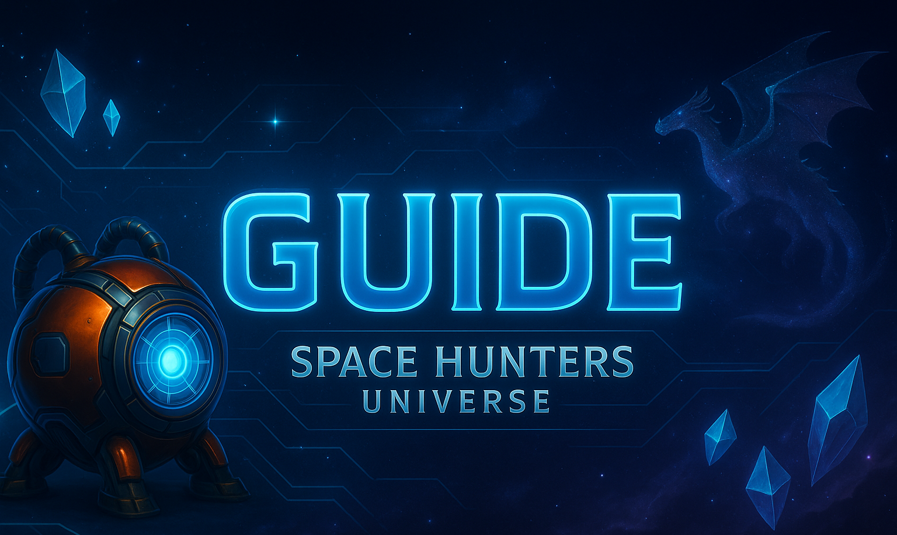

> 👽 *Official Space Hunters Documentation*

🌍 **Languages**

* 🌐 [English](/docs/eng/en.md)
* 🌐 [Spanish](/docs/esp/es.md)
* ✅  Russian
* 🌐 [Chinese](/docs/zh/zh.md)
* 🌐 [Hindi](/docs/hi/hi.md)

---
# 📚 Содержание

1. Добро пожаловать: [Обзор HUB'а](#-coins)

2. 📊 Экономическая стратегия

   * [Модель внутри игры](#-in-game-model)
     * [Токены](#-coins)
     * [\$HCASH](#-energy-level)
     * [\$HCREDIT](#-energy-level)

   * [Резидуальная модель](#-residual-model)
     * [On-Chain потоки](#-coins)
     * [Внутриигровые потоки](#-coins)

   * [On-Chain модель](#-on-chain-model)
     * [Токеномика](#-hcash-data)
     * [Распределение](#%ef%b8%8f-supply-distribution)
     * [Потоки и контроль](#-smart-contracts)

   * [Модель поощрений](#-incentives-model)
     * [Реферальная система](#-sustainable-referral-system)
     * [Бонусы за пополнение](#-deposit-bonus)
     * [Награды за траты](#-spending-rewards)
     * Очки заслуг (Скоро)
     * Поставщики ликвидности (Скоро)
     * [Ежемесячное событие](#%ef%b8%8f-monthly-event)
     * [Заработок в чате](#%ef%b8%8f-chat-to-earn--e2e)
     * [Технические билеты](#-tech-tickets)
     * [Реклама за энергию](#-ads-for-energy)
     * [Еженедельные скидки](#%ef%b8%8f-weekly-discounts-and-promotions)
     * [Достижения](#-achievements)
     * [Код создателя](#-creator-code)
     * [Подарочный код](#-gift-code)

   * [Внутриигровой рынок](#%ef%b8%8f-in-game-marketplace)

   * [Система пулов](#)
     * [Пулы токенов](#)
     * [Пулы NFT](#)

   * [Полезные ссылки](#)

3. 🛡️ Первая игра: **Tech Generators**
   * [Введение](#)
     * [Как играть](#)
   * [Игровая механика](#)
   * [Корабли](#)
   * [Генераторы](#)
   * [Инженеры](#)

---
# 🎮 Внутриигровая модель
Space Hunters — это экосистема взаимосвязанных игр, объединённых одним профилем игрока и глобальной экономикой. Эта экосистема включает как внутриигровую, так и блокчейн-экономику, работающие совместно для поддержания общей модели.

---
### 🪙 Используемые токены:
- **$HCASH →** Основная валюта, зарабатывается во время игры, торговли между игроками или через DEX.
- **$HCREDIT →** Вторичный токен, не подлежит торговле. Используется как операционный инструмент и посредник между результатами игрока и основным токеном $HCASH.

---
### 🪙 Получение $HCASH:
> HCASH — это токен, созданный с нуля усилиями сообщества и разработчиков. Без пресейлов, без распределения среди партнёров или инвесторов, которые могли бы повлиять на экономику в будущем. Ваш $HCASH принадлежит только вам, и экономика полностью управляется сообществом и командой разработчиков.

- **Игра →** Игроки — главные майнеры токена HCASH. Его можно получить в качестве награды в различных играх и игровых режимах.

- **Торговля между игроками →** Игроки могут покупать и продавать предметы из разных игр на рынке, используя исключительно $HCASH.

- **DEX →** Игроки могут покупать и продавать $HCASH на различных биржевых платформах.

- Все распределения наград основаны на моделях *Pool-Based* или *Multi-Pool*.

---
### 🪙 Получение и сжигание $HCREDIT:
> Токен Hunter Credit ($HCREDIT) основан на модели массового распространения и идеально дефляционной системе, не имеющей аналогов в других проектах.

- 100% эмиссии сжигается каждые 30 дней. Таймер с обратным отсчётом виден всем игрокам в игре.
- Каждый потраченный $HCREDIT сжигается автоматически.
- Нет ограничения на общее предложение. Система *Mass Adoption* позволяет любому генерировать столько токенов, сколько необходимо для участия в игровых форматах с использованием $HCREDIT.
- $HCREDIT можно заработать бесплатно, выполняя ежедневные задания в HUB-приложении, социальные задачи, участвуя в событиях, розыгрышах и пр.
- Можно купить наборы $HCREDIT или комбинированные пакеты с токенами и другими предметами в игровом магазине.
- Только на ежедневных заданиях можно заработать в среднем 6,000 $HCREDIT в день с Tech Pass, плюс бонус за серию до +2,000 к 28-му дню.
- При полностью бесплатной игре — примерно 300–500 токенов в день без бонуса за серию.
- С Tech Pass весь заработанный $HCREDIT удваивается в вашем балансе.

---
### 👉 Chat-to-Earn
Space Hunters предлагает систему вознаграждений, основанную на социальной активности. Общаясь в официальных или аффилированных группах, вы можете пассивно зарабатывать токены $HCREDIT. В любой группе, где активен наш бот @spacehuntersbot, вы можете фармить HCREDIT. У вас есть собственная группа или сообщество? Просто добавьте бота и начинайте зарабатывать!

- Помимо токенов $HCREDIT, вы можете получить **Tech Tickets**, которые обмениваются на усилители в игре **Tech Generators** или продаются на Marketplace.
- Кроме токенов и билетов, можно получить **предметы**, которые можно продать на внутриигровом рынке, в **Black Market**, или использовать в игре.

---
# 💼 Резидуальная модель
SHCASH построен на резидуальной модели, которая постоянно восстанавливает объём своих токенов.

#### ⚖️ On-Chain комиссии
- 5% комиссия при обмене на DEX (Tonco DEX).
- 10% комиссия создателю NFT.
- Контракт имеет стратегический резерв, который повторно использует депозиты для покрытия выводов без необходимости чеканки новых токенов.
- 100 HCASH комиссия за размещение заданий от третьих лиц на 30 дней в приложении.

#### ⚖️ Внутриигровые комиссии
- 10% комиссия на вывод + нативный токен блокчейна для оплаты газа.
- 10% комиссия за продажи на внутриигровом рынке.
- 8% комиссия в Black Market.
- 1% комиссия за редактирование или отмену предложения.
- 10% комиссия за внутренние переводы.
- Покупки в игровом магазине (высокий объём).
- Расходы на улучшения.
- 10 HCASH за смену имени пользователя.
- 5 HCASH за настройку реферальной ссылки.
- 5 HCASH за удаление аккаунта.
- 1 HCASH за использование супер-контрактов.

> Все комиссии повторно используются для поощрений, выплат наград, вывода средств и других микроэкономических операций, поддерживая баланс дефляционной системы без чеканки новых токенов на блокчейне.

🔼 [**Наверх**](#)

---

# 🔗 On-Chain модель

### 🧾 Данные о $HCASH:
- Название: Hunter Cash Token  
- Символ: $HCASH  
- Эмиссия: 1,000,000,000 фиксированных токенов на минимум 10 лет  
- Годовой лимит добычи: 9% (90M), уменьшается каждый год  
- В обращении — менее 1 миллиона токенов

---
### 🏛️ Распределение эмиссии:
- 70% — Игры и поощрения для игроков  
- 6.5% — Маркетинговые усилия  
- 3.5% — Пулы ликвидности  
- 15% — Инновации  
- 5% — Партнёры и инвесторы  
- У команды нет токенов. В течение первых 2–3 лет команда не получает прибыли в $HCASH. Все сборы в токенах перераспределяются в рамках резидуальной механики.

---
### ⚖️ Потоки и контроль:
- HCASH использует контракт Mint-On-Demand, т.е. весь объём токенов не находится в обращении и будет выпускаться постепенно в течение 10 лет, что делает токен дефицитным.
- Новые токены чеканятся только тогда, когда спрос на вывод превышает резерв контракта.
- Изначально было отчеканено 100% (334k) токенов, находящихся в обращении в игре.
- В настоящее время в руках игроков менее 40k токенов, около 56k на DEX, остальное находится в контрактном кошельке для выплат, наград и депонирования.

🔼 [**Наверх**](#)

---
# 🎁 Модель поощрений
Наша стратегия поощрений помогает игрокам сбалансировать личную экономику, усилить стратегию и даже превратить траты в прибыль.

### 🏆 Устойчивая реферальная система
Эта реферальная система без изъянов и отлично вознаграждает игроков, которые приглашают друзей или своё сообщество в Space Hunters. Вот что происходит, когда вы приглашаете друга:

- **Вы получаете Подарочную коробку с** 5,000 HCREDIT (10,000 с Tech Pass) и 1 Tech Ticket. Откроется после того, как друг выполнит 7 чекинов.

- Ваш друг получает коробку с 10,000 HCREDIT (20,000 с Tech Pass) + Tech Ticket + предметы + 2 зелья энергии (по 50%) + **TECH PASS на 7 дней** (эквивалентно 19 HCASH)!

- **2% бонус в HCASH** со всех депозитов ваших друзей! Да, вы получаете 2% от их пополнений.

- +20 **(40 с Tech Pass)** HCREDIT **ежедневно**, когда они проходят ежедневный чекин — Реферал 1 уровня.

- +10 **(20 с Tech Pass)** HCREDIT **ежедневно**, когда чекин проходят друзья ваших друзей — Реферал 2 уровня.

### 🧮 Бонус за пополнение
Когда вы вносите HCASH в игру:
- Вы моментально получаете дополнительный бонус в размере 3% от суммы пополнения.
- Вы получаете HCREDIT в размере 100% от пополненного количества HCASH.

---
### 💰 Награды за траты
При любой покупке в игровом магазине:
- У вас есть 80% шанс получить **1 Tech Ticket**.
- Вы получаете HCREDIT в размере **100% от потраченного HCASH** (50% без Tech Pass).
- При использовании промокода вы получаете **10% скидку** на все покупки на время его действия.
- Каждая покупка даёт вам 1 очко опыта.
- Вы можете получить **Очки заслуг (Merit Points)**.
- Покупки в магазине дают очки для участия в Ежемесячном Событии.

---
### 🏷️ Ежемесячное событие
Это событие повторяется каждый месяц и включает пул наград в несколько миллионов HCREDIT.
- Каждый месяц, синхронно с циклом сжигания HCREDIT, событие сбрасывается.
- Может включать дополнительные награды, такие как скины, предметы, зелья энергии и т.д.
- Правила события, как правило, остаются прежними, если не предусмотрено иное.

**🔹Как участвовать?🔹**

> ⚙️👨‍🚀 Каждый нанятый инженер = 1 балл 🎟  
> 🎁 Каждый использованный расходник = 2 балла  
> ⛏ Каждая покупка в магазине за HCASH = 25 баллов  
> 👀 Просмотр рекламы = 2 балла  
> ❤️ Комментарий + Ретвит + Лайк в Twitter (X) = 50 баллов  
> 🐈 Каждый новый реферал = 200 баллов (если выполнит 7+ чекинов) 📌  
> 👍 Больше баллов = выше позиция в рейтинге 🎨

---
### 📜 Tech Tickets
Tech Tickets используются в **Gacha-машине** — это увлекательная механика, позволяющая бесплатно получать расходуемые предметы для использования в наших играх. Gacha находится в выпадающем меню при клике на фото профиля.

- **Вероятности:** 80% успех и 20% неудача.
- **Бесплатные билеты:** Получайте их, выполняя ежедневные задания, участвуя в группах и гильдиях, общаясь в чатах и покупая в магазине.
- **Пакеты билетов:** Вы можете получить до 500 билетов в таких наборах. Они доступны как по отдельности, так и в составе комплектов.

---
### 🗨️ Chat-to-Earn (E2E) 💵
Chat-to-Earn — это базовая модель монетизации, позволяющая игрокам зарабатывать $HCREDIT, участвуя в чате — фактически, получать награды просто за повседневное общение и веселье.

- Получайте $HCREDIT каждый раз, когда отправляете сообщение  
- Получайте **предметы** с вероятностью, пока общаетесь  
- Получайте **Tech Tickets** также на основе вероятности в процессе общения

---
### 📹 Реклама за энергию
В дополнение к существующим наградам в разделе **Ежедневных заданий** появились кнопки, позволяющие смотреть рекламу (видео 15 или 30 секунд), вертикальные баннеры или даже просто посещать сайт или Telegram-канал — и в обмен вы мгновенно получаете бесплатную энергию.  
Награды за просмотр могут меняться: токены, предметы и другое.

Если вы играете бесплатно — это большое преимущество. А если вы инвестируете — такие опции ещё больше повышают вашу эффективность.

---
### 🛍️ Еженедельные скидки и акции
Каждую неделю в игровом магазине появляются акции. Если это крупная акция — она будет анонсирована. Если это обычная или внезапная скидка, игрокам нужно быть внимательными и регулярно проверять магазин.

Такая стратегия добавляет элемент случайности и удачи, давая шанс выиграть каждому.

---
### 🎁 Код создателя
Если вы — контент-креатор и уже публиковали материалы о Space Hunters, вы можете получить специальный Код Создателя. Этот код позволит вам получать 2% от всех покупок за $HCASH в магазине, сделанных вашими друзьями или подписчиками, использующими ваш код.

- Код создателя действует 30 дней  
- Даёт пользователю 10% скидку  
- Вознаграждает создателя 2% от $HCASH  
- Пользователь не может сменить код до окончания срока действия

---
### 🎁 Подарочный код
Этот код выдаётся командой разработчиков в рамках эксклюзивных событий.

---
### 🏆 Достижения
Все игроки имеют доступ к длинному списку достижений, которые помогают ускорить развитие на ранних этапах. Посетите приложение и раздел **Achievements**, чтобы увидеть подробности — в настоящее время доступно более 60 достижений.

🔼 [**Наверх**](#)

---
# 🛍️ Внутриигровой рынок
Маркетплейс Space Hunters сильно отличается от привычных рынков в других играх. Чтобы поддерживать эффективную торговлю и стабильность экономики, мы применяем уникальные стратегии:

- **P2P конфиденциальность:** Только покупатель и продавец видят историю сделки. В публичном доступе показываются лишь данные предложения или проданных предметов.

- **Фильтр вовлечённости:** Только игроки 12 уровня и выше могут пользоваться рынком.

- Вы можете разместить предложение бесплатно, но **редактирование или удаление** предложения будет стоить комиссию в 1% от установленной цены. Это предотвращает злоупотребления и манипуляции с ценами.

- **Минимальная цена:** Нельзя выставить товар по цене, ниже чем на 10% от floor price *(временно отключено)*.

- При размещении товара он исчезает из вашего инвентаря — вы не сможете им воспользоваться, пока он выставлен на продажу.

- При продаже предмета система удерживает комиссию в размере 10%.

- **Чёрный рынок (NPC):** Вы можете моментально продать предметы, которые NPC-система готова купить. Цены варьируются в зависимости от ряда факторов. Система полностью автономна и берёт комиссию 8% с продажи.

🔼 [**Наверх**](#)

---

Больше информации скоро... оставайтесь с нами!
---

---
# 🌌 Connect With Us

<b>🎮 DEX & Game</b>

  
  

<b>📰 News Channels</b>

  
  
  

<b>💬 Community Chats</b>

  
  
  

<b>🐦 Social Media (X)</b>

  
  
  

